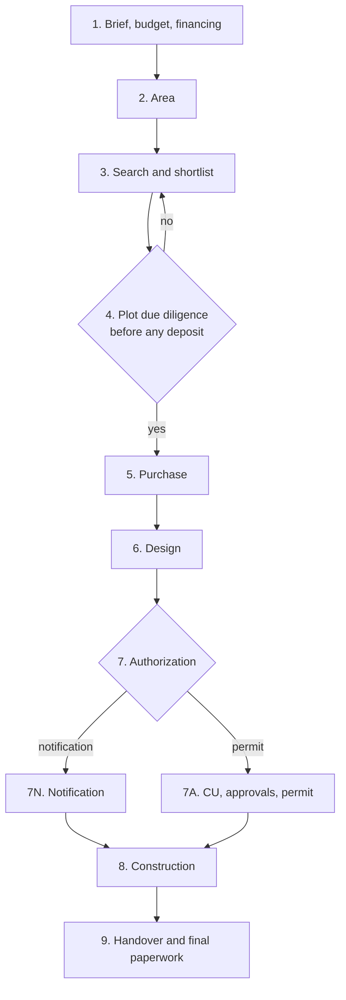

# Tekton — Functional specification

This document describes **what Tekton does** for its user, step by step. [RFD 1](rfd-0001.md) is the base: it sets the goals, the legal framework and the high-level architecture. The [technical specification](technical-spec.md) describes **how** it is built.

The spec covers the full 9-step vision. Items marked **[v1]** are in the first release; everything else is planned for later releases (see [§14 Release scope](#14-release-scope)).

## 1. Principles

1. **Agents do the heavy lifting.** Research, searching listing sites, collecting prices, reading regulations and documents, checks, drafting, comparing quotes and monitoring are done by AI agents. In most of these areas agents are assumed to be more thorough than a person.
2. **The operator does what needs a real identity, a body or a voice.** Signing, paying, phone calls, holding accounts, going to the notary, town hall, bank or the plot, and deciding. Everything the operator must do shows up as an **operator task** (sarcină pentru operator) that agents prepare as far as they can.
3. **The operator decides.** Agents propose; decisions are recorded only when the operator confirms them. Agents never sign and never pay.
4. **Every claim has a source.** Anything an agent asserts in the interface carries a source and a verification date. A claim without a source is not shown.
5. **Human-friendly first.** Tekton optimizes for the operator's clarity and effort, not for the smallest amount of software. Each screen answers three questions: *where am I, what is blocking me, what should I do next*.
6. **Personal data stays local by default.** A personal document leaves the workstation (for a cloud model) only with the operator's consent for that document.
7. **Law 169/2026 only.** Projects whose applications started before 25 August 2026 (under Law 50/1991) are out of scope.

## 2. Glossary (EN – RO)

| English | Romanian | Meaning in Tekton |
| --- | --- | --- |
| Operator | Operator / proprietar | The person using Tekton; the future owner of the house |
| Agent | Agent | An AI worker session (headless Claude Code or similar) that performs a task |
| Watcher | Supraveghetor programat | A scheduled agent job that checks something periodically |
| Operator task | Sarcină pentru operator | Something only the operator can do; closed with proof |
| Approval request | Cerere de aprobare | An agent action waiting for the operator's yes/no before it happens |
| Decision | Decizie | A typed, versioned value (e.g. `buget.teren_max`) with rationale and sources |
| Brief | Temă / program | What house the operator wants: people, rooms, levels, floor area |
| Built-up area | Intravilan | Land inside the locality's building perimeter |
| Land book extract | Extras de carte funciară (extras CF) | Registry extract: owner, encumbrances, mortgages, disputes |
| Urban planning certificate | Certificat de urbanism (CU) | Town hall document stating the plot's rules and the approvals required |
| Approvals | Avize | Approvals listed in the CU (utilities, fire, environment, …) |
| Building permit | Autorizație de construire (AC) | Permit, valid 3 years |
| Notification procedure | Procedura de notificare | Building without a permit, for eligible houses (§6) |
| Permit design documentation | PAC (formerly DTAC) | The design package submitted for the permit |
| Detailed design | Proiect tehnic de execuție (PTh) | Construction design used for quotes and building |
| Bill of quantities | Listă de cantități / antemăsurătoare | Item list builders price, so quotes are comparable |
| Local urban plan / regulation | PUG / RLU | General urban plan and its local regulation |
| Land occupancy ratio | POT | Max share of the plot covered by the building footprint |
| Floor area ratio | CUT | Max ratio of total floor area to plot area |
| Gross floor area | Suprafață desfășurată | Sum of all floor areas |
| Land registration | Intabulare | Registering ownership in the land book |
| Handover | Recepție | Acceptance of works: at completion, and final after the warranty |
| Knowledge base | Bază de cunoștințe publice | `public_knowledge/`: public rules with source and date (§11) |

## 3. Actors

| Actor | Can | Cannot |
| --- | --- | --- |
| **Operator** | Decide, approve, sign, pay, call, visit, hold accounts, upload proof | — |
| **Agents** | Research the web, search listing sites, read documents, compute checks, draft emails and documents, propose decisions, propose knowledge updates, create operator tasks and approval requests | Sign, pay, phone, log into the operator's accounts, send anything that needs approval without it, record a decision without confirmation |
| **Watchers** | Same as agents, on a schedule | Same limits |
| **External parties** | Town hall, notary, bank, architect, engineers, builders, utilities: reached through the project mailbox or by the operator | — |

One operator per instance [v1]. Every event records its author (operator, a named agent run, or a watcher), so a second person (e.g. a partner) can be added later without changing the history.

## 4. The workflow

The steps follow the order in which the cost of mistakes grows.

### 4.1 Step mechanics [v1]

- **States:** blocked, available, in progress, done, needs revalidation.
- **Each step screen shows:**
  - the earlier decisions it depends on
  - agent findings with sources
  - the decision form
  - the agent runs in progress
  - the operator tasks and approval requests for this step
- **Done:** enabled only when every required decision is set and no required operator task is open.
- **Going back:**
  - Reopening a step moves the dependent steps to *needs revalidation*.
  - The screen shows the concrete impact, e.g. "2 plots on the shortlist are now over budget", "notification eligibility lost: floor area 162 m² > 150 m²".
- **Legal cost of going back:** flagged explicitly. After the permit, a design change needs a modification permit (autorizație de modificare), with no new permit fee if it's within the original permit's validity.
- **History:** an append-only event list. Nothing is deleted; a change is a new version.

### 4.2 Step 1 — Brief, budget and financing (Program, buget și finanțare) [v1]

**Goal:** what house, and how much money in total, including the loan.

**Decisions**

| Key | Type | Notes |
| --- | --- | --- |
| `casa.persoane` | integer | People living in the house |
| `casa.camere` | integer | Bedrooms + living areas, as a list of rooms with target areas |
| `casa.regim_inaltime` | enum `P`, `D+P`, `P+M`, `P+1`, … | Levels |
| `casa.subsol` | boolean | Basement |
| `casa.suprafata_desfasurata_mp` | number | Gross floor area |
| `casa.amprenta_mp` | number | Footprint (derived from floor area and levels; editable) |
| `casa.locuire` | enum `permanenta`, `sezoniera` | Permanent or seasonal |
| `procedura.tinta` | enum `notificare`, `autorizare`, `indiferent` | Target procedure (§6) |
| `finantare.aport` | money | Own funds |
| `finantare.credit_max` | money | Bank lending ceiling |
| `finantare.tip_credit` | enum | Mortgage, construction loan, none |
| `buget.total` | money | Derived: own funds + loan; editable ceiling |
| `buget.categorii` | map | Allocation per category (below) |
| `buget.rezerva_pct` | percent | 10–15% |
| `buget.teren_max` | money | Land budget, derived from the allocation |

**Budget categories:** land; notary, taxes and land registration; design and studies (architect, topographic survey, geotechnical study, engineers); approvals and fees; utility connections; construction by stage; yard and fences; furnishing (optional); reserve (10–15%).

**What agents do**

- Estimate costs per category for the brief and the region, with sources: cost per m² for construction, notary fees, design fees, utility connection costs.
- Research lending: current mortgage offers, the maximum loan for the declared income, and down payment rules. Show the ceiling with sources.
- Check consistency: the brief fits the budget; the reserve is within 10–15%.
- Compute notification eligibility from the brief (§6) and explain which fields break it.

**Operator tasks**

- Talk to 1–3 banks for a pre-approval (pre-aprobare). The agent prepares the documents list and the questions; the proof is the bank's written offer or a call-result form.

**Done when:** brief, financing, total budget and land budget are set; the reserve is within range.

### 4.3 Step 2 — Area (Zona) [v1]

**Goal:** choose the localities (UAT) where to search.

**Decisions:** `zona.uat` (a list of candidate localities with priority), `zona.criterii` (max distances to the city, hospital, school, transport), `zona.pret_mp` (price per m² per locality, derived).

**What agents do**

- Compute distances and travel times from OpenStreetMap: to the city, hospitals, schools, transport, shops.
- **Collect land listings from listing sites** (imobiliare.ro, OLX, storia, and others) per locality. Compute the price per m² (median, spread, sample size) with the date and a link to each listing.
- Record the locality type (comună / oraș / municipiu), known utilities (water, sewage, gas, electricity, internet) and known protected zones.
- Fetch the locality's PUG/RLU into the knowledge base if missing (§11).
- **Validate each locality:**
  - *minimum plot needed* = max(footprint ÷ POT max, minimum lot from the RLU)
  - it passes if *price per m² × minimum plot needed ≤ `buget.teren_max`*
- If `procedura.tinta = notificare`, keep only comune; towns (orașe) and municipalities are marked "breaks notification".

**Operator tasks:** optional visit to the area (a task with a checklist the agent prepares).

**Done when:** at least one locality passes validation and the operator confirms the candidate list.

**Revalidation link:** a budget or brief change in step 1 reruns the validation for every locality.

### 4.4 Step 3 — Search and shortlist (Căutarea și lista scurtă) [v1]

**Goal:** a shortlist of plots, each with a complete sheet (fișă de teren).

**Plot entity (Teren):** listing links, location, cadastral number (număr cadastral) if known, area, price, frontage, access, utilities, intravilan status, zone in the RLU, photos, seller contact. Status: `candidat`, `pe_lista_scurta`, `respins` (with reason), `ales`, `cumparat`.

**What agents do**

- Search listing sites continuously in the chosen localities (a watcher, §10). They deduplicate the same plot across sites and track price changes and removals.
- Filter against the rules:
  - intravilan
  - RLU rules for the zone (POT, CUT, height, setbacks, minimum lot)
  - area ≥ minimum plot needed
  - access, utilities
  - budget
  - notification eligibility, when it's the target
- Build the **plot sheet (fișa de teren):**
  - which documents it has (extras CF, cadastru, CU, utility approvals)
  - which documents are still needed
  - the estimated effort and cost to get them
  - a fit score, with each rule linked to its source
- Draft emails to sellers for missing information (sent under the email rules, §9).

**Operator tasks:** phone the seller (the agent prepares the questions); visit the plot (with a checklist: access, slope, neighbours, water, power lines, photos).

**Done when:** the operator confirms a shortlist of at least one plot.

### 4.5 Step 4 — Plot due diligence (Verificarea terenului, înainte de orice avans) [v1]

**Goal:** a yes or no on one plot, before paying any deposit.

**What agents do**

- Read the land book extract (extras CF):
  - owner(s), matching the seller
  - encumbrances (sarcini), mortgages (ipoteci), disputes (litigii), easements (servituți)
  - area in the land book vs the listing
- Estimate the utility connection costs (racordări) from the utilities' public tariffs and the distance to the networks.
- **Choose the right CU type** among the five in Law 169/2026 and fill in the application (cerere) and the documents list.
- Once the CU is issued, read it: the approvals required (avize), the zone rules, and anything that blocks building. Update the approvals list as data.
- Check the plot against the RLU and against notification eligibility (§6).
- Prepare the questions for an architect's opinion (părerea unui arhitect).
- Produce the **verdict:** `da` / `nu` / `de verificat`. Each reason has a source, and each risk has a cost estimate.

**Operator tasks**

- Order the extras CF on ANCPI ePay: log in and pay. The agent gives the exact cadastral number and fields. Proof: receipt plus the downloaded PDF.
- Submit the CU application at the town hall or on its portal, and pay the fee. Proof: the registration number (număr de înregistrare) plus the receipt.
- Pick up the CU if it isn't delivered electronically. Proof: the CU document.
- Get an architect's opinion (call or meeting). Proof: the call-result form or the architect's written note.

**Decision:** `teren.verdict` for the chosen plot. **No** sends the operator back to step 3 with the plot marked `respins` and the reason. **Yes** unlocks step 5.

### 4.6 Step 5 — Purchase (Cumpărarea)

**What agents do**

- Review the draft preliminary contract (antecontract): price, deposit (avans), conditions for returning the deposit (e.g. the loan being refused), deadlines, penalties.
- Track the mortgage process: documents list, valuation (evaluare), approval deadlines.
- Prepare the documents list for the notary.
- Check the land registration (intabulare) once done, from a new extras CF.

**Operator tasks:** sign the preliminary contract, pay the deposit, sign the loan agreement, attend the notary, pay taxes and fees. Each one needs proof.

**Decisions:** `cumparare.pret_final`, `cumparare.data_notar`, `cumparare.credit` (terms).

### 4.7 Step 6 — Design (Proiectarea)

**What agents do**

- Shortlist architects: check signing rights in the OAR Register (Tabloul OAR), their portfolio, and fees. Draft the quote requests.
- Generate the **design brief (tema de proiectare)** directly from the step 1 decisions and the CU.
- Organize the topographic survey (ridicare topografică) and the geotechnical study (studiu geotehnic): find providers, draft requests, compare quotes.
- Confirm the procedure: notification or permit (§6).
- Review design versions against the brief, the RLU, the budget and notification eligibility, and flag drift (e.g. floor area creeping past 150 m²).

**Operator tasks:** meet architects, sign the design contract, pay stage invoices, give access to the plot for the survey.

**Decisions:** `proiect.arhitect`, `proiect.procedura` (final), `proiect.versiune_aprobata`.

### 4.8 Step 7 — Authorization (Autorizarea)

The step has two variants, chosen in step 6.

**7A. Permit (autorizare).** Path: CU → approvals (avize) → PAC → building permit (autorizație de construire).

- Agents track every approval listed in the CU as an item with its authority, documents, fee, legal deadline, status and proof.
- They draft the applications and follow up by email.
- Deadlines: 30 days for issuing the permit. The permit is valid 3 years; its expiry goes on the calendar with reminders.

**7N. Notification (notificare).**

- The design is approved by the county chief architect (arhitectul-șef al județului).
- The notification is submitted; the answer is due within 15 working days, and **silence means approval (tacit)**.
- Agents compute the working-day deadline, excluding public holidays, and record the tacit approval when it expires with no answer.

**Operator tasks:** submit and pay at each authority, pick up approvals, sign with a qualified electronic signature (semnătură electronică calificată) where filing is digital.

### 4.9 Step 8 — Construction (Execuția)

**What agents do**

- Once the detailed design (PTh) and the **bill of quantities** are ready, draft quote requests for builders on the same items.
- **Vet builders:**
  - financial statements (bilanțuri, from the Ministry of Finance)
  - court records (portal.just.ro)
  - company data (ONRC)
  - past projects
- **Compare quotes line by line:** missing items, unit price outliers, totals vs the budget.
- Review the construction contract: stages, payment schedule, warranty, penalties, and who supplies which materials.
- Track the site by stage: planned vs actual dates, payments vs budget, photos and site reports.

**Operator tasks:** meet builders, sign the contract, pay each stage (proof: invoice plus receipt), visit the site at each milestone (checklist plus photos).

### 4.10 Step 9 — Handover and final paperwork (Recepția și actele finale)

- **Handover at completion of works (recepția la terminarea lucrărilor):** agents prepare the file and the checklist of defects to note.
- **Final handover (recepția finală)**, when the warranty period ends. A calendar milestone years later, with reminders.
- **Land registration of the house (intabularea construcției):** the agent prepares the documents; the operator submits and pays.
- **Tax declaration at the town hall (declararea la primărie):** the agent prepares the form and the deadline.

## 5. Budget (cross-cutting) [v1 for steps 1–4]

- One budget from step 1 to step 9, with categories (§4.2).
- For each category: **planned** (step 1), **committed** (signed contracts, accepted quotes), **paid** (receipts), **remaining**.
- Every payment is linked to an operator task and its proof (receipt).
- Money is stored with its currency (RON or EUR). EUR amounts are converted at the BNR exchange rate on the payment date, and that rate is recorded.
- Alerts when a category exceeds its plan, when the reserve drops below a threshold, or when the total goes over `buget.total`.

## 6. Notification eligibility (cross-cutting) [v1]

Law 169/2026 allows building by notification (notificare) instead of a permit when **all** of these hold:

| Condition | Where it is decided |
| --- | --- |
| A single single-family house (casă unifamilială), with its own lot and access | Steps 1, 3–4 |
| Ground floor only (P), or D+P; no basement (subsol) | Step 1 |
| At most 150 m² gross floor area (suprafață desfășurată) | Step 1, watched in step 6 |
| In the intravilan of a commune (comună), not a town | Steps 2–4 |
| Outside protected zones | Steps 3–4 |
| Compliant with the PUG | Steps 3–4, 6 |

- The operator may set the target `procedura.tinta = notificare` in step 1. That target then **filters** localities in step 2 and plots in step 3.
- A live status is shown on every screen: **eligibil / neeligibil / de verificat**, with the failing or unverified conditions listed.
- Final confirmation happens in step 6, with the architect.
- **Open legal point:** rural localities inside metropolitan areas. The law's exclusion is published for outbuildings of up to 50 m², not explicitly for the 150 m² house. Until practice is clear, these cases are marked *de verificat*, with the source of the interpretation.

## 7. Operator tasks (Sarcini pentru operator) [v1]

A dedicated inbox, always visible, with a counter. It's the main place the operator works from.

**Each task has:**

- a title
- a type
- its step
- why it matters
- a deadline (derived from the law or a watcher when relevant)
- everything the agent prepared: who to contact, phone numbers, address and opening hours, questions to ask, documents to bring, exact form fields, amounts
- the required proof
- a status: open, in progress, done, cancelled

**Task types and required proof**

| Type | Example | Proof required to mark done |
| --- | --- | --- |
| Payment (plată) | Extras CF on ANCPI ePay, CU fee, deposit | **Receipt (chitanță / dovada plății)**, stored locally |
| Portal request | Order extras CF, file online | Confirmation or registration number, plus the downloaded document |
| Phone call (telefon) | Ask a seller about access | Call-result form (the agent's questions, answered) |
| Visit (deplasare) | Town hall, plot visit, site | Registration number and a photo of the stamped copy, or a checklist with photos |
| Signing (semnare) | Preliminary contract, design contract | Signed document |
| Meeting (întâlnire) | Architect, bank | Meeting-result form and any documents received |
| Account setup (cont) | **Create the project Gmail**, e.g. `casa.ciortea@gmail.com`, and connect it | Successful OAuth connection |
| Decision | Confirm the shortlist, the plot verdict | The decision recorded |

- The **Done** button stays disabled until the required proof is attached.
- After closing, an agent **checks the proof**: the amount and date on the receipt, the registration number format, the signatures present. If something doesn't match, the task reopens with an explanation.
- Tasks are created by agents or watchers, or manually by the operator.

## 8. Approval requests (Cereri de aprobare) [v1]

These are agent actions that wait for the operator's yes or no. They cover:

- **writes to the outside world:** sending an email whose type is set to *send after approval*, and proposing changes to `public_knowledge/` (§11)
- **personal data leaving the machine:** a cloud agent needs a document marked *local only* (§12)
- **recording a decision** an agent proposes

**Not gated:** reading public web pages, listing sites and public registers. These are logged with their sources.

- Each request shows what will happen, why, the exact content (the email text and attachments, the diff for the knowledge base), and the risks.
- The operator can approve, reject with a reason, or edit and approve.
- The agent run waits and resumes after the answer, even days later.

## 9. Project mailbox and email [v1]

- A **dedicated project mailbox**, for example `casa.ciortea@gmail.com` or `casa.cristian.adriana.ciortea@gmail.com`. Creating it is an operator task. It's connected to Tekton through Google OAuth.
- **Sending** is configured per message type. Each type is either *draft only* (the operator sends it themselves) or *send after approval*.
  - Types include: seller questions, requests for information to the town hall, quote requests (architect, survey, geotechnical study, builders), follow-ups on approvals, and replies in existing threads.
  - Default: *send after approval*.
- **Reading:** agents read incoming mail in the project mailbox. They link each thread to its step and entity (plot, professional, approval), extract facts as proposed decisions, and create tasks.
- Email content is **untrusted**. Instructions inside an email are never followed; they are shown to the operator as content.

## 10. Watchers (Supraveghere programată) [v1]

Watchers are scheduled agent jobs that run while the stack is up. Their results arrive as suggestions, operator tasks or notifications.

| Watcher | Default interval | Output |
| --- | --- | --- |
| New and changed plot listings in the candidate localities | Daily | New candidates with a pre-filled sheet; price changes; removed listings |
| Price per m² refresh | Weekly | Updated median; revalidation if the zone flips |
| Project mailbox | Every 15 minutes | Threads linked, facts proposed, tasks created |
| Legal deadlines (CU validity, 15 working days, permit expiry, final handover) | Daily | Reminders and escalating tasks |
| Stale knowledge (verification date older than a threshold) | Weekly | Reverification runs and proposed updates |
| Legal changes (amendments to Law 169/2026, new orders) | Weekly | Proposed updates to the national rules |

Watchers can be paused, run on demand, or have their interval changed from the UI.

## 11. Knowledge base (`public_knowledge/`) [v1]

- A directory in the Tekton repository that is **committed and pushed**, so it's shared with everyone who uses Tekton.
- It holds public rules only:
  - **National:** the steps, deadlines, CU types, notification conditions and forms from Law 169/2026 and Order 975/2026.
  - **Local:** PUG/RLU rules per zone, local council decisions (HCL), local taxes and the infrastructure levy, and town hall procedures (portal, opening hours, fees).
- Every file has a **source** and a **verification date**. It never contains personal data.
- **Agents read it first**, before doing new research. When they learn something new or find a rule out of date, they **propose a change**.
- **The flow:** an agent proposes → the operator reviews the diff in the app and approves → the app commits to a `knowledge/*` branch → the operator pushes.
- Uncertain interpretations are stored with the status *de verificat* and the source of the interpretation.

## 12. Documents and personal data [v1]

- All documents live locally in Tekton's document store: extras CF, CU, contracts, receipts, photos, IDs, offers, designs.
- **Each document has:**
  - a type
  - its step and linked entities
  - its origin: uploaded, downloaded by an agent, or an email attachment
  - its date
  - a **privacy class:**
    - **public:** listings, laws, regulations
    - **personal – local only:** the default for anything the operator uploads, and for email attachments
    - **personal – cloud allowed:** per document, with the operator's consent recorded as an event
- Agent sessions working on *local only* documents run on a **local model** (through the model gateway). If no local model is available, the document waits and the UI says so.
- Documents can be previewed and downloaded. Every agent claim that comes from a document links back to the page.

## 13. Interface [v1]

- **Language:** English first. Romanian is added through i18n. Romanian legal terms (CF, CU, PAC, avize) are kept, with explanations.
- **Main screens**
  - **Home:**
    - the 9-step map with states
    - the current step
    - notification eligibility
    - the budget summary
    - the next deadlines
    - open operator tasks and approval requests
  - **Step:** decisions, agent findings with sources, runs in progress, tasks and approvals for the step, history.
  - **Operator tasks:** the inbox (§7).
  - **Approvals:** the queue (§8).
  - **Plots:** a list and a map with filters, and the plot sheet (fișa de teren).
  - **Budget:** categories with planned, committed, paid and remaining.
  - **Calendar:** legal deadlines and milestones; `.ics` export.
  - **Documents:** a browser with privacy classes.
  - **Mail:** threads, linked to steps and entities.
  - **Agents:**
    - runs (live progress, cost, results, logs)
    - watchers (schedules, last result)
  - **Knowledge:** browse the rules; pending changes with diffs.
  - **History:** every event, filterable.
  - **Settings:** mailbox connection, email rules per type, model profiles, watcher schedules.
- **Notifications:** an in-app inbox with counters [v1].

## 14. Release scope

Tekton is built in workflow order: each step is complete before the next one starts.

| Release | Contents |
| --- | --- |
| **v1** | The workflow engine, decisions, history and revalidation; operator tasks with proof; approvals; agent runner and watchers; project mailbox; knowledge base; documents and privacy classes; budget; calendar; notification eligibility; **steps 1–4 in full** (everything up to the plot verdict, before any deposit) |
| v2 | Steps 5–6: purchase and design, including vetting architects |
| v3 | Step 7: permit and notification variants |
| v4 | Steps 8–9: quotes, builder vetting, site tracking, handover |
| Last | Backup of important documents to Google Drive (OAuth) |

## 15. Non-functional requirements

- **Local only:** the app runs on a Linux workstation (Ubuntu or Rocky) in containers, reachable only from that machine.
- **Durability over 5 years:** data survives app upgrades (migrations), and local backups of the database and documents are available [v1]. Cloud backup comes later.
- **Auditability:** every decision, task, approval, agent run, email and knowledge change is an event with its author and sources.
- **Honesty of claims:** an agent result without sources is rejected by the app, not shown.
- **Legal positioning:** the UI presents information and organization with sources, not legal advice. The wording is to be validated by a lawyer.

## 16. Open questions

- [ ] Wording of "information, not advice", to be validated with a lawyer.
- [ ] Rural localities in metropolitan areas and the 150 m² house (§6).
- [ ] Listing sites' terms of use for automated collection: the rate limits and which sites to include.
- [ ] Long-term community home for `public_knowledge/` (e.g. Code for Romania).
- [ ] Review rules for knowledge contributions from other users (PRs to the repository).
