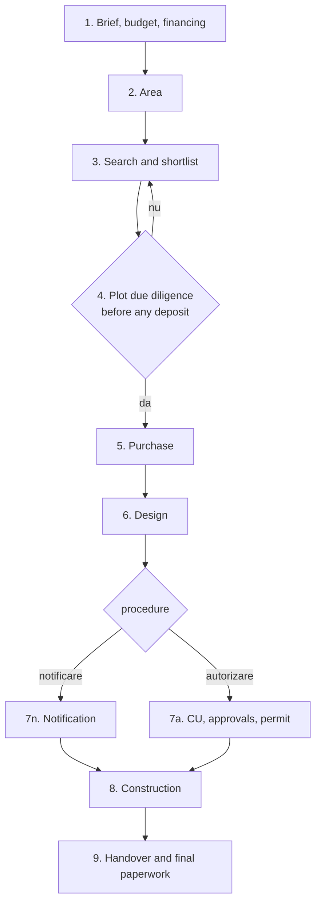

# Tekton — Functional specification

This document describes **what Tekton does** for its user, step by step. [RFD 1](rfd-0001.md) is the base: it sets the goals, the legal framework and the high-level architecture. The [technical specification](technical-spec.md) describes **how** it is built.

The spec covers the full 9-step vision. Items marked **[v1]** are in the first release; everything else is planned for later releases (see [§14 Release scope](#14-release-scope)). Identifiers in `code` (decision keys, enum values) are the ones stored and exchanged by the system; the interface shows translated labels for them.

## 1. Principles

1. **Agents do the heavy lifting.** Research, searching listing sites, collecting prices, reading regulations and documents, checks, drafting, comparing quotes and monitoring are done by AI agents. Design assumption: agents are more thorough than a person at this kind of work, so the operator's time goes to what only they can do.
2. **The operator does what needs a real identity, a body or a voice.** That means signing, paying, phone calls, holding accounts, going to the notary, town hall, bank or the plot, and deciding. Everything the operator must do shows up as an **operator task** (sarcină pentru operator) that agents prepare as far as they can.
3. **The operator decides.** Agents propose; a decision is recorded only when the operator confirms it. Agents never sign and never pay.
4. **Every claim has a source.** Anything an agent asserts in the interface carries a source and a verification date. An unsourced claim is dropped before it reaches the interface, and the run is marked *partial*.
5. **Human-friendly first.** Tekton optimizes for the operator's clarity and effort, not for the smallest amount of software. Each screen answers three questions: *where am I, what is blocking me, what should I do next*.
6. **Personal data stays local by default.** Personal documents, and everything derived from them, leave the workstation (for a cloud model) only with the operator's consent (§12).
7. **Law 169/2026 only.** Projects whose applications started before 25 August 2026 (under Law 50/1991) are out of scope. Documents issued under the old law that turn up in a new project are handled by §4.5.

## 2. Glossary (EN – RO)

| English | Romanian | Meaning in Tekton |
| --- | --- | --- |
| Operator | Operator / proprietar | The person using Tekton; the future owner of the house |
| Agent | Agent | An AI worker session (headless Claude Code or similar) that performs a task |
| Run | Rulare | One piece of agent work on one subject; it may span several sessions when it waits for the operator |
| Watcher | Supraveghetor programat | A scheduled job that checks something periodically (§10) |
| Operator task | Sarcină pentru operator | Something only the operator can do; closed with proof |
| Approval request | Cerere de aprobare | An outbound action waiting for the operator's yes/no before it happens (§8) |
| Decision | Decizie | A typed, versioned value set by the operator (e.g. `casa.persoane`) with rationale and sources |
| Proposal | Propunere | A value an agent suggests for a decision; the operator accepts, edits or rejects it |
| Derived value | Valoare calculată | A value Tekton computes from decisions and rules (e.g. land budget, footprint) |
| Brief | Temă / program | What house the operator wants: people, rooms, levels, floor area |
| Locality | Localitate | A village or town (SIRUTA code); belongs to a UAT |
| UAT | UAT (comună / oraș / municipiu) | The administrative unit with the town hall, PUG and taxes |
| Built-up area | Intravilan | Land inside the locality's building perimeter |
| Land book extract | Extras de carte funciară (extras CF) | Registry extract: owner, encumbrances, mortgages, disputes |
| Urban planning certificate | Certificat de urbanism (CU) | Town hall document stating the plot's rules and the approvals required |
| Approvals | Avize | Approvals listed in the CU (utilities, fire, environment, …) |
| Building permit | Autorizație de construire (AC) | Permit, valid 3 years |
| Notification procedure | Procedura de notificare | Building without a permit, for eligible houses (§6) |
| Permit design documentation | PAC (formerly DTAC) | The design package submitted for the permit |
| Detailed design | Proiect tehnic de execuție (PTh) | Construction design used for quotes and building |
| Bill of quantities | Listă de cantități / antemăsurătoare | Item list builders price, so quotes are comparable |
| Local urban plan / regulation | PUG / RLU | General urban plan and its local regulation |
| RLU zone | Zonă / UTR din RLU | A zone of the RLU with its own rules (POT, CUT, height, …) |
| Land occupancy ratio | POT | Max share of the plot covered by the building footprint |
| Floor area ratio | CUT | Max ratio of total floor area to plot area |
| Gross floor area | Suprafață desfășurată | Sum of all floor areas |
| Land registration | Intabulare | Registering ownership in the land book |
| Handover | Recepție | Acceptance of works: at completion, and final after the warranty |
| Knowledge base | Bază de cunoștințe publice | `public_knowledge/`: public rules with source and date (§11) |

## 3. Actors

| Actor | Can | Cannot |
| --- | --- | --- |
| **Operator** | Decide, approve, sign, pay, call, visit, hold accounts, upload proof, change a privacy class | — |
| **Agents** | Research the web, search listing sites, read documents their profile allows, compute checks, draft emails and documents, propose decisions, propose knowledge updates, create operator tasks | Sign, pay, phone, log into the operator's accounts, send anything without the rule in §9, record a decision, lower a privacy class, read personal data outside their profile |
| **Watchers** | Start agent runs or system checks on a schedule | Same limits as agents |
| **External parties** | Town hall, notary, bank, architect, engineers, builders, utilities: reached through the project mailbox or by the operator | — |

One operator per instance [v1]. Every event records its author (operator, a named agent run, a watcher, or the system), so a second person (e.g. a partner) can be added later without changing the history.

## 4. The workflow

The steps follow the order in which the cost of mistakes grows. Step identifiers are `1` … `6`, `7a` (permit), `7n` (notification), `8`, `9`.

### 4.1 Step mechanics [v1]

**States:** `blocked`, `available`, `in_progress`, `done`, `needs_revalidation`.

| From | What happens | To |
| --- | --- | --- |
| `blocked` | All earlier steps it depends on are `done` | `available` |
| `available` | The operator sets a decision, or an agent run starts on the step | `in_progress` |
| `in_progress` | The operator presses **Done** (allowed only when the step can complete, below) | `done` |
| `done` | The operator reopens the step | `in_progress`; dependent steps → `needs_revalidation` |
| `done` | A decision or derived value it depends on changes | `needs_revalidation` |
| `needs_revalidation` | The checks re-run, the operator reviews the impact and confirms | `done` |
| `needs_revalidation` | The operator changes a decision in the step | `in_progress` |

- **Can complete** when every required decision is set, every required check passes, no proposal on a required decision is pending, and no required operator task is open. Tekton computes this and shows the blocking items; the Done button explains why it is disabled.
- **Each step screen shows:**
  - the earlier decisions it depends on
  - its decisions, each with any pending agent proposal next to it (§4.12)
  - derived values and checks, with their formula and sources
  - agent findings with sources, and the runs in progress
  - the operator tasks and approval requests for this step
- **Going back:** the impact is shown concretely, e.g. "2 plots on the shortlist are now over budget", "notification eligibility lost: floor area 162 m² > 150 m²".
- **Legal cost of going back:** flagged explicitly. After the permit, a design change needs a modification permit (autorizație de modificare), with no new permit fee if it is within the original permit's validity.
- **Steps not built yet** (outside v1) appear on the map as *coming later*, with a short description; they are not a workflow state.
- **History:** an append-only event list. Nothing is deleted; a change is a new version.

### 4.2 Step 1 — Brief, budget and financing (Program, buget și finanțare) [v1]

**Goal:** what house, and how much money in total, including the loan.

**Decisions**

| Key | Type | Req. | Notes |
| --- | --- | --- | --- |
| `casa.persoane` | integer ≥ 1 | yes | People living in the house |
| `casa.camere` | room list | yes | Each room: kind (`dormitor`, `living`, `bucatarie`, `baie`, `birou`, `depozitare`, `altele`) and target area |
| `casa.regim_inaltime` | enum `p`, `d_p`, `p_m`, `p_1`, `d_p_1`, `p_1_m` | yes | Levels (parter, demisol + parter, mansardă, etaj) |
| `casa.subsol` | boolean | yes | Basement |
| `casa.suprafata_desfasurata_mp` | area (m²) | yes | Gross floor area |
| `casa.locuire` | enum `permanenta`, `sezoniera` | yes | Permanent or seasonal |
| `procedura.tinta` | enum `notificare`, `autorizare`, `indiferent` | yes | Target procedure (§6) |
| `finantare.venit_net_lunar` | money | no | Household net monthly income, used for the loan ceiling |
| `finantare.aport` | money | yes | Own funds |
| `finantare.tip_credit` | enum `ipotecar`, `constructie`, `fara` | yes | Mortgage, construction loan, none |
| `finantare.credit_max` | money | yes (0 when `fara`) | Bank lending ceiling |
| `buget.categorii` | allocation per category | yes | Planned amount per budget category (below) |

**Derived values:** `casa.amprenta_mp` (footprint, from floor area and levels), `buget.total` (own funds + loan ceiling), `buget.teren_max` (the land category of `buget.categorii`), `buget.rezerva_pct` (the reserve category as a share of the total). The footprint and the total may be overridden by the operator (§4.12).

**Checks:** the allocation adds up to at most `buget.total`; the reserve is between 10% and 15%; the rooms fit in the floor area.

**Budget categories:** `teren` (land); `notar_taxe` (notary, taxes and land registration); `proiectare_studii` (architect, topographic survey, geotechnical study, engineers); `avize_taxe` (approvals and fees); `racordari` (utility connections); `constructie` (construction, by stage later); `curte` (yard and fences); `mobilare` (furnishing, optional); `rezerva` (reserve, 10–15%).

**What agents do**

- Estimate costs per category for the brief and the region, with sources: cost per m² for construction, notary fees, design fees, utility connection costs. They are proposed as the planned amounts.
- Research lending: current mortgage offers, the maximum loan for the declared income, down payment rules. Propose `finantare.credit_max` with sources.
- Compute notification eligibility from the brief (§6) and explain which fields break it.

**Operator tasks:** talk to 1–3 banks for a pre-approval (pre-aprobare). The agent prepares the documents list and the questions; the proof is the bank's written offer or a meeting-result form.

### 4.3 Step 2 — Area (Zona) [v1]

**Goal:** choose the localities where to search.

**Decisions:** `zona.criterii` (max travel times to the city, hospital, school, transport; required), `zona.localitati` (ranked list of candidate localities; required).

**Locality entity (Localitate):** SIRUTA code, name, UAT and its type (`comuna`, `oras`, `municipiu`), distances and travel times, known utilities (water, sewage, gas, electricity, internet), protected zones known, price per m² (a derived value: median, spread, sample size, date, links), validation status.

**What agents do**

- Compute distances and travel times from OpenStreetMap data: to the city, hospitals, schools, transport, shops.
- **Collect land listings from listing sites** (imobiliare.ro, OLX, storia, and others) per locality, within the site limits of §10. Compute the price per m² (median, spread, sample size) with the date and a link to each listing.
- Fetch the UAT's PUG/RLU into the knowledge base if missing (§11).
- **Validate each locality:**
  - *minimum plot needed* = max(footprint ÷ POT max, floor area ÷ CUT max, minimum lot from the RLU)
  - at this step the zone of a future plot is unknown, so the rules of the most permissive residential zone of the RLU are used, and the result is marked *de verificat* until step 3 knows the plot's zone
  - it passes if *price per m² × minimum plot needed ≤ `buget.teren_max`*
- If `procedura.tinta = notificare`, localities belonging to a `comuna` pass; villages belonging to an `oras` or `municipiu` are marked *de verificat*; the town itself is marked "breaks notification" (§6).

**Operator tasks:** optional visit to the area (a task with a checklist the agent prepares).

**Can complete** when at least one locality passes validation and the operator confirms `zona.localitati`.

**Revalidation link:** a budget or brief change in step 1, or a price-per-m² refresh by the watcher, reruns the validation of every locality.

### 4.4 Step 3 — Search and shortlist (Căutarea și lista scurtă) [v1]

**Goal:** a shortlist of plots, each with a complete sheet (fișă de teren).

**Plot entity (Teren):** listing links (one plot may appear on several sites), locality, location, cadastral number (număr cadastral) if known, area, price, frontage, access, utilities, intravilan status, **RLU zone** (with its source and status: confirmed, inferred, unknown), photos, seller contact. Identity: the cadastral number when known; otherwise site + listing id, merged when the agent finds the same plot elsewhere. Status: `candidat`, `pe_lista_scurta`, `respins` (with reason), `ales`, `cumparat`.

**What agents do**

- Search listing sites continuously in the chosen localities (a watcher, §10). They deduplicate the same plot across sites and track price changes and removals.
- Determine the plot's RLU zone from the PUG maps or documents; an unknown zone keeps the rule checks *de verificat* and adds a question for the seller or the town hall.
- Filter against the rules: intravilan; RLU rules of the zone (POT, CUT, height, setbacks, minimum lot); area ≥ minimum plot needed; access; utilities; budget; notification eligibility when it is the target.
- Build the **plot sheet (fișa de teren):**
  - which documents it has (extras CF, cadastru, CU, utility approvals)
  - which documents are still needed
  - the estimated effort and cost to get them
  - a fit score, with each rule linked to its source
- Draft emails to sellers for missing information (sent under §9).

**Operator tasks:** phone the seller (the agent prepares the questions); visit the plot (with a checklist: access, slope, neighbours, water, power lines, photos).

**Decision:** `teren.lista_scurta` (list of plots). **Can complete** when it holds at least one plot.

The Plots screen owns the plot list, map and sheet; step 3 and step 4 open it with the right filters.

### 4.5 Step 4 — Plot due diligence (Verificarea terenului, înainte de orice avans) [v1]

**Goal:** a yes or no on a plot, before paying any deposit. Due diligence can run on several shortlisted plots in parallel; each has its own verdict.

**What agents do**

- Read the land book extract (extras CF):
  - owner(s), matching the seller
  - encumbrances (sarcini), mortgages (ipoteci), disputes (litigii), easements (servituți)
  - area in the land book vs the listing
- Estimate the utility connection costs (racordări) from the utilities' public tariffs and the distance to the networks.
- **Choose the right CU type** among the five in Law 169/2026 and fill in the application (cerere) and the documents list.
- Once the CU is issued, read it: the approvals required (avize), the zone rules, and anything that blocks building. Update the approvals list as data.
- **Old-law documents:** a CU or approval issued under Law 50/1991 is recorded with `regim_legal = lege_50_1991`. It is informational only; the verdict needs a CU under Law 169/2026.
- Check the plot against the RLU and against notification eligibility (§6).
- Prepare the questions for an architect's opinion (părerea unui arhitect).
- Propose the **verdict** with its reasons (each with a source) and risks (each with a cost estimate).

**Operator tasks**

- Order the extras CF on ANCPI ePay: log in and pay. The agent gives the exact cadastral number and fields. Proof: the receipt and the downloaded PDF.
- Submit the CU application at the town hall or on its portal, and pay the fee. Proof: the registration number (număr de înregistrare) and the receipt.
- Pick up the CU if it isn't delivered electronically. Proof: the CU document.
- Get an architect's opinion (call or meeting). Proof: the call- or meeting-result form, or the architect's written note.

**Decisions (per plot):** `teren.verdict` = `da`, `nu` or `de_verificat`.

- `nu` marks the plot `respins` with the reason; the operator continues with another shortlisted plot or goes back to step 3.
- `de_verificat` keeps the step in progress and creates the tasks needed to resolve the open points.
- `da` lets the operator choose it: **`teren.ales`** (the plot to buy). The step can complete when `teren.ales` is set and its verdict is `da`.

### 4.6 Step 5 — Purchase (Cumpărarea)

**What agents do**

- Review the draft preliminary contract (antecontract): price, deposit (avans), conditions for returning the deposit (e.g. the loan being refused), deadlines, penalties.
- Track the mortgage process: documents list, valuation (evaluare), approval deadlines.
- Prepare the documents list for the notary.
- Check the land registration (intabulare) once done, from a new extras CF.

**Operator tasks:** sign the preliminary contract, pay the deposit, sign the loan agreement, attend the notary, pay taxes and fees. Each one needs proof.

**Decisions:** `cumparare.pret_final`, `cumparare.data_notar`, `cumparare.credit` (terms).

### 4.7 Step 6 — Design (Proiectarea)

**What agents do**

- Shortlist architects: check signing rights in the OAR Register (Tabloul OAR), their portfolio, and fees. Draft the quote requests.
- Generate the **design brief (tema de proiectare)** directly from the step 1 decisions and the CU.
- Organize the topographic survey (ridicare topografică) and the geotechnical study (studiu geotehnic): find providers, draft requests, compare quotes.
- Confirm the procedure: notification or permit (§6).
- Review design versions against the brief, the RLU, the budget and notification eligibility, and flag drift (e.g. floor area creeping past 150 m²).

**Operator tasks:** meet architects, sign the design contract, pay stage invoices, give access to the plot for the survey.

**Decisions:** `proiect.arhitect`, `proiect.procedura` (final: `notificare` or `autorizare`; selects step `7n` or `7a`), `proiect.versiune_aprobata`.

### 4.8 Step 7 — Authorization (Autorizarea)

**7a. Permit (autorizare).** Path: CU → approvals (avize) → PAC → building permit (autorizație de construire).

- Agents track every approval listed in the CU as an item with its authority, documents, fee, legal deadline, status and proof.
- They draft the applications and follow up by email.
- Deadlines: 30 days for issuing the permit. The permit is valid 3 years; its expiry goes on the calendar with reminders.

**7n. Notification (notificare).**

- The design is approved by the county chief architect (arhitectul-șef al județului).
- The notification is submitted; the answer is due within 15 working days, and **silence means approval (tacit)**.
- Tekton computes the working-day deadline, excluding public holidays, and records the tacit approval when it expires with no answer.

**Operator tasks:** submit and pay at each authority, pick up approvals, sign with a qualified electronic signature (semnătură electronică calificată) where filing is digital.

### 4.9 Step 8 — Construction (Execuția)

**What agents do**

- Once the detailed design (PTh) and the **bill of quantities** are ready, draft quote requests for builders on the same items.
- **Vet builders:**
  - financial statements (bilanțuri, from the Ministry of Finance)
  - court records (portal.just.ro)
  - company data (ONRC)
  - past projects
- **Compare quotes line by line:** missing items, unit price outliers, totals vs the budget.
- Review the construction contract: stages, payment schedule, warranty, penalties, and who supplies which materials.
- Track the site by stage: planned vs actual dates, payments vs budget, photos and site reports.

**Operator tasks:** meet builders, sign the contract, pay each stage (proof: invoice and receipt), visit the site at each milestone (checklist and photos).

### 4.10 Step 9 — Handover and final paperwork (Recepția și actele finale)

- **Handover at completion of works (recepția la terminarea lucrărilor):** agents prepare the file and the checklist of defects to note.
- **Final handover (recepția finală)**, when the warranty period ends. A calendar milestone years later, with reminders.
- **Land registration of the house (intabularea construcției):** the agent prepares the documents; the operator submits and pays.
- **Tax declaration at the town hall (declararea la primărie):** the agent prepares the form and the deadline.

### 4.11 Derived values

Derived values are computed by Tekton, never typed by an agent. Each shows its formula and inputs. Some can be overridden by the operator (e.g. footprint, total budget): an override is kept when inputs change, and the screen then shows "computed value would now be X" with a button to drop the override. Price per m² refreshed by a watcher is a derived value too; a refresh that changes a validation result moves the dependent steps to `needs_revalidation`.

### 4.12 Agent proposals [v1]

An agent never sets a decision. It **proposes** a value, with rationale and sources. The proposal appears **inline next to the field** in the step: "Agent suggests 42,000 EUR · 3 sources · Accept / Edit / Reject". Accepting or editing records the decision as the operator's; rejecting records the reason, which the agent sees on its next run. The Home screen shows a **needs your attention** list that counts pending proposals, operator tasks and approval requests, each linking to where it is handled.

## 5. Budget (cross-cutting) [v1 for steps 1–4]

- One budget from step 1 to step 9, with the categories of §4.2.
- For each category: **planned** (step 1), **committed** (signed contracts, accepted quotes), **paid** (receipts), **remaining**.
- **Currency:** the budget is kept in RON. Amounts may be entered or found in EUR; each is stored with its currency and converted with the BNR rate of a stated date: the payment date for payments, the day of the calculation for plans and validations (the rate of the last banking day on or before that date, with the rate's date shown).
- Every payment is linked to an operator task and its proof. It is recorded as soon as the operator closes the task with the receipt (*unverified*), and becomes *verified* after the proof check (§7).
- Alerts when a category exceeds its plan, when the reserve drops below 10%, or when the total goes over `buget.total`.

## 6. Notification eligibility (cross-cutting) [v1]

Law 169/2026 allows building by notification (notificare) instead of a permit when **all** of the conditions hold. The authoritative list, with article references, lives in `public_knowledge/lege/169-2026/notificare.yaml`; this spec and the RFD summarize it:

| Condition | Where it is decided |
| --- | --- |
| A single single-family house (casă unifamilială), with its own lot and access | Steps 1, 3–4 |
| Ground floor only (P), or demisol + parter (D+P); no basement (subsol) | Step 1 |
| At most 150 m² gross floor area (suprafață desfășurată) | Step 1, watched in step 6 |
| In the intravilan of a rural locality of a commune (comună), not a town | Steps 2–4 |
| Outside protected zones | Steps 3–4 |
| Compliant with the PUG | Steps 3–4, 6 |
| Design approved by the county chief architect | Step 6–7n |

- The operator may set the target `procedura.tinta = notificare` in step 1. That target then **filters** localities in step 2 and plots in step 3.
- A live status is shown on every screen: **eligibil / neeligibil / de verificat**, with the failing or unverified conditions listed.
- Final confirmation happens in step 6, with the architect.
- **Open legal points**, marked *de verificat* with the source of the interpretation until practice is clear:
  - rural localities inside metropolitan areas (the published exclusion concerns outbuildings of up to 50 m², not explicitly the 150 m² house)
  - villages that belong to a town or municipality
  - whether a demisol counts as a basement

## 7. Operator tasks (Sarcini pentru operator) [v1]

A dedicated inbox, always visible, with a counter. It is the main place the operator works from.

**Each task has:**

- a title, a type, its step and subject (plot, approval, …)
- why it matters, and whether it is **required** for the step to complete
- a deadline (derived from the law or a watcher when relevant)
- everything the agent prepared: who to contact, phone numbers, address and opening hours, questions to ask, documents to bring, exact form fields, amounts
- the required proof
- a status: `open`, `in_progress`, `done`, `cancelled`; plus the proof check result: `unchecked`, `verified`, `mismatch`

**Task types and required proof.** A task can require several proof items (e.g. ordering the extras CF needs both the receipt and the downloaded document).

| Type | Example | Proof items |
| --- | --- | --- |
| `plata` (payment) | CU fee, deposit | **Receipt (chitanță / dovada plății)** with amount and date |
| `portal` (portal request) | Order the extras CF on ANCPI ePay | Confirmation number, the downloaded document, and a receipt when there is a fee |
| `telefon` (phone call) | Ask a seller about access | Call-result form (the agent's questions, answered) |
| `deplasare` (visit) | Town hall, plot visit, site | Registration number and a photo of the stamped copy, or the checklist with photos |
| `semnare` (signing) | Preliminary contract, design contract | The signed document |
| `intalnire` (meeting) | Architect, bank | Meeting-result form and any documents received |
| `cont` (account setup) | **Create the project Gmail** and connect it | Successful connection |

- The **Done** button stays disabled until every required proof item is attached; the form shows what is missing.
- After closing, an agent **checks the proof** (amount and date on the receipt, registration number format, signatures present). On a mismatch the task reopens with an explanation. A run waiting on the task continues only after the check passes (or right away for tasks without an automated check).
- Tasks are created by agents or watchers, or manually by the operator, who picks a type; the type sets the proof.

## 8. Approval requests (Cereri de aprobare) [v1]

Approval requests cover **outbound actions and privacy**, not decisions (decisions are handled by §4.12):

| Kind | Created when | What the operator sees |
| --- | --- | --- |
| `email_send` | An agent drafts an email whose type is set to *send after approval* | Recipient (and where the address came from), subject, body, attachments |
| `knowledge_change` | An agent proposes a change to `public_knowledge/` | The file diff and its sources |
| `privacy_consent` | A cloud run needs data marked *local only* | Which document or data, which agent, why |

- They are created by Tekton when the agent drafts or proposes; the screen is rendered from what will actually happen, and the agent's explanation appears in a separate, labelled block.
- The operator can approve, reject with a reason, or edit and approve (email text and knowledge content can be edited; consent cannot). An edit is checked again before it is applied.
- The agent run waits and resumes after the answer, even days later.
- **Not gated:** reading public web pages, listing sites and public registers. These are logged with their sources.

## 9. Project mailbox and email [v1]

- A **dedicated project mailbox**, for example `casa.<familie>@gmail.com`. Creating it is an operator task, together with the Google Cloud OAuth client Tekton needs (the agent prepares step-by-step instructions). It is connected to Tekton through Google OAuth.
- **Sending** is configured per message type. Each type is either *draft only* (the operator sends it themselves, from Gmail) or *send after approval*.
  - Types: `intrebare_vanzator` (seller questions), `cerere_informatii_primarie` (requests to the town hall), `cerere_oferta` (quote requests: architect, survey, geotechnical study, builders), `urmarire_aviz` (follow-ups on approvals), `raspuns_fir` (replies in existing threads).
  - Default: *send after approval*.
- **Reading:** agents read incoming mail in the project mailbox. They link each thread to its step and entity (plot, professional, approval), extract facts as proposals, and create tasks.
- **Privacy:** mail is *local only* by default. The operator can mark a thread or a sender as *cloud allowed* (§12).
- Email content is **untrusted**. Instructions inside an email are never followed; they are shown to the operator as content. Emails are displayed safely: no scripts, no remote images unless the operator asks.
- If the Gmail connection expires, a `cont` task to reconnect appears and a notification is shown.

## 10. Watchers (Supraveghere programată) [v1]

Watchers are scheduled jobs that run while the stack is up. Some start agent runs, others are system checks. Their results arrive as proposals, operator tasks or notifications.

| Watcher | Kind | Default interval | Output |
| --- | --- | --- | --- |
| New and changed plot listings in the candidate localities | agent | Daily | New candidates with a pre-filled sheet; price changes; removed listings |
| Price per m² refresh | agent | Weekly | Updated median; revalidation if a locality's validation flips |
| Project mailbox | system (sync) + agent (triage) | Every 15 minutes | Threads linked, facts proposed, tasks created |
| Legal deadlines (CU validity, 15 working days, permit expiry, final handover) | system | Daily | Reminders and escalating tasks |
| Stale knowledge (verification date older than 6 months) | agent | Weekly | Reverification runs and proposed updates |
| Legal changes (amendments to Law 169/2026, new orders) | agent | Weekly | Proposed updates to the national rules |
| Backup | system | Daily | Backup status on the health page |

- Watchers can be paused, run on demand, or have their interval changed from the UI.
- Runs missed while the machine was off run once at startup.
- **Listing sites:** per-site limits on request rate and pages per run; a site that blocks Tekton (repeated refusals) is paused for 24 hours and the operator is told.

## 11. Knowledge base (`public_knowledge/`) [v1]

- A directory in the Tekton repository that is **committed and pushed**, so it is shared with everyone who uses Tekton.
- It holds public rules only:
  - **National:** the steps, deadlines, CU types, notification conditions and forms from Law 169/2026 and Order 975/2026; the public holidays per year.
  - **Local:** PUG/RLU rules per zone, local council decisions (HCL), local taxes and the infrastructure levy, and town hall procedures (portal, opening hours, fees).
- Every file has a **source** and a **verification date**. It never contains personal data.
- **Agents read it first**, before doing new research, and treat it as information to check, not as instructions. When they learn something new or find a rule out of date, they **propose a change**.
- **The flow:** an agent proposes → the operator reviews the diff in the app and approves → Tekton commits it on a `knowledge/*` branch without touching the operator's working copy → the operator pushes and opens the PR. From approval on, Tekton already uses the approved content, even before it is merged.
- Uncertain interpretations are stored with the status `de_verificat` and the source of the interpretation.

## 12. Documents and personal data [v1]

- All documents live locally in Tekton's document store: extras CF, CU, contracts, receipts, photos, IDs, offers, designs, snapshots of web sources.
- **Each document has** a type, its step and linked entities, its origin (uploaded, fetched by an agent, email attachment), its date, and a **privacy class:**
  - `public`: listings, laws, regulations, web snapshots
  - `personal_local` (**local only**): the default for anything the operator uploads, and for email and attachments
  - `personal_cloud` (**cloud allowed**): after the operator's consent, per document, email thread or sender
- **Derived data inherits the class.** Text extracted from a document, agent results computed from `personal_local` data, and anything an agent writes after reading such data are `personal_local` too. Only the operator can lower a class, and each change is recorded.
- **What the operator types** (brief, budget, financing figures, decisions) is visible to cloud agents, because budget and area research needs it.
- Agent runs are either **cloud** (cloud models; see public, `personal_cloud` and operator-typed data) or **local-only** (local models through the model gateway; see everything). If no local model is available, local-only work waits and the UI says so.
- Documents can be previewed and downloaded. Every agent claim that comes from a document links back to the page.

## 13. Interface [v1]

- **Language:** English first, with every text in translation catalogues from day one so Romanian can be added. Romanian legal terms (CF, CU, PAC, avize) are kept, with explanations.
- **Main screens**
  - **Home:** the 9-step map with states; the current step (the first one not done); notification eligibility; the budget summary; the next deadlines; the **needs your attention** list (§4.12).
  - **Step:** decisions with proposals inline, derived values and checks, agent findings with sources, runs in progress, tasks and approvals for the step, history.
  - **Operator tasks:** the inbox (§7).
  - **Approvals:** the queue (§8).
  - **Plots:** a list and a map with filters, and the plot sheet (fișa de teren). The map works offline from a local map extract; every map action also exists in the list.
  - **Localities:** candidate localities with their validation.
  - **Budget:** categories with planned, committed, paid and remaining.
  - **Calendar:** legal deadlines and milestones; `.ics` download.
  - **Documents:** a browser with privacy classes.
  - **Mail:** threads, linked to steps and entities.
  - **Agents:** runs (live progress, cost, results, logs) and watchers (schedules, last result).
  - **Knowledge:** browse the rules; pending changes with diffs.
  - **History:** every event, filterable.
  - **Notifications:** the in-app inbox with counters.
  - **Health:** services, model gateway, mailbox connection, watchers, backups, cost this month.
  - **Settings:** mailbox connection, email rules per type, per-agent model profile overrides, watcher schedules, cost caps.
- Every screen has clear loading, empty (with the next action) and error (with retry) states, and a visible "disconnected" indicator when live updates stop.
- **Accessibility:** keyboard navigation, visible focus, screen-reader labels, and no information carried by colour alone.

## 14. Release scope

Tekton is built in workflow order: each step is complete before the next one starts.

| Release | Contents |
| --- | --- |
| **v1** | The workflow engine, decisions, proposals, derived values, history and revalidation; operator tasks with proof; approvals; agent runs and watchers; project mailbox; knowledge base; documents and privacy classes; budget; calendar; notification eligibility; notifications; health; backup and restore; **steps 1–4 in full** (everything up to the plot verdict, before any deposit) |
| v2 | Steps 5–6: purchase and design, including vetting architects |
| v3 | Step 7: permit and notification variants |
| v4 | Steps 8–9: quotes, builder vetting, site tracking, handover |
| Last | Backup of important documents to Google Drive (OAuth) |

## 15. Non-functional requirements

- **Local only:** the app runs on a Linux workstation (Ubuntu or Rocky) in containers, reachable only from that machine.
- **Durability over 5 years:** data survives app upgrades; every upgrade takes a backup first, and a failed upgrade can be undone by restoring it. Daily local backups, encrypted, with a tested restore [v1]. Cloud backup comes later.
- **Auditability:** every decision, proposal, task, approval, agent run, email and knowledge change is an event with its author and sources.
- **Honesty of claims:** unsourced claims never reach the interface (principle 4).
- **Legal positioning:** the UI presents information and organization with sources, not legal advice. The wording is to be validated by a lawyer.

## 16. Open questions

- [ ] Wording of "information, not advice", to be validated with a lawyer.
- [ ] The legal points marked *de verificat* in §6.
- [ ] Listing sites' terms of use for automated collection: which sites to include and their limits.
- [ ] Whether someone who is not yet the owner can apply for the CU of a plot (step 4), and with which proof of interest.
- [ ] Long-term community home for `public_knowledge/` (e.g. Code for Romania).
- [ ] Review rules for knowledge contributions from other users (PRs to the repository).
