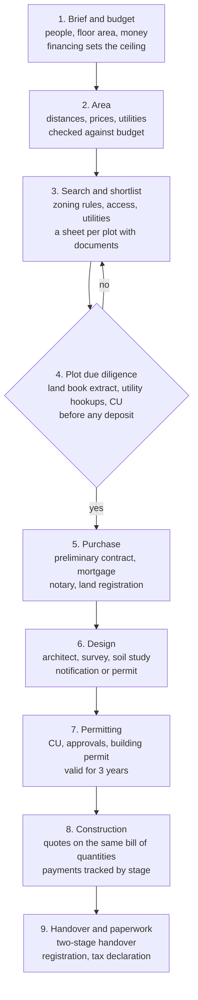
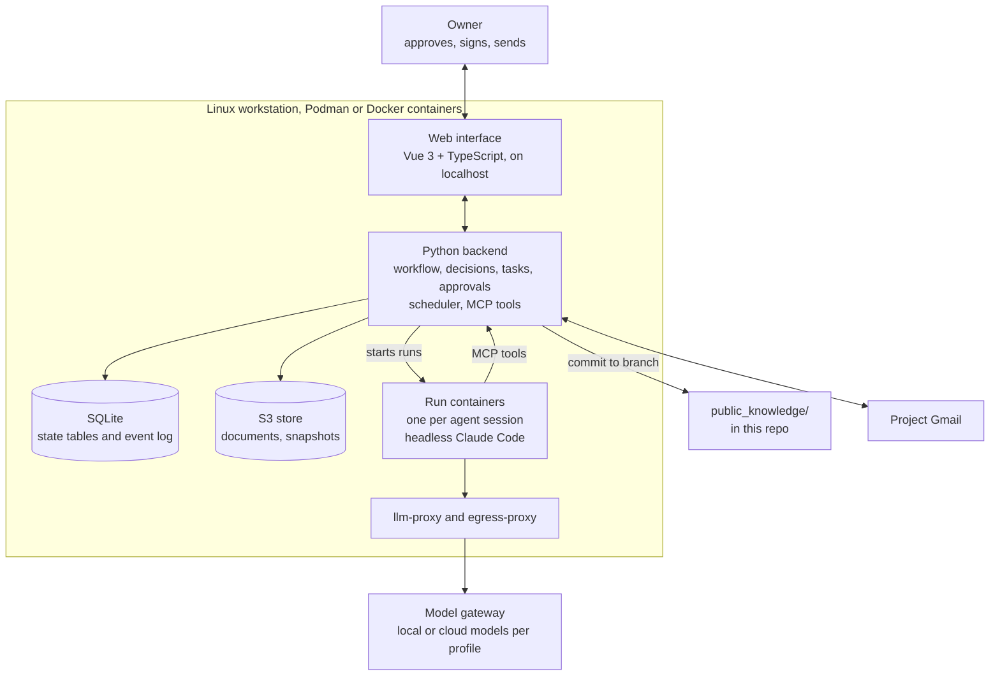

# RFD 1: Tekton — an open-source assistant for building a house in Romania

## Summary

Tekton is an open-source assistant that runs locally on Linux and guides an owner through building a house in Romania, from budget to land registration. AI agents do the heavy lifting: research, searching listing sites, reading documents, checks, drafting and monitoring. The operator does what needs a real identity, a body or a voice: deciding, signing, paying, phone calls and visits, each tracked as an operator task with proof.

The app follows a 9-step workflow with typed decisions and an append-only history. Public knowledge, meaning the steps from Law 169/2026 and the rules for each locality, lives in the `public_knowledge/` directory of this repository, committed and pushed, with changes reviewed by a human.

This RFD is in the *discussion* state: the architecture is settled and most open questions are answered (see the last section). The [functional specification](functional-spec.md) and the [technical specification](technical-spec.md) refine it.

## Problem and context

Building a house in Romania takes years and goes through dozens of steps: notary, town hall, bank, architect, engineers, builders. The most expensive mistakes happen early, when buying a plot that cannot be built on, or only with great difficulty.

The legal framework has just changed. Law 169/2026 (the new Planning and Construction Code) has been in force since 25 August 2026 and replaced Law 50/1991 and Law 350/2001. What LLMs "know" from training is therefore out of date, and practice under the new law is only now taking shape.

Information is fragmented: more than 3,000 town halls have their own General Urban Plan (PUG), often scanned or available only at the counter. The only competitor we identified, SmartAC, offers a paid permitting guide and a directory of specialists, with no agents and no sources cited per claim.

Market context: Romania's National Institute of Statistics (INS) reported 34,602 permits for residential buildings in January–November 2025, about 70% of them in rural areas. Tekton starts as a personal tool for a house built over the next 5 years, but is designed to serve any of these owners.

## Goals and non-goals

Tekton reduces risk and coordination effort; it does not make decisions and does not replace professionals.

**Goals**

- Avoid expensive mistakes before paying any deposit on a plot.
- A map of the process over 5 years, with deadlines tied to the law.
- A budget tracked from brief to handover, with quotes compared line by line on the same items.
- Vetting professionals against official sources: the OAR Register (Romanian Order of Architects) for signing rights, financial statements and court records for builders.
- Every claim an agent makes has a source and a verification date.
- Personal data stays on the user's machine by default; a personal document goes to a cloud model only with the operator's consent for that document.

**Non-goals**

- Legal advice: in Romania it is reserved for lawyers admitted to the bar. Tekton informs and organizes, with sources.
- Autonomous signing or filing: the qualified electronic signature stays with the human.
- Replacing the architect, engineer or notary; they remain the source of truth.
- A hosted service, subscriptions, or commissions on recommendations.
- Reddit and Facebook as the basis for recommendations: the groups are hard to access automatically and the signal is weak.

## Legal framework: Law 169/2026

The new Code (CATUC) was published in Official Gazette no. 661 of 10 August 2026 and applies from 25 August 2026. It has 584 articles; the mandatory forms are in Order 975/2026. Documents issued and applications started before 25 August 2026 stay under the old law.

| Element | What the law says | What it means for Tekton |
| --- | --- | --- |
| Urban planning certificate (CU) | Five types; the list of required approvals is communicated through the CU | The agent picks the right type; the approval list is data, not a guess |
| Building permit | General issuing deadline of 30 days; valid for 3 years; the DTAC becomes the PAC (permit design documentation) | Deadlines and expiry dates on the calendar |
| Notification procedure | Single-family house, ground floor only (P or D+P), no basement, max. 150 m² gross floor area, in the intravilan of a commune, outside protected zones, compliant with the PUG; design approved by the county chief architect; answer within 15 working days, silence = approval | Automatic check: eligible yes / no / to verify |
| Modification permit | Changing the design within the original permit's validity, with no new permit fee | Warning when going back after step 7 |
| Handover | Two stages: on completion of works, and final, when the warranty period ends | Step 9 has two milestones |
| Consequence class | Ground-floor or ground-plus-one-storey houses fall into CC1 | Lighter technical requirements |
| Geoportal and National Single Window | Rolled out in stages over about 5 years | Integrations added as they become available |
| Local infrastructure levy | Optional, set by local councils | Checked per locality, in the repo |

The exclusion of rural localities inside metropolitan areas appears in the law only for outbuildings of up to 50 m², not for the 150 m² house. This is a published interpretation, and practice needs to be watched.

Source text: Law 169/2026, Monitorul Oficial no. 661 of 10 August 2026 (official text on [legislatie.just.ro](https://legislatie.just.ro)); a readable copy is on [autorize.ro](https://autorize.ro/legea-169-2026). The authoritative list of notification conditions, with article references, will be kept in `public_knowledge/lege/169-2026/notificare.yaml`. The architect remains the source of truth for each specific case.

## The 9-step workflow

The steps follow the order in which the cost of mistakes grows. Financing belongs to step 1, because the bank's lending ceiling sets the real budget.



A "no" at plot due diligence sends you back to the shortlist, before any deposit is paid. Steps 1 and 2 validate each other: the price per m² multiplied by the minimum plot size needed must fit within the land budget.

**Interface mechanics**

- Each step shows the earlier decisions it depends on, AI guidance with sources, a decision form, and tasks marked *agent* or *owner*.
- Decisions are typed fields, not free text, for example `casa.suprafata_desfasurata_mp`, `procedura.tinta`, `teren.verdict`. Each has a version, a rationale, sources and an author. Agents only propose values; the operator accepts them next to the field. Values such as `buget.teren_max` are derived by Tekton.
- Step states: blocked, available, in progress, done, needs revalidation. The "Done" button is enabled only when every required decision is set, the step's checks pass, no proposal on a required decision is pending, and no required operator task is open.
- History is an append-only list of events: decision set, step completed, step reopened.
- Going back moves dependent steps to "needs revalidation" and shows the difference, for example "two plots on the shortlist are now over budget".
- Going back when it has a legal cost is flagged: after permitting, a design change requires a modification permit.

Validation example: a ground-floor house with a 150 m² footprint and a land occupancy ratio (POT) of 30% needs a plot of at least 500 m².

## Architecture

Tekton runs entirely on a Linux workstation. What leaves it: public web research (through an egress proxy), model requests through the model gateway (personal documents only with consent), emails from the project mailbox (per message type: draft only or sent after approval), Google OAuth, BNR exchange rates, routing requests for locality coordinates, and `public_knowledge/` commits that the operator pushes.



The owner works in the web interface. The backend owns all state (SQLite and an S3-compatible store); agents change it only through backend tools. Agents run when the operator starts them or on a schedule (watchers: new listings, mailbox, deadlines, stale knowledge).

| Decision | What we chose | Why |
| --- | --- | --- |
| Project model | Free and open source, in `forgeit-co/tekton` | No commissions, no conflict of interest in recommendations, no hosting |
| Runtime | Local, Linux only (Ubuntu, Rocky), in Podman or Docker containers | Data stays with the user; a single kind of environment to test |
| Stack | Python backend (FastAPI), Vue 3 + TypeScript frontend, SQLite, an S3-compatible store (MinIO, provisional), on localhost | Python ecosystem; a typed, human-friendly interface; documents in S3-compatible storage |
| Models | Local and cloud behind an external model gateway; each run has a profile (`cloud` or `local-only`) | Personal documents go to the local profile unless the operator consents per document |
| Orchestration | Custom, in Python: a runner port with a headless Claude Code adapter; each session runs in its own short-lived container | A run stops at an approval request or operator task saved in SQLite; after the answer a new session continues it, even days later |
| Agents | Headless agent sessions with tools (browser, files), plus scheduled watchers | Agents do the heavy lifting; the operator handles identity, payments, calls and visits |
| State | SQLite: typed decisions and append-only events; documents in the S3 store | Full history, going back, and revalidation |
| External actions | Only after the owner's approval | Agents cannot sign; protection against prompt injection |
| Knowledge | `public_knowledge/` in this repo; agents propose, the operator approves, the app commits to a branch, the operator pushes | Per-locality data goes stale; the community keeps it current |

`public_knowledge/` holds public information only, never personal data. Every file has a source and a verification date; the values below are illustrative. Field names are kept in Romanian, matching the source documents.

```yaml
# judete/<judet>/<uat>/zone/l1.yaml
schema: zona/v1
sursa: <link to the local urban regulation or council decision>
verificat: 2026-09-27
status: confirmat
reguli:
  pot_max: 0.30              # max land occupancy ratio
  cut_max: 0.9               # max floor area ratio
  regim_inaltime: P+1        # max height: ground + 1 storey
  retragere_strada_m: 5      # setback from the street, metres
  lot_minim_mp: 500          # minimum plot size, m²
```

## Alternatives considered

The most important rejected alternative is Paperclip AI as the orchestrator; the others were dropped for reasons of data, cost or accountability.

| Alternative | Why we rejected it |
| --- | --- |
| Paperclip AI (coordinators and teams of agents) | Built for "companies without people", with agents that wake up periodically and act on their own; building a house happens in bursts, with a human in the loop. Launched on 4 March 2026, it is still early, while this project needs 5 years of stability. It brings Node.js 20, embedded PostgreSQL and external agents (Claude Code, Codex, Gemini), a heavy dependency to distribute. |
| Paid product or open core | Commissions create a conflict of interest in recommendations; hosting brings costs and GDPR risk; the legal positioning is more delicate for a paid service. |
| Cloud models only | Personal documents (land book extracts, contracts, ID documents) would leave the workstation. |
| Local models only | Reading a ~100-page local urban regulation in Romanian needs a serious GPU; research on public data works well in the cloud. |
| Agents that send emails and applications on their own | Digital filings require a qualified electronic signature; an agent that reads the web and can send messages is exposed to prompt injection. Emails go out only as drafts or after approval, per message type. |
| PydanticAI short calls as the only agent mechanism | We would rebuild browsing, file handling and tool loops that headless coding agents already have; agents here do long research, not single calls. |
| A separate public knowledge repository | Two repos to keep in sync; a directory in this repo is versioned with the code that reads it. |
| Reddit and Facebook as the main source for recommendations | The groups are practically inaccessible to automation, and the signal is weak. Official sources (OAR Register, financial statements, court records) say more. |

## Risks and security

The main risk is not technical but maintenance: per-locality data and practice under the new law change faster than a single person can keep up with.

| Risk | Mitigation |
| --- | --- |
| Knowledge goes stale | A `verificat` field on every file; watchers reverify old files and propose updates; we look for a community host, for example Code for Romania (about 2,000 volunteers). |
| Models "know" the old law | Agents work only from cited, dated sources; without a source, a claim does not appear in the interface. |
| Practice under Law 169/2026 is still forming | Uncertain interpretations are marked "to verify"; the architect and notary decide the specific case. |
| Prompt injection from web pages and emails | Every outward-facing write requires approval; agents change state only through backend tools; agents that read the web or mail cannot send. |
| Personal data sent to the cloud | Documents and everything derived from them are `local only` by default; agents run in tiers (web, cloud, local only) and web-browsing agents see only public data and the brief they need; the local-only model allowlist is enforced by Tekton's `llm-proxy`; cloud use needs the operator's consent, recorded as an event. |
| Compromised worker writing into the operator's `.git` | Hooks and git config are read-only inside the container and hooks are disabled for Tekton's commits; the remaining risk (objects and refs) is accepted, and the operator reviews `knowledge/*` branches before pushing. |
| Legal positioning | Tekton presents itself as information and organization with sources, not advice; the wording is validated with a lawyer. |
| Hardware for the local model | Local models are reached through the gateway; without one, `local only` documents wait and the UI says so. |
| Listing sites' terms of use | Rate-limited collection of public search pages; sources snapshotted; sites excluded on request. Page budgets and block detection run in the agent's browser tool, so they are advisory against a hijacked session; the egress proxy enforces per-host connection limits. |

## Open questions

Answered on 2026-09-27; the details are in the specifications.

- [x] First module after the skeleton: build in workflow order; v1 covers the foundation and steps 1–4.
- [x] Emails: configurable per message type, *draft only* or *send after approval*, from a dedicated project Gmail.
- [x] Users per instance: one operator in v1; every event records its author, so a partner can be added later.
- [x] The schema of files in `public_knowledge/`: common header (`sursa`, `verificat`, `status`) and JSON Schemas in `_schema/` (technical spec §11).
- [ ] Review rules for knowledge PRs from other users.
- [ ] Long-term community home for `public_knowledge/`: `forgeit-co/tekton` for now.
- [ ] How to handle 150 m² houses in rural localities inside metropolitan areas until practice is clear (marked *de verificat* meanwhile).
- [ ] Validating the "information, not advice" wording with a lawyer.
- [ ] The open-source licence for the code and for `public_knowledge/` (e.g. AGPL-3.0 for code, CC BY-SA 4.0 for knowledge).
