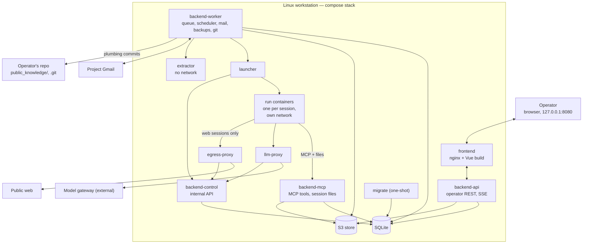

# Tekton — Technical specification

This document describes **how Tekton is built**. It implements the [functional specification](functional-spec.md) (FS); [RFD 1](rfd-0001.md) is the base. Items marked **[v1]** are in the first release.

## 1. Fixed contracts

These are expensive to change later and are defined here; everything else (libraries, tooling) is a recommendation and can be swapped.

| Contract | Section |
| --- | --- |
| Event vocabulary, event envelope, SSE messages | §5.3, §5.4, §14.4 |
| Decision keys, value types, subjects | §5.5, §14.1, FS §4 |
| Privacy classes, tiers, propagation | §6 |
| Agent views (`sql_query` surface), versioned | §6.5 |
| Agent result envelope, `suspend` payload | §7.5, §7.6 |
| MCP tools and the session file API | §8 |
| Internal API and launcher API | §4.3 |
| Knowledge file format and paths | §11 |
| REST API and error format | §14 |
| Enum wire values (`snake_case`) | FS, §14.1 |

## 2. System overview



- The **backend** is one Python package with five entrypoints: `backend-api` (the operator's REST and SSE), `backend-control` (the internal API for the edge services), `backend-mcp` (the only service that talks to agent sessions), `backend-worker` and `migrate`. All state changes go through its use cases.
- **Every agent session runs in its own short-lived container on its own network**, started by `launcher`. A container holds only its own session token and a private scratch directory.
- **`llm-proxy`** checks the session token, enforces the session's model allowlist and forwards to the external **model gateway**. The gateway key never enters a run container.
- **`egress-proxy`** is the only route to the internet for web sessions. It denies every non-public address and applies per-site limits.
- Nothing is published outside `127.0.0.1`.

## 3. Repository layout

```
tekton/
  backend/
    pyproject.toml, uv.lock        Python 3.14, uv
    project_structure.md           module map and rules (M0a)
    src/tekton/
      kernel/                      Money, Area, Ratio, UnitPrice, Cost, ContentPrivacyClass,
                                   PrivacyClass, Ulid, StepId, SubjectRef, SourceId, Clock port,
                                   DomainError base, spec protocols
      domain/<module>/             entities, value objects, rules, ports — framework-free
      application/<module>/        use cases, event subscribers, approval handlers
      application/shared/          UnitOfWork, ReadOnlyUnitOfWork, Actor
      application/eventlog/contracts/  event payload models and upcasters (Pydantic)
      infrastructure/<module>/     repositories, mappers, S3, Gmail, git, launcher client,
                                   BNR, routing, sessions/claude_code (Runner adapter)
      presentation/
        api/<module>/              operator REST routers
        stream/                    SSE
        control/                   internal API
        mcp/                       MCP tools and session files
      composition/                 core.py + one composer per entrypoint
      entrypoints/                 api.py, control.py, mcp.py, worker.py, migrate.py
    migrations/                    Alembic; agent_views.py
    tests/{unit,application,integration,api,contract,e2e,support}/
    tests/fixtures/{events,values,releases,transcripts}/
  edge/                            separate small package, no domain code
    llm_proxy/  launcher/  egress_proxy/
  frontend/
    project_structure.md           feature/domain map and rules (M0a)
    src/{app,features,shared/domains,shared/foundation}/
    tests/{unit,component,e2e}/
  agents/<name>/                   definition.yaml (references prompt.md, result.schema.json)
  images/
    backend/ frontend/ edge/ extractor/ egress-proxy/
    run/                           Dockerfile, package-lock.json (CLI with integrity hashes),
                                   browser-mcp/ (Tekton's wrapper around Playwright MCP)
  public_knowledge/                committed and pushed (§11)
  evals/<agent>/                   synthetic fixtures, expected outputs, threshold.yaml, report.json
  deploy/                          compose.yaml, .env.example, nginx.conf
  docs/
  justfile                         init, up, down, open, logs, backup, restore, upgrade, rollback,
                                   rotate-secrets, map-fetch, api-types, eval, release-fixture,
                                   test, lint
  .gitignore                       data/, s3/, backups/, deploy/.env
```

The layout is layer-first; within each layer, one package per module (§5.1). Modules without domain rules (`auth`, `backup`, `health`, `scheduling`, `settings`, `eventlog`) have no `domain/` package. v1 runs from a clone of the repository (the knowledge flow needs it); packaged installs are out of scope.

## 4. Runtime and deployment [v1]

### 4.1 Services and networks

| Service | Image | Networks | Notes |
| --- | --- | --- | --- |
| `frontend` | `images/frontend` | `edge` | Published on `127.0.0.1:8080`. `server_name 127.0.0.1` plus a `default_server` returning 444; `localhost` redirects to `127.0.0.1`. Proxies `/api/` to `backend-api:8000` with `proxy_set_header Host $http_host`; `client_max_body_size 51m` on `/api/v1/documents`, 1 MB elsewhere; `error_page` 413/502/504 return problem+json; SSE locations use `proxy_buffering off`, `proxy_read_timeout 1h`; other paths fall back to `index.html`. Sets the app CSP (§16) |
| `migrate` | `images/backend` | `data` | One-shot (`restart: "no"`): waits for `s3`; checks free disk space (twice the database size); takes a `pre-migrate` snapshot unless `data/upgrade-state.json` already names one, the database is empty, or `current = head` (then `migrate.noop`); refuses to migrate without a snapshot; runs the migrations; provisions buckets and S3 policies; recreates agent views |
| `backend-api` | `images/backend` | `edge`, `data` | Operator API and SSE on `:8000` |
| `backend-control` | `images/backend` | `control`, `data` | Internal API on `:8002` (§4.3) |
| `backend-mcp` | `images/backend` | `data`, `control`, per-session run networks | MCP tools and session files on `:8001` |
| `backend-worker` | `images/backend` | `data`, `control`, `extract`, `internet` | Run queue, scheduler, bus consumers, Gmail, BNR, routing, backups, knowledge commits, projection recompute |
| `llm-proxy` | `images/edge` | `control`, `gateway`, per-session run networks | §7.7 |
| `launcher` | `images/edge` | `control` | The only service with the container engine socket; §4.3 |
| `extractor` | `images/extractor` | `extract` | poppler, tesseract (`ron`); no internet, no secrets, CPU/memory/time limits |
| `egress-proxy` | `images/egress-proxy` | `control`, `internet`, per-session web networks | §7.3 |
| `s3` | MinIO, pinned by digest (provisional, §21) | `data` | Buckets and per-service policies in §10 |

- **Networks:** `control`, `extract` and `data` are `internal: true`; `internet` and `gateway` route outward (the gateway is a host address through `host-gateway`, or a compose service). For each session the launcher creates an internal network `run-<session>`, connects the run container, `backend-mcp`, `llm-proxy` and (web sessions only) `egress-proxy` to it, and removes it when the session ends; run containers therefore cannot reach each other. The resolver on run networks answers service names only; an external lookup fails.
- **Mounts:** `data/` (SQLite; `backend-api`, `backend-control`, `backend-mcp`, `backend-worker`, `migrate`), the backup target (`backend-worker`, `migrate`), `data/llm-proxy/` (`llm-proxy` usage spool), `public_knowledge/` read-only (`backend-api`, `backend-mcp`, `backend-worker`), and `/repo/.git` read-write in `backend-worker` only, with `/repo/.git/hooks` and `/repo/.git/config` mounted read-only over it. On Rocky/SELinux, shared mounts use `:z`. `backend-worker` runs with the operator's UID (`userns_mode: keep-id` on Podman), so git objects stay owned by the operator.
- **Secrets** are file-based compose `secrets:` scoped per service (§16.1); there is no shared `env_file`.
- **Startup order:** `s3` (healthy) → `migrate` (completed) → `backend-api`, `backend-control`, `backend-mcp`, `backend-worker`, `llm-proxy`, `launcher`, `extractor`, `egress-proxy` → `frontend`. Backend services refuse to start when `alembic current ≠ head` (`startup.schema_mismatch`). Every long-running service has a healthcheck; `restart: unless-stopped`.
- **Logs:** services log JSON to stdout; the engine's `json-file` driver keeps 5 × 20 MB per service; `just logs [service]` reads them. Run containers use `--log-driver=none` (§4.2).
- **Images:** published images are tagged with the Tekton release and pinned by digest. `images/run` is built locally at `just init`/`just upgrade` from a pinned base digest, with the Claude Code CLI installed from `package-lock.json` (integrity hashes); the resulting digest is recorded in `data/run-image.lock`.
- **Engines:** rootless Podman (reference) or rootless Docker. A rootful engine works but weakens the boundaries in §16; the health page shows it.

### 4.2 Container hardening

All services and run containers run as non-root with `no-new-privileges`, `cap_drop: [ALL]`, a read-only root filesystem with `tmpfs` scratch, and `pids`/memory/CPU limits. Run containers also get a wall-clock limit, the label `tekton.run=<run_id>`, and `--log-driver=none`.

### 4.3 Internal API and launcher API

**`backend-control`** (`:8002`, network `control`); each caller has its own credential (§16.1):

| Endpoint | Caller | Purpose |
| --- | --- | --- |
| `POST /internal/tokens/verify` | `llm-proxy`, `egress-proxy`, `backend-mcp` | Session token → `{run_id, session_id, tier, models, prices, tools, expires_at}`; callers cache for 30 s (an accepted revocation delay) and fail closed when unreachable |
| `POST /internal/usage` | `llm-proxy` | Token usage per session (batched, idempotent by spool id) |
| `GET /internal/egress/config` | `egress-proxy` | Listing-site limits and paused sites |
| `POST /internal/egress/events` | `egress-proxy` | Connection records (host, session, bytes), written **before** the tunnel is relayed; refusals |
| `GET /internal/sessions/{id}` | `launcher` | Session spec, including the session token, returned **once** |
| `POST /internal/sessions/{id}/log` | `launcher` | Batched opaque output chunks (up to 50 lines or 1 s; 64 KB per line, 50 MB per session), idempotent by line number |
| `POST /internal/sessions/{id}/heartbeat`, `/exit` | `launcher` | Liveness every 15 s; exit status |

When `backend-control` is unreachable, `llm-proxy` answers `503 gateway.unavailable` (never 401), and the launcher keeps heartbeats queued.

**`launcher`** (`:8003`, network `control`, worker credential only): `POST /sessions {run_id, session_id}`, `DELETE /sessions/{id}` (kill), `GET /sessions` (running containers by label). It accepts nothing else. On restart it re-attaches to running `tekton.run` containers and resumes forwarding; containers without a live session are removed.

## 5. Backend architecture [v1]

### 5.1 Modules and layering

| Module | Responsibility |
| --- | --- |
| `workflow` | Step definitions, the step transition table, can-complete |
| `projections` | Registries of derived values and checks, the dependency graph, `RevalidationService`, projection repositories, input loaders |
| `decisions` | Decision registry, decisions, overrides |
| `proposals` | Agent proposals and their resolution |
| `eligibility` | Notification-eligibility rules |
| `plots` | Plots, plot facts, listings, aliases |
| `localities` | Localities, UATs, listing samples, validation rules |
| `budget` | Categories, commitments, payments |
| `fx` | Exchange rates and conversion |
| `tasks` | Operator tasks, proof parts, proof check state |
| `approvals` | Approval requests and per-kind handlers |
| `privacy` | Classes, tiers, propagation, session watermarks, consent grants |
| `documents` | Documents, links, extraction jobs |
| `sources` | Citation records, snapshots, provenance |
| `runs` | Run lifecycle, queue, reconciliation |
| `sessions` | Sessions, tokens, the `Runner` and `Launcher` ports |
| `metering` | Usage, prices, caps |
| `mail` | Gmail sync, threads, sender rules, outbox |
| `knowledge` | `KnowledgeReader`/`KnowledgeWriter` ports, validation, overlay |
| `deadlines` | Legal deadline rules, holidays, reminders |
| `scheduling` | Scheduled jobs |
| `eventlog` | Events, upcasters, consumers |
| `notifications` | In-app notifications |
| `settings`, `auth`, `backup`, `health` | Settings, operator session, backup/restore/upgrade state, probes |

- **Layers:** `presentation → application → domain → kernel`; `infrastructure` implements ports and is wired only in `composition/`. import-linter contracts are generated from the DAG below: a `layers` contract, "domain and kernel import no framework", and one `forbidden` contract per domain module listing every module outside its allowed dependencies.
- **Allowed domain dependencies** (besides `kernel`; anything else fails CI):

| Module | May import |
| --- | --- |
| `privacy`, `knowledge`, `sources`, `documents`, `fx` | — |
| `decisions` | `privacy` |
| `proposals` | `decisions`, `privacy` |
| `localities` | `decisions`, `knowledge`, `fx`, `privacy` |
| `plots` | `decisions`, `localities`, `privacy` |
| `eligibility` | `decisions`, `plots`, `localities`, `knowledge` |
| `budget` | `decisions`, `fx`, `privacy` |
| `tasks` | `budget`, `privacy` |
| `deadlines` | `knowledge` |
| `projections` | `decisions`, `privacy` (other modules register into it) |
| `workflow` | `projections`, `decisions` |

- **Registration:** each module registers its decision specs, derived specs, checks, input loaders and step contributions into `projections` and `workflow` through ports, from `composition/core.py`. Across modules, entities are referenced by id only.
- **Composition:** `composition/core.py` builds shared pieces; `composition/api.py`, `control.py`, `mcp.py`, `worker.py` and `migrate.py` add only what their entrypoint needs. A test asserts that `mcp` wires no Gmail, git or backup adapter.
- **Persistence style:** domain entities are plain dataclasses that record dataclass domain events; stored JSON values (`prepared`, `continuation`, decision values) are domain dataclasses with Pydantic mappers in infrastructure and presentation. SQLAlchemy 2 with imperative mapping; repositories per aggregate, declared as domain ports; one `UnitOfWork` port exposing named repository attributes, with explicit `commit()`, plus a `ReadOnlyUnitOfWork`. `uow_factory(actor)` stamps an `Actor` (author kind, id, causation id) on every event collected at commit; a test per entrypoint checks it.
- **Rule inputs are typed:** each derived value and check takes a frozen input dataclass; the module's registered `InputLoader` builds it from the UoW; a startup validator compares its fields with the declared `depends_on`.
- **Errors:** `DomainError(code, params)` for rule violations; `ApplicationError` for use-case failures (not found, conflicts, `RunStateConflict`); `InfrastructureError` for adapters (storage, gateway, Gmail), with repositories translating integrity errors. Presentation maps codes to HTTP statuses (§14.1) and to MCP errors; a test checks that every subclass is mapped for both.
- **Cross-module reactions** that need I/O go through event consumers (§5.3). **Synchronous exceptions:** revalidation (§5.6); approval handlers, which run inside the approve UoW (the knowledge handler writes the overlay row and revalidates; the consent handler grants or lowers classes; the email handler marks the outbox row approved); task completion, which records the payment in the same use case.
- **Worker concurrency:** one `anyio` task group per concern (run dispatcher, lease keeper, reconciliation, bus consumers, scheduler, mail, backup, git); blocking work runs through `to_thread`/`run_process` with a `CapacityLimiter(1)` per kind; reconciliation never waits on other groups; a job that runs longer than its interval logs `worker.job_overrun`.

### 5.2 SQLite

- Every connection: `journal_mode=WAL`, `busy_timeout=5000`, `synchronous=NORMAL`, `foreign_keys=ON`, `isolation_level=None`. The UoW kind decides the transaction: a write UoW emits `BEGIN IMMEDIATE`, a read UoW `BEGIN DEFERRED`.
- Money, rates and ratios are stored as text through a `DecimalText` type; instants as UTC text loaded as aware datetimes.
- A use case is one synchronous `execute()` run through `anyio.to_thread` with a database `CapacityLimiter`; `sql_query` has its own limiter. Routers inject a UoW factory, never a UoW.
- **No network or S3 I/O inside a write UoW.** Files go to S3 before the row that references them; Gmail, git, extraction and routing run in the worker and commit their results in short transactions.
- `SQLITE_BUSY` after the timeout maps to `503 db.busy` with `Retry-After`; the worker retries with jitter. A lock wait over 2 s logs `db.lock_wait`.
- **Migrations:** Alembic with `render_as_batch=True` and `transactional_ddl=True`; `env.py` opens one explicit transaction for all pending migrations on a connection with `foreign_keys=OFF`; afterwards `PRAGMA foreign_key_check` must return nothing, otherwise everything is rolled back. The agent views are dropped once before `upgrade head` and recreated once after, from `migrations/agent_views.py`. Migrations are forward-only and never squashed once a release is tagged. Every data-transforming migration has its own test that loads fixtures through the repositories.

### 5.3 Event log and bus

Tekton is **event-logged**: the tables are the source of truth, and every change also appends an event in the same transaction. Events serve the history, the audit trail and the bus; state is not rebuilt by replay. Events are never pruned.

```
events(
  seq             INTEGER PRIMARY KEY,   -- order within a database epoch
  id              TEXT UNIQUE,           -- ULID
  at              TEXT,                  -- UTC
  author_kind     TEXT,                  -- operator | agent_run | scheduled_job | system
  author_id       TEXT,
  type            TEXT,                  -- vocabulary §5.4
  payload_version INTEGER NOT NULL,
  subject_type    TEXT NOT NULL,         -- EventSubjectType
  subject_id      TEXT NOT NULL,
  subject_version INTEGER,               -- the subject resource's version after the change
  causation_id    TEXT,                  -- X-Request-Id, event id, or run id
  privacy         TEXT NOT NULL,         -- §6
  payload         TEXT                   -- JSON
)
meta(key, value)                          -- includes db_epoch, regenerated by restore
```

- **Payload versions:** each `(type, version)` has a Pydantic model in `application/eventlog/contracts/`; upcasters turn any old version into the latest before it is returned or consumed. Stored JSON values (decision values, proposals, continuations, `prepared`, settings) follow the same rule with a `*_version` column. For every stored `(kind, version)` the fixture corpus holds an input and an `expected_latest.json`; a test upcasts, validates and compares, and CI fails when a registered pair has no fixture.
- **Consumers** (one runner each; the offset update is a compare-and-set on `seq`, committed with the handler's writes):

| Consumer | Process | Consumes |
| --- | --- | --- |
| `run-resumer` | worker | `approval.approved`, `approval.rejected`, `approval.expired`, `task.verified`, `task.completed`, `task.cancelled`, `consent.granted`, `mail.connected` |
| `proof-check-queuer` | worker | `task.completed` |
| `extraction-queuer` | worker | `document.stored` |
| `distances-queuer` | worker | `locality.added` |
| `knowledge-committer` | worker | `knowledge.approved` |
| `mail-outbox` | worker | `approval.approved` (kind `email_send`) |
| `notifier` | worker | events that create notifications |

- A handler failure that is transient (`db.busy`, storage or network errors) is retried with backoff without counting. Other failures are retried 5 times; then the event goes to `consumer_failures`, the offset advances, `bus.handler_failed` is logged and the operator is notified. The health page lists failures with a **retry** action. Consumer lag above 60 s logs `bus.consumer_lag_high`.
- A consumer's offset row is created by the migration that introduces it, at the current max `seq`; a consumer without an offset row fails startup.
- **SSE fan-out** is not a consumer: `backend-api` polls `seq > last` every 250 ms (backing off to 1 s when idle) and fans out to connected clients.

### 5.4 Event vocabulary (v1)

| Area | Events |
| --- | --- |
| Steps | `step.started`, `step.completed`, `step.reopened`, `step.revalidation_required`, `step.revalidated`, `step.not_applicable`, `step.applicable` |
| Decisions | `decision.set`, `decision.privacy_changed`, `decision.override_set`, `decision.override_cleared` |
| Proposals | `proposal.created`, `proposal.accepted`, `proposal.rejected`, `proposal.superseded`, `proposal.stale` |
| Projections | `derived.changed`, `check.changed`, `eligibility.changed` |
| Plots, localities | `plot.added`, `plot.updated`, `plot.listing_linked`, `plot.merge_suggested`, `plot.merged`, `plot.dismissed`, `locality.added`, `locality.updated`, `locality.sample_added` |
| Operator tasks | `task.created`, `task.started`, `task.proof_attached`, `task.payee_confirmed`, `task.completed`, `task.verified`, `task.proof_mismatch`, `task.cancelled` |
| Approvals, consent | `approval.requested`, `approval.approved`, `approval.rejected`, `approval.expired`, `consent.granted` |
| Documents, sources | `document.stored`, `document.extracted`, `document.extraction_failed`, `document.privacy_changed`, `source.stored` |
| Runs | `run.queued`, `run.started`, `run.waiting`, `run.resumed`, `run.retry_scheduled`, `run.succeeded`, `run.partial`, `run.failed`, `run.cancelled` |
| Mail | `mail.connected`, `mail.disconnected`, `mail.received`, `mail.draft_created`, `mail.draft_pushed`, `mail.sent`, `mail.send_failed`, `mail.thread_privacy_changed`, `mail.sender_privacy_changed` |
| Knowledge | `knowledge.proposed`, `knowledge.approved`, `knowledge.rejected`, `knowledge.committed`, `knowledge.overlay_retired`, `knowledge.overlay_dropped` |
| Budget, FX | `commitment.recorded`, `commitment.updated`, `commitment.withdrawn`, `payment.recorded`, `payment.verified`, `payment.disputed`, `payment.superseded`, `fx.rate_stored` |
| Scheduling | `job.updated`, `job.paused`, `job.resumed`, `job.triggered`, `job.failed`, `deadline.created`, `deadline.reminder_due` |
| Settings, system | `settings.changed` (never with secret values), `backup.completed`, `backup.failed`, `upgrade.completed`, `upgrade.failed`, `privacy.profile_check_failed` |
| Notifications | `notification.created`, `notification.read` |

`blocked → available` is computed, not an event. `EventSubjectType` = `SubjectType` (§5.5) plus `run`, `session`, `job`, `approval`, `task`, `document`, `source`, `thread`, `knowledge_change`, `commitment`, `payment`, `notification`, `system`; each maps to a route or to none, and a test checks every event type's subject against it.

### 5.5 Decisions, proposals and derived values

```python
DecisionSpec(
    key="casa.suprafata_desfasurata_mp",
    scope=SubjectType.PROJECT,          # PROJECT | PLOT | LOCALITY
    value_type=AreaType(min=Decimal("1")),
    required=RequiredAlways(),          # or RequiredWhen(predicate)
)
DerivedSpec(
    key="locality.pret_mp",
    scope=SubjectType.LOCALITY,
    depends_on=(EntityField("locality.samples"),),
    compute=price_per_m2,               # Callable[[PricePerM2Inputs], UnitPrice | None]
    overridable=False,
)
Check(
    key="zona.validare",
    scope=SubjectType.LOCALITY,
    depends_on=(DerivedKey("buget.teren_max"), DecisionKey("casa.amprenta_mp"),
                DecisionKey("casa.suprafata_desfasurata_mp"), DerivedKey("locality.pret_mp"),
                KnowledgeFile("judete/*/*/zone/*.yaml"), FxRate("EUR")),
    evaluate=locality_fits_budget,      # → CheckResult: pass | fail | de_verificat
)
```

Specs are frozen, slotted dataclasses with tuple fields.

- **Subjects:** `SubjectRef` is a union discriminated on `type`: `{type: "project", id: "project"}`, `{type: "plot" | "locality", id: <ULID>}`. The ULID pattern applies to entity ids only.
- **Value types** (value objects in `kernel` where shared, in `decisions` otherwise; descriptors are named `AreaType`, `MoneyType`, …): `Integer`, `Boolean`, `Enum`, `Money`, `Area`, `Ratio`, `RoomList`, `CategoryAllocation`, `DistanceCriteria`, `EntityRef`, `EntityRefList`, `Verdict`. The authoritative v1 keys are the tables in FS §4; a snapshot test fails on any rename; a rename is a data migration with an alias and its own test.
- **Decisions:** `decisions(key, subject_type, subject_id, version, value, value_version, rationale, source_ids, author_kind, author_id, causation_id, set_at, privacy)`, `UNIQUE(key, subject_type, subject_id, version)`; the current value is the highest version, written in one write UoW with the expected version.
- **Proposals:** `proposals(id, key, subject_type, subject_id, base_version, value, value_version, rationale, source_ids, run_id, status, privacy)`. `source_ids` must be non-empty. A new proposal for the same key and subject supersedes the pending one. If the decision's version moved past `base_version`, the proposal becomes `stale` and is shown as such (for list values the operator sees both). Only operator requests produce `decision.set`.
- **Privacy of accepted values:** `max(operator, proposal.privacy)`; the accept dialog can lower it (`decision.privacy_changed`).
- **Projections:** `derived_values(key, subject_type, subject_id, value, inputs_hash, computed_at, privacy)`, `check_results(key, subject_type, subject_id, result, details, computed_at, privacy)` (details include the frozen FX rate and its date), `overrides(key, subject_type, subject_id, value, set_at)`, `eligibility_results(subject_type, subject_id, status, conditions, privacy)`. Each projection's class is the max of its inputs'.
- **Step membership** lives only in `workflow`'s step definitions; `?step=` filters resolve through them.
- **Completion requirements** per step name the key or check, a quantifier (`all_subjects`, `any_subject`, `selected_subject(key)`, `subjects_in(key)`), and `accepts_de_verificat` (shown as a warning when true).

### 5.6 Dependency graph and revalidation

- Node types: `DecisionKey`, `DerivedKey`, `CheckKey`, `EntityField`, `KnowledgeFile(glob)`, `FxRate(currency)`, `EligibilityKey`, `StepId`. Edges come from `depends_on`; each step lists what it owns. The reverse index is built at startup and validated (no unknown nodes, no cycles).
- **Revalidation is synchronous.** `UoW.commit()` maps the recorded domain events to changed nodes (a registry-driven mapping, with a test that every node-changing event type is mapped) and calls `RevalidationService` before committing, so `needs_revalidation` is committed together with the change, whichever entrypoint made it. `POST /steps/{id}/complete` re-evaluates can-complete inside its own `BEGIN IMMEDIATE`.
- **Fan-out:** a change is evaluated for these subjects only:

| Changed node scope | Evaluated subjects |
| --- | --- |
| `PROJECT` → `LOCALITY` checks | Localities in `zona.localitati` |
| `PROJECT` → `PLOT` checks | Plots in the active shortlist and candidates not `respins` |
| `LOCALITY` → `PLOT` checks | Plots in that locality, not `respins` |
| Same scope | The subject itself |

- A check change moves a `done` step to `needs_revalidation` only if one of the step's completion requirements selects that subject (e.g. step 3 is not affected by a new candidate; step 2 only by localities in `zona.localitati`).
- **External triggers:** the BNR job calls revalidation for `FxRate` when the rate moved more than 2% from the rate frozen in an affected check; a knowledge watcher (file mtimes, every minute) and `knowledge.*` handlers call it for `KnowledgeFile`; `task.proof_mismatch` re-evaluates can-complete for the task's step.
- **Bounds:** synchronous revalidation touches only the fanned-out subjects; if a change would evaluate more than 200 subject checks, the UoW records `projections.recompute_requested` for those and the worker completes them in batches. `projections.recompute` (a worker startup job, keyed by release and knowledge tree hash, and on request) processes one subject per short UoW, writes only on change, and is safe to rerun; with an unchanged tree it produces no `check.changed` events.
- **Impact** is a list of `{code, params}` items; the frontend owns the wording. `GET /steps/{id}/reopen-impact` and `POST /decisions/{key}/preview` return it without writing.

### 5.7 Steps

- Step ids are the `StepId` enum: `"1"` … `"6"`, `"7a"`, `"7n"`, `"8"`, `"9"`. Step 8 depends on `[["7a"], ["7n"]]`.
- The transitions are the FS §4.1 table (authoritative), implemented as a pure table in `domain/workflow/step_state.py` with a unit test per row, including `display_state` masking and the `not_applicable` exit (`step.applicable` when `proiect.procedura` changes back).
- Decisions of a step whose `display_state` is `blocked` can still be set; the step's stored state follows the table.
- A task is **resolved** when it is `completed` and its check is `verified` or not applicable, or `cancelled`.
- Each step resource carries `state`, `display_state`, `release` (`v1`, `v2`, …), `can_complete`, `blocking[]` (codes, params and a `target`), `next_action` (`{code, params, target}` where `target` is a `SubjectRef` or `{type: "step_panel", step_id, panel}`), and the home summary carries `current_step_id` (the first step not `done`).

### 5.8 Eligibility

`evaluate_eligibility(inputs: EligibilityInputs, rules: NotificationRules) -> EligibilityResult`. `NotificationRules` is loaded from `public_knowledge/lege/169-2026/notificare.yaml`; the file maps each condition to its input (decision key, plot fact, locality or UAT field) and its article. Results are stored per subject (`project`, each plot, each locality) and recomputed through revalidation (`EligibilityKey` nodes). A missing or invalid rules file gives `de_verificat` with `rules_unavailable` and logs `knowledge.invalid`.

### 5.9 Budget, estimates and currency

- `Money(amount, currency: RON | EUR)`; `UnitPrice(amount, currency, per: m2)`; `Cost(amount, currency: USD)` for model usage.
- **Deterministic estimates:** Tekton computes, as derived values, the planned amount per category from the brief and researched unit costs (`cost facts`: public, sourced, stored by `cost-researcher`), and `finantare.credit_estimat` from the declared income and researched lending rules (maximum debt-to-income ratio, rate, term, down payment; public, sourced, stored by `lending-researcher`). Agents propose `buget.categorii` and `finantare.credit_max` from these derived values; no agent reads the operator's income.
- **FX** (`fx` module): `ExchangeRates` port with a BNR adapter (timeouts 10 s, 3 retries); daily rates in `fx_rates(on, currency, rate)` with 4 decimals. A conversion uses the last rate on or before its date and returns `ConvertedMoney {original, ron, rate, rate_on}`. A missing rate gives `de_verificat` (`fx.rate_missing`); a rate older than 3 banking days logs `fx.rate_stale`.
- `commitments(id, category, amount, currency, source, created_at, version)` — operator-entered in v1, editable and withdrawable.
- `payments(id, task_id, category, amount, currency, ron_amount, rate_on, paid_on, receipt_document_id, receipt_sha256, status: unverified|verified|disputed|superseded)`, with a partial unique index on `(task_id, receipt_sha256) WHERE status <> 'superseded'`. Completing a task whose payment is `disputed` first marks it `superseded`, then records the new one. "Paid" sums `unverified` and `verified` only.

### 5.10 Table catalogue (v1)

| Table | Key | `privacy` | `version` |
| --- | --- | --- | --- |
| `events`, `meta`, `consumer_offsets`, `consumer_failures` | seq / key / consumer / id | events only | — |
| `decisions`, `overrides`, `proposals` | §5.5 | yes (not overrides) | per row / proposals |
| `derived_values`, `check_results`, `eligibility_results` | key + subject | yes | — |
| `steps` | step_id | — | yes |
| `plots`, `plot_facts`, `plot_listings`, `plot_aliases` | ULID / plot + field / site + listing id / alias | facts, listings | plots |
| `localities`, `locality_facts`, `listing_samples`, `cost_facts`, `lending_rules` | SIRUTA / … | yes | localities |
| `commitments`, `payments`, `fx_rates` | ULID / ULID / on + currency | — | commitments |
| `tasks`, `approvals`, `consent_grants` | ULID | yes | tasks, approvals |
| `documents`, `document_links`, `document_text`, `extraction_jobs`, `sources` | ULID / … | documents, text, sources | — |
| `runs`, `sessions`, `session_tokens`, `session_privacy`, `tool_invocations`, `run_log` | ULID / … | runs, tool_invocations, run_log | runs |
| `usage`, `prices` | session + spool id / model | — | — |
| `mail_threads`, `mail_messages`, `mail_sender_rules`, `outbox`, `oauth_pending` | ULID / gmail id / address / ULID / state | threads, messages, outbox | outbox |
| `knowledge_overlay`, `knowledge_changes` | path + approval id | yes | — |
| `scheduled_jobs`, `deadlines`, `notifications` | ULID | deadlines, notifications | jobs |
| `settings` (non-secret), `rest_idempotency`, `login_tokens`, `worker_heartbeat` | section / key / hash / process | — | settings (per section) |

Tables outside the agent views are never exposed to MCP; a schema test checks that every table in a view has `privacy`.

**Retention** (a daily `retention` job): `run_log` 30 days; `tool_invocations` 90 days after the run ends; `rest_idempotency` 24 hours; `session_tokens`, `session_privacy` 30 days after expiry; `login_tokens`, `oauth_pending` after use or expiry; read `notifications` 180 days; listing snapshots of `respins` plots 1 year; `transcripts` per setting. `events` are never pruned.

## 6. Privacy model [v1]

### 6.1 Classes

| Class | Meaning |
| --- | --- |
| `public` | Public web content, knowledge, listings, researched costs and rules |
| `operator` | What the operator types: decisions, rationale, settings |
| `personal_cloud` | Personal data the operator released to cloud models |
| `personal_local` | Personal data; the default for uploads, mail and anything derived from them |

Content (documents, threads, senders) uses `ContentPrivacyClass` (`public`, `personal_cloud`, `personal_local`); `operator` applies only to what the operator types.

### 6.2 Tiers

Each run has a tier from its definition (optionally overridden per agent in Settings, or for one run by a consent grant, §6.4):

| Tier | Models | Web | Reads |
| --- | --- | --- | --- |
| `web` | `cloud.models` | Yes | `public`, plus the brief allowlist of FS §12 — only rows whose class is `public` or `operator` |
| `cloud` | `cloud.models` | No | `public`, `operator`, `personal_cloud` |
| `local_only` | `local_only.models` | No | Everything |

`PATCH /settings/tiers` refuses an override that would give a `local_only` agent web access (`422 privacy.invalid_tier`), and the session spec builder re-checks it (`failed(privacy_check_failed)`).

### 6.3 Propagation

- **Rule:** every column written by, or derived from, an MCP session carries `privacy` (§5.10).
- **Session watermark:** `session_privacy(session_id, max_class)`, managed by `SessionPrivacyGuard` in `application/privacy/`:
  - initialized when the session spec is built to `max(runs.privacy, class of every input rendered into the prompt, including the continuation and resume outcomes)`;
  - raised on every read to the max class of the returned rows (`sql_query` results include each row's `privacy`; an aggregate over a view family counts as that family's maximum: `web_*` → `public`, `cloud_*` → `personal_cloud`, `local_*` → `personal_local`);
  - **exception:** in tier `web`, reading allowlisted `operator` rows raises the watermark to `public` only — the allowlist is the operator's declassification of those keys for web research, documented in FS §12;
  - the raise is committed in its own short `BEGIN IMMEDIATE` UoW **before** the data is returned; it survives restarts;
  - on `suspend`, `runs.privacy` is raised to the session watermark.
- Anything a session writes gets at least its watermark, except `store_source`/`store_document` of web content whose content is verified or whose host was contacted (§10): those are `public`.
- `propose_knowledge_change` is refused (`privacy.forbidden`) when the session watermark is above `public`.
- Reads outside the tier fail with `privacy.forbidden` and a hint to call `request_consent`.
- **Lowering a class** is an operator action (document, thread, sender rule, decision, or a consent approval), always after a confirmation, appending the matching `*.privacy_changed` event. Sender rules apply to messages received after they are set.

### 6.4 Consent

A `privacy_consent` approval offers two choices:

- **This run only** (default): a `consent_grants(run_id, items, granted_at)` row; the run's tier becomes `cloud` for its next session (`tier_override`), and the granted items are readable by that run only. The waiting run is re-queued (`consent.granted`).
- **Always**: the items' class is lowered to `personal_cloud` for every future cloud run.

### 6.5 Agent views and `sql_query`

- `sql_query(sql, params?)` runs on a separate connection opened with `mode=ro`, `PRAGMA query_only`, a row limit (1,000) and a time limit (progress handler, 5 s).
- Views are generated from `migrations/agent_views.py`: `web_*` (public rows; allowlisted decision keys and derived values whose row class is `public` or `operator`), `cloud_*` (`public`, `operator`, `personal_cloud`, plus rows granted to the run) and `local_*` (all rows). Each view includes the `privacy` column. `settings`, secrets and tables outside §5.10's view list are in no view.
- An SQLite authorizer allows `SELECT` only on the views of the session's tier, deciding on the innermost view name and refusing direct base-table reads; `ATTACH`, `PRAGMA`, writes and non-allowlisted functions are denied; extension loading is disabled. The authorizer reports the view families it touched to the guard.
- The views are a **versioned contract** (`agent_views` version in the tool description). A snapshot test fails when a view changes without a version bump; a bump requires re-running the agent evals. The tier privacy tests run on databases upgraded from every release fixture.

## 7. Agent runs [v1]

### 7.1 Definitions

`agents/<name>/definition.yaml`: `prompt: prompt.md`, `result_schema: result.schema.json`, the MCP tool allowlist, tier, per-session timeout, cost cap (required), `max_turns`, priority, and the decision keys it may propose. A run's step is its subject's step.

| Definition | Tier | Writes |
| --- | --- | --- |
| `cost-researcher` | `web` | Cost facts (construction per m², fees, connection tariffs) |
| `lending-researcher` | `web` | Lending rules (DTI, rates, terms, down payment) |
| `budget-proposer` | `cloud` | Proposals for `buget.categorii`, `finantare.credit_max`, `casa.amprenta_mp` from derived estimates (reads no income) |
| `listing-scout` | `web` | Plots, listings, listing samples |
| `rlu-reader` | `web` | Knowledge proposals (zone rules) |
| `plot-zone-finder` | `web` | Plot facts: zone, protected zones, PUG compliance |
| `connection-cost-estimator` | `web` | Plot facts: connection costs |
| `seller-contact` | `web` | Seller emails from plot contacts |
| `cu-type-selector` | `cloud` | Proposal of the CU type |
| `cf-reader`, `cu-reader`, `plot-verdict` | `local_only` | Plot facts from CF and CU, verdict proposals |
| `mail-triage`, `proof-checker` | `local_only` | Proposals and tasks from mail; proof checks |
| `knowledge-verifier`, `legal-watch` | `web` | Knowledge proposals |

### 7.2 Lifecycle

- **States:** `queued → running → waiting_approval | waiting_operator | waiting_resource → running → succeeded | partial | failed | cancelled`. Terminal states are absorbing.
- `waiting_resource` reasons: `local_model_unavailable`, `gateway_unavailable`, `egress_unavailable`, `cost_cap_reached` (monthly cap), `mail_disconnected`. `failed` reasons: `invalid_result`, `no_terminal_call`, `timeout`, `orphaned`, `cost_cap` (per-run cap), `container_error`, `privacy_check_failed`, `definition_incompatible`. `cancelled` reasons: `operator`, `wait_expired`.
- **Transitions** are a pure table in `domain/runs/run.py`; every write is `UPDATE … WHERE id=:id AND version=:expected`, and a lost race raises `RunStateConflict`, so finalization and reconciliation cannot both win.
- **Queue:** `runs(id, definition, compat_hash, subject_type, subject_id, status, status_reason, priority, attempt, lease_until, deadline_at, continuation, continuation_version, tier_override, privacy, version)`, `sessions(id, run_id, started_at, ended_at, exit_status, cost)`. The worker claims queued runs with a 120 s lease renewed from the launcher's 15 s heartbeats.
- **Coalescing:** a partial unique index allows one `queued` run per `(definition, subject)`; `POST /runs` returns `201` with a new run or `200 {coalesced: true}` with the existing one (keeping the higher priority). Mail triage runs once per sync batch.
- **Retries:** `orphaned`, `container_error` and `no_terminal_call` are retried up to 3 times with backoff from the last continuation (`run.retry_scheduled`); then the run fails and the operator is notified.
- **Reconciliation** (worker, at startup and every minute): runs with an expired lease or passed `deadline_at` are killed through the launcher, their token revoked, and marked `failed(orphaned|timeout)`; waiting runs whose awaited items are resolved are resumed; `waiting_resource` reasons are re-probed and the run re-queued when the resource is back; runs waiting more than 30 days are `cancelled(wait_expired)` and their pending approvals `expired`.
- **Definition changes:** `compat_hash` covers the tool allowlist, result schema, tier, proposable keys and continuation schema — not the prompt. A resumed run whose compat hash changed fails with `definition_incompatible`; a restart adopts the old run's open tasks and approvals. The upgrade report lists affected runs.
- **Upgrades drain:** `just upgrade` stops new claims and tells running sessions to suspend (a `suspend_requested` flag returned on every MCP call), waits up to 5 minutes, then proceeds.
- **Concurrency:** 3 concurrent sessions by default; operator-started runs have priority over scheduled ones.
- **Worker liveness:** the worker writes `worker_heartbeat` every 15 s; older than 2 minutes, the health page and a notification report it.

### 7.3 Launcher, run containers and egress

- The worker asks the launcher to start a session with `{run_id, session_id}` only. The launcher fetches the spec once, creates the session network, and starts a container from the locked run image with fixed flags.
- The container gets its session token and prompt through the environment and stdin, and a private `tmpfs` scratch directory. Web sessions get `HTTPS_PROXY`/`HTTP_PROXY` pointing to `egress-proxy` with the session token as `Proxy-Authorization`, and `NO_PROXY=backend-mcp,llm-proxy`.
- The launcher forwards the container's output as opaque, size-capped chunks; it does not parse it. `backend-control` normalizes it through the `Runner` port (§7.4).
- **egress-proxy:**
  - authenticates each connection with the session token (via `/internal/tokens/verify`);
  - denies every address that is not global unicast (IPv4 and IPv6, including mapped and NAT64 forms, `0.0.0.0/8`, CGNAT, link-local, loopback, private ranges), plus the host's and the gateway's addresses; resolves once, checks, and connects to the validated address, for CONNECT and absolute-URI requests alike;
  - records each connection (host, session, bytes) through `/internal/egress/events` **before** relaying, so provenance checks never race;
  - applies per-host connection-rate limits from `/internal/egress/config`.
- **Page budgets and blocking detection** for listing sites are enforced in the browser wrapper (the proxy sees only encrypted tunnels): pages per run per site, and three consecutive 403/429 responses pause the site for 24 hours. This is advisory against a hijacked session, as recorded in the RFD.
- Chromium runs with its own sandbox when the runtime allows user namespaces; otherwise the container is the boundary, and the health page says so.

### 7.4 Session invocation (`Runner` port, Claude Code adapter)

The `Runner` port (`build_invocation(spec) -> Invocation`, `parse_output(chunk) -> list[RunLogLine]`) lives in `sessions`; the Claude Code adapter in `infrastructure/sessions/claude_code/`. Inside the run container:

```
claude -p --verbose \
  --output-format stream-json \
  --strict-mcp-config --mcp-config /run/tekton/mcp.json \
  --allowedTools "mcp__tekton__<tool>,…[,mcp__browser__<tool>,…]" \
  --disallowedTools "Bash,Edit,Write,NotebookEdit,WebFetch,WebSearch,Task" \
  --max-turns <max_turns>
```

- `mcp.json` defines `tekton` (`http://backend-mcp:8001/mcp`, session token) and, for tier `web`, `browser` (the wrapper, over stdio, inside the container). The wrapper provides navigation, page capture (HTML, text, PDF/PNG render into session files) and a budgeted `fetch`; there is no other web tool.
- Environment: `ANTHROPIC_BASE_URL=http://llm-proxy:4000`, `ANTHROPIC_AUTH_TOKEN=<session token>`, every model variable (main and small/fast) set to the tier's model, `CLAUDE_CODE_DISABLE_NONESSENTIAL_TRAFFIC=1`. The prompt is rendered by the backend and read from stdin.
- A contract test parses recorded transcripts of the pinned CLI version; unknown event types are logged and skipped. Normalized `RunLogLine` items (`text`, `tool_call`, `tool_result`, `error`, `usage`) go to `run_log`; the raw transcript to the `transcripts` bucket.
- **Session tokens** are opaque 256-bit values, minted when the spec is fetched, stored hashed in `session_tokens` with run, session, tier, tools, proposable keys and expiry; revoked when the session ends, suspends or is cancelled.

### 7.5 Result envelope

`submit_result` takes this envelope; `payload` is validated against the definition's schema.

```json
{
  "status": "complete | partial",
  "claims": [
    {"id": "c1", "lang": "ro", "text": "Terenul are o ipotecă în favoarea Băncii X.", "source_ids": ["01J…"]}
  ],
  "summary": [{"lang": "en", "text": "…", "claim_ids": ["c1"]}],
  "payload": {"verdict": {"value": "nu", "reasons": [{"claim_id": "c1"}], "risks": []}}
}
```

- Payload fields that state something reference claims by `claim_id`; the loader rejects a result schema in which such a field is not nullable. `source_ids` may reference any source readable in the session's tier.
- **Processing order:** validate → drop claims whose sources do not resolve → null every payload field referencing a dropped claim and drop summary sentences referencing it → if anything was dropped, the run is `partial` and the drops are listed on the run page.
- **Finalization** is an application service invoked by `submit_result`, `suspend` or the exit report, guarded by the run's CAS. A session that exits without a terminal call fails with `no_terminal_call`.

### 7.6 Waiting and resuming

- `suspend(continuation, waiting_on)` is the second terminal tool. `continuation` has a fixed, versioned schema: `{done: [...], next: [...], state: {...}, notes}`. `waiting_on` lists approval or task ids created by the same run. It emits `run.waiting`.
- `run-resumer` resumes the run when every awaited item is resolved (§5.7 for tasks; approved, rejected or expired for approvals; `consent.granted` for consent). A new session starts with the continuation and the outcomes (`run.resumed`).
- `create_operator_task` and the approval-creating tools never block; waiting is always an explicit `suspend`.

### 7.7 `llm-proxy`

- Settings hold the model names per tier: `local_only.models` (declared local by the operator) and `cloud.models` (used by `cloud` and `web`).
- `llm-proxy` forwards only `POST /v1/messages` and `POST /v1/messages/count_tokens`; everything else is `404`. It accepts only a live session token, rejects any `model` outside the session's list (`403`, `privacy.model_rejected`), adds the gateway key (inference-scoped) and forwards, streaming. Gateway connect and idle timeouts return `503 gateway.unavailable`, mapped to `waiting_resource(gateway_unavailable)`.
- **Usage:** `llm-proxy` appends usage to a spool in `data/llm-proxy/` (fsync per record), replays it at startup, and posts it to `/internal/usage` until accepted. It prices usage with the prices returned by token verification and checks, before each request, the session's usage plus an in-flight estimate against the run cap (refusing with `403 cost.cap_reached`, mapped to `failed(cost_cap)`). `backend-control` enforces the monthly cap: watchers pause, running cloud sessions are suspended with `waiting_resource(cost_cap_reached)`, and manual runs require `confirm_over_cap`.
- **Self-check (fail-closed):** at startup and before each `local_only` session (cached 5 minutes), `llm-proxy` verifies that the gateway is reachable and, where it exposes model metadata, that every `local_only` model routes to a local provider. If that cannot be verified, `local_only` sessions start only after the operator's explicit acknowledgement in Settings; otherwise they wait with `local_model_unavailable`, `privacy.profile_check_failed` is logged, and the health page shows it.
- An `http://` gateway URL is refused unless it resolves to loopback or `host-gateway`.

### 7.8 Idempotency

- The backend derives the idempotency key of every write tool call from `(run_id, tool, canonical arguments hash)`; agents pass no key. `tool_invocations(run_id, tool, key, result, privacy)`, primary key `(run_id, tool, key)`, is written in the same UoW as the effect; a repeat returns the stored result. Because the key uses the run id, resumed sessions of the same run deduplicate.
- Natural guards: one open task per `(type, subject, title)`; one pending send per `(thread or recipient, body hash)`; plots by cadastral number, otherwise site + listing id; sources by URL + text hash; documents by content hash; payments per §5.9; deadline reminders by deadline + offset.
- **REST:** `POST` creates accept an `Idempotency-Key` header, stored in `rest_idempotency(key, route, body_hash, status, response)` for 24 hours; the same key with a different body returns `409 conflict.idempotency_key_reused`.

## 8. MCP tools and session files [v1]

Served by `backend-mcp` at `/mcp` on the session network, named `mcp__tekton__<tool>`. Every call is authorized against the session's tools, tier and objects: a tool acts only on the run's subject and on objects the run created or was given. All text that originates from the web, mail, knowledge or earlier agent output is returned in an untrusted-content envelope (`{"untrusted": true, "origin": …, "content": …}`). String arguments have maximum lengths; bodies are capped at 1 MB. Every response carries `suspend_requested` during an upgrade drain. MCP errors carry `code`, `params` and `hint`.

| Tool | Kind | Notes |
| --- | --- | --- |
| `sql_query(sql, params?)` | read | Tier views only (§6.5) |
| `get_decisions(keys?, subject?)`, `get_step(step_id)` | read | Current values, pending proposals, the last rejected proposal and its reason, derived values |
| `get_plot(id)`, `list_plots(filter, cursor?)`, `get_locality(id)`, `list_localities(filter, cursor?)` | read | Filtered by tier |
| `get_document(id)` | read | Extracted text with page offsets and a `source_id` per page; for `local_only` sessions, a `file_id` of a copy |
| `get_mail_thread(id)` | read | Messages with a `source_id` each |
| `search_knowledge(query)`, `get_knowledge(path)` | read | Effective knowledge, `KnowledgePath` validated, with a `source_id` per file |
| `store_source(file_id, url, excerpt, locator)` | write | Session saved the page as files; provenance recorded (§10) |
| `store_document(file_id, url, type, links)` | write | Agent-fetched public documents |
| `add_cost_fact(...)`, `add_lending_rule(...)` | write | Public, sourced facts for deterministic estimates |
| `propose_decision(key, subject?, value, rationale, source_ids)` | write | Only the definition's keys; non-empty sources; records `base_version` |
| `upsert_plot(natural_key, fields, source_ids)`, `link_listing(plot_id, site, listing_id, source_id)` | write | A match on another plot's key records `plot.merge_suggested` for the operator |
| `add_listing_sample(locality_id, price, area, url, source_id)` | write | Intravilan samples for price per m² |
| `upsert_locality(siruta, fields, source_ids)` | write | SIRUTA must exist in the nomenclator |
| `mark_listing_removed(plot_id, listing, source_id)` | write | |
| `create_operator_task(type, subject, prepared, required, due?)` | write | `prepared` typed per task type, each field with its `source_ids` |
| `draft_email(type, to, subject, body, attachment_ids, thread_id?)` | write | Recipients must be participants of the thread, contacts stored on the run's subject entity (e.g. the plot's seller, the UAT's town hall) with their provenance, or operator-confirmed contacts. Attachments above `public` are allowed only from `local_only` sessions and are flagged in the approval |
| `propose_knowledge_change(path, content, source_ids)` | write | §11.2; refused above watermark `public`; creates a `knowledge_change` approval |
| `request_consent(items, reason)` | write | Creates a `privacy_consent` approval |
| `report_proof_check(task_id, verdict, findings)` | write | `proof-checker` only, for its subject task |
| `submit_result(envelope)` | terminal | §7.5 |
| `suspend(continuation, waiting_on)` | terminal | §7.6 |

**Session files** (same listener, session token): `PUT /files` (up to 50 MB, MIME allowlist by magic bytes, 500 MB per session) returns an opaque `file_id`; `GET /files/{file_id}`. Ids are bound to the session; files not promoted by `store_*` are deleted when the session ends. The backend never fetches URLs chosen by an agent, except the content verification of §10, which goes through `egress-proxy` to official domains only.

## 9. Operator tasks and proof [v1]

- `tasks(id, type, step_id, subject_type, subject_id, title, prepared, prepared_version, required, due_on, status, check_status, run_id, privacy, version)`. Status: `open`, `in_progress`, `completed`, `cancelled`; check status: `unchecked`, `verified`, `mismatch`, `not_applicable`.
- `GET /task-types` returns each type's proof parts (kind, required, alternatives group); the models are exported to OpenAPI:

| Type | Proof parts |
| --- | --- |
| `plata` | `receipt` (document) + `amount` (Money) + `paid_on` (date); `prepared` requires `category`, payee, IBAN |
| `portal` | `confirmation_number` + `document`, and `receipt` + `amount` + `paid_on` when `prepared.fee` is set |
| `telefon` | `answers` (one per `prepared.questions` id) |
| `deplasare` | `registration_number` + `stamped_copy_photo`, **or** `checklist` + `photos` |
| `semnare` | `signed_document` |
| `intalnire` | `answers` + optional `documents` |
| `cont` | `connection_confirmed` (filled by `mail.connected`, or by the operator for other accounts) |

- Proof submission: files are uploaded with `POST /documents` first; `PUT /tasks/{id}/proof/{part}` takes a body discriminated on `kind` (`document` with `document_id`, `money`, `date`, `text`, `answers`, `checklist`, `photos`, `confirmation`).
- **Unverified details:** in `plata` and `portal` tasks, the payee, IBAN, amount and any URL carry their sources; a detail from mail or the web, or a URL outside `official_domains`, is `unverified` until the operator confirms it (`PUT /tasks/{id}/confirmations`); the task cannot complete before that. Links show their host.
- `TaskOut` carries `missing_parts`, `unconfirmed_details` and `can_complete`. `POST /tasks/{id}/complete` returns `422 proof.missing` (with `missing_parts`) or `422 details.unconfirmed` otherwise.
- **Completion** records the payment (if any) as `unverified` in the same use case. A `proof-checker` run is queued for `plata`, `portal`, `deplasare` and `semnare`; its report appends `task.verified` (and `payment.verified`) or `task.proof_mismatch` (task back to `open`, payment `disputed`). Without a local model, the operator can verify the proof themselves (`POST /tasks/{id}/verify`) or grant consent for a cloud check (§6.4).

## 10. Documents, sources and storage [v1]

- **S3 buckets** (provisioned idempotently by `migrate`, with per-service policies: `backend-mcp` can read `public`, `snapshots`, `session-files` and write `session-files`, `snapshots`, `public`, and read `documents` only through signed server-side reads): `documents`, `public` (agent-fetched public documents, the map extract), `snapshots`, `transcripts` (retention per setting, default 180 days), `session-files` (per-session prefixes, deleted at session end, lifecycle rule 1 day).
- Object keys are `sha256/<hash>`; the hash is verified when an object is copied in and when it is read for display or backup.
- **Access:** only `backend-api`, `backend-mcp` and `backend-worker` hold S3 credentials; run containers exchange files only through the session file API.
- **Outage:** S3 client timeouts of 10 s; an unavailable store returns `503 storage.unavailable` to REST and a retryable error to MCP, shows on the health page, and fails backups with `backup.failed`.
- **Metadata:** `documents(id, sha256, bucket, mime, size, filename, type, privacy, origin, url, regim_legal, created_at)`, `document_links`, `document_text(document_id, page, text, privacy)`.
- **Extraction:** `extraction_jobs(document_id, attempts, status, error)`; the worker sends documents to `extractor` over the `extract` network (poppler for text PDFs, tesseract `ron` for scans), with a 5-minute timeout and 3 attempts, then `document.extraction_failed` and a notification.
- **Sources:** `sources(id, kind: web|document|knowledge|email, url, retrieved_at, snapshot_key, sha256, text_sha256, excerpt, locator, host_contacted, content_verified, privacy)`. `locator` is `{page, offset?}` for documents. `host_contacted` is true if `egress-proxy` recorded a connection from the same session to the URL's host before the call. `content_verified` is set by the worker, which re-fetches the URL through `egress-proxy` (official domains only) and compares `text_sha256`; it is required for sources cited by knowledge changes. A listing is snapshotted when first seen and again only when its extracted text changes.
- **Serving content:** `GET /api/v1/documents/{id}/content` and `/sources/{id}/snapshot` stream from S3 with `Range` support, `Content-Security-Policy: sandbox; default-src 'none'`, `X-Content-Type-Options: nosniff`, an RFC 6266 `filename*`, and `Content-Disposition: attachment` unless the MIME type is in the allowlist (`application/pdf`, `image/png`, `image/jpeg`, `image/webp`, `text/plain`). Uploads: `POST /api/v1/documents` (multipart, 50 MB, type from magic bytes, default class `personal_local`).

## 11. Knowledge base: `public_knowledge/` [v1]

### 11.1 Layout and format

```
public_knowledge/
  _schema/                         JSON Schemas, one per file kind and version
  lege/169-2026/
    pasi.yaml                      steps and legal deadlines
    tipuri_cu.yaml                 the five CU types
    notificare.yaml                notification conditions, inputs, article references
  calendar/
    sarbatori.yaml                 public holidays, keyed by year
  nomenclator/siruta/<judet>.yaml  localities and UATs of a county (SIRUTA)
  judete/<judet>/<uat>/
    uat.yaml                       SIRUTA, type, metropolitan area, protected zones,
                                   town hall contact, portal
    zone/<cod>.yaml                RLU zone rules: functiune (e.g. rezidential), POT, CUT,
                                   height, setbacks, minimum lot; lowercase file name
    taxe.yaml                      local taxes, infrastructure levy
```

- **Slugs:** lowercase ASCII with diacritics folded and spaces as `-` (e.g. `cluj/feleacu`). Component localities are listed only in the nomenclator; `uat.yaml` references the UAT's SIRUTA.
- Every file starts with a common header; rules inside a file may carry their own `sursa`, `verificat`, `status` and `nota`:

```yaml
schema: zona/v1
sursa: https://…                 # official URL, or "attested:<document-id-hash>" (below)
verificat: 2026-09-27
status: confirmat                # confirmat | de_verificat
nota: …                          # optional, at most 500 characters
```

- **Attested sources:** a PUG/RLU obtained at the town hall counter can be the source when the operator uploads the copy and attests it; the file records the town hall, the date and the document's hash, with status `de_verificat` until an official online source exists.
- Files are loaded with a safe YAML loader that rejects anchors, aliases and custom tags, 256 KB per file (CI checks the size), validated on read and cached by `(path, mtime, overlay_version)`. Readers accept the current and previous schema version of a kind; unsupported files are skipped with `knowledge.schema_unsupported`. A schema change and the migration of every affected file (and of overlay rows, done by `migrate`) land together.
- `calendar/sarbatori.yaml` must contain the current and next year; the deadline engine marks a deadline `de_verificat`, logs `deadline.holidays_missing` and notifies when a year is missing; a scheduled CI job opens an issue from 1 October. Orthodox Easter and Pentecost are cross-checked against a computed date.

### 11.2 Paths and validation

- One `KnowledgePath` value object is used for every read and write (MCP, REST, overlay): normalized, matching `^(lege|calendar|nomenclator|judete)/[a-z0-9_/-]+\.yaml$`, no `..`, symlinks resolved, inside `public_knowledge/`; `_schema/` is not writable by agents.
- Proposals are validated against their schema, scanned by the **pattern scanner** (CNP with checksum, IBAN, personal e-mail addresses and phone numbers outside institutional domains) and, locally, by the **records scanner** (names and addresses from Tekton's own records, behind `KnownPersonalNames`), and must cite `content_verified` sources on `official_domains`, or an attested source. An operator edit is validated again.
- Only one pending change per path; a second proposal for the same path while one is pending returns `409 knowledge.change_pending`.

### 11.3 Effective knowledge and commits

- **Effective knowledge** = `public_knowledge/` as mounted, overlaid with approved changes not yet on disk (`knowledge_overlay(path, approval_id, content, approved_at, branch, privacy)`). An entry is retired when the file on disk equals it or carries a later `verificat`; the operator can drop an entry whose branch is gone.
- The approval diff is shown against the file at `knowledge.base_ref` (validated with `git check-ref-format`, default `main`), which is also the commit's base; if the mounted file differs from `base_ref`, the approval shows a warning.
- On `knowledge.approved`, the `knowledge-committer` builds the commit without touching the working tree or index: temporary `GIT_INDEX_FILE`, `read-tree --end-of-options <base_ref>`, `hash-object -w`, `update-index --cacheinfo 100644,…`, `write-tree`, `commit-tree`, then `update-ref` creating `refs/heads/knowledge/<topic>-<ulid>` (ulid minted at approval; an existing ref is skipped). Git runs with `-c core.hooksPath=/dev/null`; author and committer "Tekton agent (approved by operator) `<tekton-agent@localhost>`". It never pushes.
- **Residual risk (accepted by the operator):** the worker has write access to the operator's `.git`. Hooks and config are read-only, and Tekton's own git calls disable hooks, but a compromised worker could write any object or ref, including `main`, remote-tracking refs and `refs/replace`, which reviewing `knowledge/*` branches would not reveal. Mitigation: the Knowledge screen shows a warning before the operator pushes, and `just knowledge-check` lists refs changed outside `knowledge/*` since the last check (recorded in `data/`).
- Branch topics are neutral (`zone-rules`, `taxes`, `holidays`, `law`). The Knowledge screen reminds the operator that pushing reveals which UATs they are researching.
- **CI** runs the schema validation, the size check and the pattern scanner on every PR touching `public_knowledge/` or `evals/`, and CODEOWNERS requires a maintainer review for `public_knowledge/`.

## 12. Mail [v1]

- **Provisioning** (a `cont` task with step-by-step instructions): create the Gmail account; create a Google Cloud project; enable the Gmail API; configure the OAuth consent screen (External) and **publish it to production** (unverified, used only by the operator), because apps in Testing mode get refresh tokens that expire after 7 days; create a *Desktop* OAuth client; enter its id and secret in Settings (stored in `data/secrets`, never returned).
- **OAuth:** `POST /api/v1/mail/oauth/start` (session-authenticated) creates a single-use pending row with `state`, a PKCE verifier and a 10-minute expiry, and returns Google's URL with the fixed redirect `http://127.0.0.1:8080/api/v1/mail/oauth/callback`. The callback does not use the session cookie; it validates `state` and PKCE, stores the tokens and redirects to `/settings/mail?result=connected` or `?result=error&code=oauth.<reason>`. Scopes: `gmail.readonly` and `gmail.compose` (drafts and sending).
- **Sync** (worker, every 15 minutes, 30 s request timeouts): `users.history.list` from the stored `historyId`; on `404`, `messages.list` with `after:` one day before the last successful sync (`mail.sync_fallback`). Messages are deduplicated by `UNIQUE(gmail_message_id)` and committed in batches of 100 with the new `historyId`; attachments go to S3 first as `personal_local`; `cid:` references are rewritten to Tekton document URLs; one `mail-triage` run is queued per batch. Sender rules set the class of new messages.
- **Expiry:** `invalid_grant` marks the mailbox disconnected (`mail.disconnected`), creates a `cont` task to reconnect and a notification.
- **Outbox:** `outbox(id, draft_id, approval_id, message_id, gmail_draft_id, state: draft|approved|sending|sent|failed, attempts, privacy, version)`. Every message carries a deterministic `Message-ID: <outbox-{id}@tekton.local>`. Sending creates the Gmail draft, stores `gmail_draft_id`, then sends it. **Recovery** of a row in `approved` or `sending` (after a crash, a restore or a rollback) searches the mailbox for `rfc822msgid:<outbox-{id}@tekton.local>`: found in Sent → `sent`; found as a draft → send that draft; not found and a `gmail_draft_id` was stored → `failed(draft_missing)` with a notification, never an automatic resend; not found and no draft id → send. Errors (429, 5xx, timeouts) are retried up to 5 times with backoff, then `failed` with a notification. The restore report lists emails sent since the snapshot.
- `draft_only` drafts stay in Tekton until the operator clicks "Create in Gmail" (`mail.draft_pushed`).
- **Rendering:** mail HTML is sanitized with DOMPurify and shown in an `<iframe sandbox="allow-same-origin allow-popups allow-popups-to-escape-sandbox" srcdoc>` whose document has a CSP meta `default-src 'none'; img-src 'self' data:; style-src 'unsafe-inline'; script-src 'none'` — never `allow-scripts` (an ESLint rule forbids `allow-scripts` with `allow-same-origin`). The parent measures the height from `contentDocument.scrollHeight`; links get `target="_blank" rel="noopener"`. Remote images are fetched only on the operator's request, through `GET /api/v1/mail/messages/{id}/remote-image?url=` (the worker fetches it through `egress-proxy`).

## 13. Scheduling and deadlines [v1]

- `scheduled_jobs(id, kind: agent|system, target, schedule, enabled, last_run_at, next_run_at, last_status, last_error, consecutive_failures, version)`. `schedule` is `{"kind": "every", "every": "PT15M"}` or `{"kind": "cron", "cron": "0 7 * * *"}` (Europe/Bucharest, evaluated with croniter; a non-existent local time runs at the next valid minute, a repeated one runs once); `next_run_at` in UTC. The worker's loop reads the table every 30 seconds; a job missed while the machine was off runs once at startup. Three consecutive failures append `job.failed` and notify.
- Agent jobs ship with `enabled=false` and `listing_sites=[]`; setup enables them (`409 job.setup_incomplete` before that).
- v1 jobs: listing watcher (agent), listing samples (agent), mail sync (system), deadline engine (system), stale knowledge (agent), legal watch (agent), BNR rates (system), backup (system), retention (system), run reconciliation (system, every minute). Event-driven work (distances, extraction, proof checks, triage) runs through consumers, not jobs.
- **Distances:** a `Routing` port (§21) with 10 s timeouts, a rate limit and backoff; a failure leaves distances `de_verificat` with `routing.unavailable`.
- **Deadlines** (`deadlines` module): rules from `lege/169-2026/pasi.yaml`, holidays from `calendar/sarbatori.yaml`, working days in Europe/Bucharest. v1 triggers: a CU's issue date and validity (proposed by `cu-reader`, set by the operator). Stored in `deadlines(id, kind, subject, due_on, status, privacy)`, with reminders at configured offsets.
- Time comes from a `Clock` port.

## 14. API [v1]

### 14.1 Conventions

- REST under `/api/v1`, JSON, OpenAPI generated by FastAPI with stable `operation_id`s. All wire models derive from a `WireModel` base (Pydantic `json_schema_serialization_defaults_required=True`), with separate input and output schemas. FastAPI's automatic `HTTPValidationError` is removed from the OpenAPI.
- **IDs:** entity ids are ULIDs (26 characters, with a pattern); `SubjectRef` as in §5.5; step ids are `StepId`; Gmail thread ids are opaque strings. **Instants:** UTC ISO-8601 with `Z`, named `*_at`. **Dates:** `YYYY-MM-DD` in Europe/Bucharest, named `*_on`.
- **Numbers:** `DecimalStr` (a string with a pattern, quantized on output: money 2 decimals, rates 4, ratios 4); `Money = {amount: DecimalStr, currency}`; `ConvertedMoney = {original, ron, rate, rate_on}`; `UnitPrice = {amount, currency, per}`; `Area = {value: DecimalStr, unit: "m2"}`; `Ratio` is a fraction (`"0.12"` = 12%); `Cost = {amount, currency: "USD"}`. The frontend never computes money; live totals come from the preview endpoint.
- **Composite values:** `RoomList = [{kind, area: Area}]`; `CategoryAllocation = [{category, amount: Money}]`; `DistanceCriteria = [{destination: {kind: city|hospital|school|transport|shops, name?, coordinates?}, max_minutes}]`; `EntityRef = SubjectRef`; `EntityRefList = [EntityRef]`; `Verdict = {value: da|nu|de_verificat, reasons: [ClaimRef], risks: [{claim_id, cost: Money | null}]}`.
- **Decisions:** `DecisionOut` is a union discriminated on `value_type`; each branch has `value: T | null`, `version`, `subject`, `rationale`, `sources: [SourceRef]`, `privacy`. `DecisionIn = {value: T | null, rationale, source_ids}`, parsed by key on the server. Privacy changes use `PATCH /decisions/{key}/privacy`. `DecisionSpecOut` carries key, scope, step, value type, options, bounds, required, quantifier, `accepts_de_verificat`, proposable. `DerivedOut = {key, subject, computed, override, effective, overridable, formula_code, inputs, computed_at}`. `SourceRef = {id, kind, title, url, retrieved_at, locator, content_verified}`; `GET /sources?ids=` batch-reads.
- **Enums:** `snake_case`, published as named schemas; i18n keys `decision.<key>.option.<value>`, falling back to `enum.<schema>.<value>`.
- **Nulls:** response fields are always present, absent values are `null`. `PATCH` accepts only `application/merge-patch+json` (absent = unchanged, `null` = clear; other types `415`).
- **Strings:** every REST string has a `max_length` (names 200, texts 10,000); bodies are capped at 1 MB except uploads.
- **Pagination:** lists marked *paged* in §14.3 take `?cursor=&limit=` (default 50, max 200) and return `{items, next_cursor, total?}`; each documents its filters and a fixed sort. `/events` takes `?after_seq=`/`?before_seq=`.
- **Concurrency:** resources carry `version`; GETs send `ETag: "<version>"`; mutating requests on versioned resources require `If-Match: "<version>"` (missing → `428 precondition.required`, stale → `409 conflict.stale_version`). Accepting a proposal sends the decision's version. Mutations return the updated resource with its new `ETag`.
- **Release:** every response carries `X-Tekton-Release`; `GET /session` returns it too.
- **Human text:** codes with typed params (published as discriminated unions); agent prose is `LocalizedText {text, lang}`.
- **Errors:** `application/problem+json` (RFC 9457): `{type: "urn:tekton:error:<code>", title, status, code, detail, params, errors: [{in: body|query|path|header, path, code, params}]}` with `path` a JSON Pointer, plus typed extension members per code (`missing_parts`, `unconfirmed_details`, `blocking`). Handlers for `RequestValidationError`, `StarletteHTTPException` and unhandled exceptions (`500 internal`) emit this shape; each route declares its problem union as its 4xx response.

| Status | Codes |
| --- | --- |
| 400 | `validation.failed` |
| 401 | `auth.required`, `auth.login_token_invalid` |
| 403 | `csrf.invalid`, `host.rejected`, `privacy.forbidden` |
| 404 | `not_found` |
| 409 | `conflict.stale_version`, `conflict.idempotency_key_reused`, `step.cannot_complete`, `step.invalid_transition`, `proposal.superseded`, `proposal.already_resolved`, `proposal.stale`, `approval.already_resolved`, `task.invalid_transition`, `run.already_finished`, `cost.confirmation_required`, `knowledge.change_pending`, `knowledge.branch_exists`, `job.setup_incomplete`, `mail.disconnected` |
| 413, 415 | `upload.too_large`, `upload.type_not_allowed`, `media_type.unsupported` |
| 422 | `proof.missing`, `details.unconfirmed`, `decision.not_overridable`, `knowledge.invalid`, `knowledge.path_invalid`, `privacy.invalid_tier`, `subject.scope_mismatch` |
| 428 | `precondition.required` |
| 500 | `internal` |
| 503 | `db.busy`, `storage.unavailable`, `gateway.unavailable` |

### 14.2 Operator session

- The canonical origin is `http://127.0.0.1:8080`; `localhost` redirects to it.
- `just init` generates `data/secrets/operator.key` (`0600`, a plaintext exception to the encrypted secrets). `just open` mints a single-use login token (256-bit, 10-minute expiry; its hash is stored in `login_tokens` with `used_at`) and prints `http://127.0.0.1:8080/login#<token>`.
- `main.ts` reads and clears the fragment before the router starts, then calls `POST /session`, which sets `tekton_session` (`HttpOnly`, `SameSite=Strict`, 30 days, sliding). An invalid token shows "run `just open` again". `GET /session` returns `{authenticated, csrf_token?, release}`; `DELETE /session` logs out.
- Mutating requests carry `X-CSRF-Token`. Every route except `POST /session`, `GET /session`, `GET /mail/oauth/callback` and `GET /health/live` (`text/plain` `ok`) requires the session; a test enumerates the routes.
- The operator API accepts only `Host: 127.0.0.1:8080` (and `localhost:8080` for the redirect).

### 14.3 Endpoints

| Area | Endpoints |
| --- | --- |
| Session | `GET/POST/DELETE /session` |
| Attention | `GET /attention` — counts and items: pending proposals, open tasks, pending approvals, unread notifications (the single source for badges) |
| Steps | `GET /steps`, `GET /steps/{step_id}`, `GET /steps/{step_id}/reopen-impact`, `POST /steps/{step_id}/complete`, `POST /steps/{step_id}/reopen`, `POST /steps/{step_id}/revalidate` (confirm after review; `If-Match`) |
| Decisions | `GET /decision-specs`, `GET /decisions?step=&subject_type=&subject_id=`, `PUT /decisions/{key}?subject_type=&subject_id=` (`DecisionIn`), `PATCH /decisions/{key}/privacy`, `POST /decisions/{key}/preview` (`DecisionIn` → `{derived: [DerivedOut], checks, impacts}`; debounced 300 ms by the client) |
| Proposals | `GET /proposals?status=&step=&subject_type=&subject_id=` (paged), `POST /proposals/{id}/accept` (optional edited value, optional privacy lowering), `POST /proposals/{id}/reject` (reason) |
| Derived values | `GET /derived?step=&subject_type=&subject_id=`, `PUT/DELETE /derived/{key}/override?subject_type=&subject_id=` |
| Eligibility | `GET /eligibility?subject_type=&subject_id=` (default: the project, or `teren.ales` once set) |
| Plots | `GET /plots` (paged; filters: `status`, `locality_id`, `in_shortlist`, `verdict`, `min_area`, `max_price`, `zone_status`; sort `fit` or `updated_at`), `POST /plots`, `GET /plots/{id}`, `PATCH /plots/{id}`, `POST /plots/{id}/dismiss` (reason), `GET /plots/merge-suggestions`, `POST /plots/merge` |
| Localities | `GET /nomenclator/localities?q=` (diacritics-insensitive), `GET /localities` (paged), `POST /localities` (`{siruta}`), `GET /localities/{id}` (with eligibility and validation) |
| Budget | `GET /budget`, `GET /payments` (paged), `GET/POST /commitments`, `PATCH/DELETE /commitments/{id}` |
| Tasks | `GET /task-types`, `GET /tasks` (paged; filters `status`, `step`, `type`), `POST /tasks`, `GET /tasks/{id}`, `POST /tasks/{id}/start`, `PUT /tasks/{id}/proof/{part}`, `PUT /tasks/{id}/confirmations`, `POST /tasks/{id}/complete`, `POST /tasks/{id}/verify`, `POST /tasks/{id}/cancel` |
| Approvals | `GET /approvals` (paged), `GET /approvals/{id}`, `POST /approvals/{id}/approve` (body discriminated on kind: `email_send {edited?}`, `knowledge_change {edited_content?}`, `privacy_consent {scope: run|always}`), `POST /approvals/{id}/reject` (reason) |
| Documents | `GET /documents` (paged), `POST /documents`, `GET /documents/{id}`, `GET /documents/{id}/content`, `GET /documents/{id}/text`, `PATCH /documents/{id}/privacy` |
| Sources | `GET /sources?ids=`, `GET /sources/{id}`, `GET /sources/{id}/snapshot` |
| Runs | `GET /agent-definitions`, `GET /runs` (paged; filters `status`, `definition`, `step`), `POST /runs` (definition, subject, `confirm_over_cap`), `GET /runs/{id}`, `POST /runs/{id}/cancel`, `GET /runs/{id}/log?after_line=`, `GET /runs/{id}/transcript` |
| Scheduled jobs | `GET /jobs`, `PATCH /jobs/{id}`, `POST /jobs/{id}/run` |
| Mail | `GET /mail/status`, `POST /mail/oauth/start`, `GET /mail/oauth/callback`, `GET /mail/threads` (paged), `GET /mail/threads/{id}`, `PATCH /mail/threads/{id}/privacy`, `PATCH /mail/senders/privacy`, `POST /mail/drafts/{id}/push`, `GET /mail/messages/{id}/remote-image?url=` |
| Knowledge | `GET /knowledge/tree`, `GET /knowledge/file?path=`, `GET /knowledge/changes` (paged; `{approval_id, path, before, after, unified_diff, sources, status: pending|approved|committed|rejected|retired|dropped}`), `DELETE /knowledge/overlay?path=` |
| Calendar | `GET /calendar?from_on=&to_on=` (inclusive), `GET /calendar.ics` (download; RFC 5545 escaping; no URL or ATTACH from agent data) |
| History | `GET /events?after_seq=&before_seq=&limit=&type=&subject_type=&subject_id=` (items are the SSE message union) |
| Notifications | `GET /notifications` (paged), `POST /notifications/{id}/read`, `POST /notifications/read-all` (`{up_to_seq}`) |
| Settings | `GET /settings`; one operation per section, each with its own `version`: `PATCH /settings/mail`, `/email-rules`, `/models`, `/tiers`, `/caps`, `/listing-sites`, `/official-domains`, `/backup`, `/transcripts`, `/knowledge` |
| Bus | `GET /bus/failures`, `POST /bus/failures/{id}/retry` |
| Map | `GET /map/{path}` (path from the manifest written by `just map-fetch`: `romania.pmtiles`, `style.json`, `glyphs/{fontstack}/{range}.pbf`, `sprites/*`; `Range`; session cookie) |
| Health | `GET /health/live`, `GET /health` |
| Streams | `GET /stream`, `GET /runs/{id}/stream?after_line=` |

### 14.4 Live updates (SSE)

- `GET /api/v1/stream` resumes from the `Last-Event-ID` header, or `?last_event_id=` when the client reconnects manually. Message ids are `<db_epoch>:<seq>`; a different epoch (after a restore or rollback) triggers `resync`.
- Each event is sent as `id: <epoch>:<seq>`, `event: message`, `data:` an `SseMessage {seq, type, at, subject, subject_version, causation_id, data}` with `data` the upcast latest payload, as a union over the event types plus `unknown`. `resync` is a named event without an id; heartbeats are comment lines every 15 s. The `SseMessage` union is published in OpenAPI through a schema-only operation (`getStreamMessageSchema`).
- Replay from the events table; beyond 10,000 missed events the server sends `resync`. GET responses carry `X-Event-Seq` (`<epoch>:<seq>`), which the client uses as its first `last_event_id`.
- `GET /runs/{id}/stream?after_line=` sends `RunLogLine` items with their `line_no`, and an `end` event when the session ends.

### 14.5 Generated types

`just api-types` exports the OpenAPI schema and generates `frontend/src/shared/foundation/api/schema.d.ts` with `openapi-typescript`; the client uses `openapi-fetch`. CI regenerates and fails on any diff; a contract test checks that no Decimal field is typed as a number.

## 15. Frontend [v1]

- **Stack:** Vue 3 (Composition API), TypeScript strict, Vite, Vue Router (history mode), TanStack Vue Query, Pinia for client-only state, vue-i18n (`en` from day one; `ro` through the same keys, with `Intl.PluralRules`), Reka UI, MapLibre GL with a local PMTiles extract (style, glyphs and sprites bundled; `just map-fetch` downloads a pinned extract, checks its hash and writes the manifest; ODbL attribution shown), pdf.js (pinned, `isEvalSupported: false`), DOMPurify.
- **Structure** (`frontend/project_structure.md`, M0a): `src/app` (shell, router, providers, stream wiring, global guards), `src/features/<feature>`, `src/shared/domains/<domain>`, `src/shared/foundation` (`api`, `stream`, `routing` with `subjectRoute`, `ui`, `i18n`, `format`). Rules, enforced by ESLint: `app → features → shared/domains → shared/foundation`; features never import features; domains never import other domains (entity pickers receive options from the feature). A query lives in its feature until a second feature needs it, then moves to `shared/domains`.
- **Shared domains (v1):** `steps` (`StepMap`, `StepStatus`), `decisions` (`useDecisionQuery`, `useDecisionMutation`, `DecisionField.vue` container, `DecisionInput<ValueType>` presenters, `DerivedValueRow`, `DerivedOverrideEditor`), `proposals` (`ProposalInline`, privacy dialog), `eligibility` (`EligibilityStatus`), `plots` (filters parser/serializer for route queries, `PlotCard`), `localities`, `tasks` (`TaskCard`, `ProofPartInput`, `ProofCheckStatus`), `approvals` (`ApprovalCard`), `runs` (`RunStatusBadge`, `RunStatusDetail`, `RunLogView`), `documents` (`PdfViewer`), `sources` (`SourceList`, `SourceViewer`, `SourceChip`), `budget`, `notifications`, `attention`.
- **Routes:**

| Route | Feature |
| --- | --- |
| `/` | home |
| `/steps/:stepId` | step |
| `/tasks`, `/tasks/:id` | tasks |
| `/approvals`, `/approvals/:id` | approvals |
| `/plots`, `/plots/:id` | plots |
| `/localities`, `/localities/:id` | localities |
| `/budget` | budget |
| `/calendar` | calendar |
| `/documents`, `/documents/:id?page=` | documents |
| `/sources/:id` | sources (viewer) |
| `/mail`, `/mail/:threadId` | mail |
| `/agents`, `/agents/runs/:id` | agents |
| `/knowledge` | knowledge |
| `/history` | history |
| `/notifications` | notifications |
| `/health` | health |
| `/settings/:section?` | settings |
| `/login`, `/session-expired` | auth |

  `subjectRoute(target)` (in `shared/foundation/routing/`) maps every `EventSubjectType`, `SubjectRef` with a locator, and step-panel target to a route, with a test. Parameterized views take reactive arguments (`MaybeRefOrGetter`), so navigating from step 1 to step 2 refetches (tested).
- **Server state:** `staleTime: Infinity`, no refetch on focus or reconnect while the stream is healthy. Every domain **and** every feature with its own queries exports `registerStreamHandlers` next to its key factory; `app/` calls them all, and a test checks that every key factory has handlers. Handlers invalidate queries; only resource-shaped appends (notifications, run log lines, unfiltered history) are added directly; filtered history queries are invalidated. After a mutation, the client updates the mutated resource from the response and ignores stream messages with the same `causation_id` **and** the same `(type, subject)` as that resource; all other messages (revalidation effects) are processed. `X-Request-Id` is a ULID generated per request by the API client.
- **One stream per browser:** the tab holding the Web Lock `tekton-stream` owns the `EventSource` and relays messages over `BroadcastChannel`; when it closes, another tab takes the lock and resumes from the last relayed id. Run log streams also go through the leader, at most one at a time.
- **API client middleware:** CSRF header, `X-Request-Id`, `Idempotency-Key` on creates, `problem+json` → `ApiError`, 401 → `onUnauthorized` (drafts saved to `sessionStorage`, then `/session-expired`, bypassing the draft guard), `X-Tekton-Release` mismatch → a reload banner. Uploads use the same middleware through an XHR transport for progress.
- **Per-code behaviour:** `conflict.stale_version` → Reload / Keep mine; `proof.missing` and `details.unconfirmed` → highlight the parts; `validation.failed` → field errors from JSON Pointers; `db.busy`, `storage.unavailable`, `gateway.unavailable` → automatic retry with backoff (3 times) then a retry button; `privacy.forbidden` → consent explanation; `cost.confirmation_required` → confirm dialog; others → a toast with the code's message.
- **Drafts:** `useDraft` (a `structuredClone` of the server value, `baseVersion` advanced from the mutation response, computed `isDirty`, `serverChanged` when a newer `subject_version` arrives, `If-Match`, 409 handling) registers with a Pinia drafts registry (`register`/`unregister`); one global navigation guard asks before leaving dirty drafts.
- **Step screen:** a generic `StepView` plus panels from `features/step/panels/<stepId>/` (room list, budget allocation with live preview, localities with keyboard reordering, plot verdict links). A panel declares `ownsKeys`, and those keys are not rendered as generic fields. Per-plot decisions render in the plot sheet.
- **Documents:** `PdfViewer` renders pdf.js in a same-origin `/pdf-viewer.html` iframe with `sandbox="allow-scripts"` (no same-origin); the parent fetches the bytes and posts an `ArrayBuffer` after a handshake; the frame posts back `{page, numPages}`.
- **Safe content:** DOMPurify only in the mail `srcdoc` builder; `SafeLink` accepts only `http(s)` URLs and shows the host; `vue/no-v-html` is an error; agent prose gets its `lang`.
- **States:** `AsyncState` per section (loading, error with retry, `#empty` slot); an empty-state table per route (text and next action); a global "disconnected" banner.
- **Accessibility:** `eslint-plugin-vuejs-accessibility`; axe in Playwright; the step map uses `aria-current`; dialogs trap focus; focus moves to the page heading on navigation and to the next item (or the list heading) when the focused item disappears; blocked buttons use `aria-disabled` with `aria-describedby` pointing to the visible blocking list; ranked lists have Move up/down buttons with announcements; entity pickers are comboboxes; the announcer speaks the operator's own actions and a debounced (10 s) summary of background changes.
- **Times** are formatted with `timeZone: "Europe/Bucharest"`; legal dates are parsed as dates. Decimal input goes through `parseDecimal(input, locale)`.

## 16. Security [v1]

| Threat | Controls |
| --- | --- |
| Another local process or website drives the app | `127.0.0.1` binding, nginx `server_name` + default 444, Host allowlist, `SameSite=Strict` cookie and CSRF header, single-use login token, app CSP |
| Hijacked agent (prompt injection from web, mail, knowledge or earlier agent output) | One container and one network per session; per-session token with server-side tool, tier and object scoping; built-in tools disabled; no S3, DB, Gmail or git credentials in runs; outbound actions only through approvals; recipient provenance rules for every tier; personal attachments flagged; payee, IBAN and URLs unverified until the operator confirms; untrusted-content envelopes on all agent-authored and external text |
| Personal or financial data sent out | Privacy classes and tiers with a persisted watermark (§6); web sessions see only public data and the allowlisted brief; no v1 agent reads income; `local_only` sessions have no web; model and path allowlists in `llm-proxy`; fail-closed self-check |
| Exfiltration over the network or DNS | Per-session internal networks; web only through `egress-proxy`; run-network DNS answers service names only |
| SSRF against internal services | The backend never fetches agent-chosen URLs (content verification and remote mail images go through `egress-proxy`, restricted as stated) |
| Forged sources reaching the public repository | `content_verified` by re-fetching from official domains; attested sources marked `de_verificat`; operator review of every knowledge change |
| Malicious content in the browser | App CSP `default-src 'self'; script-src 'self'; img-src 'self' data: blob:; worker-src 'self' blob:; frame-src 'self'; object-src 'none'; base-uri 'none'; form-action 'self'; frame-ancestors 'none'`; CSP sandbox and `nosniff` on served content; snapshots as PDF/PNG; pdf.js in a script-only sandboxed frame; sandboxed mail frames without scripts; `SafeLink` |
| Malicious file parsing | `extractor` on its own network with only the worker, no secrets, resource limits |
| Malicious knowledge paths or refs | `KnowledgePath` on every read and write; commit mode `100644`; `base_ref` validated |
| Compromised worker writing into the operator's `.git` | Hooks and config read-only; hooks disabled for Tekton's git calls; `just knowledge-check`. **Residual risk accepted** (§11.3) |
| Container engine abuse | Only `launcher` holds the socket; fixed image and flags; opaque output forwarding; separate minimal `edge` image; rootless engine (rootful flagged on the health page) |
| Tampered release or CLI | `just upgrade` verifies the release tag's signature (`git verify-tag`) when a maintainer key is configured; the CLI is installed from a lockfile with integrity hashes |
| Secrets or personal data in logs | §16.1; `settings.changed` never carries secrets; secrets in no agent view; the log formatter redacts tokens, cookies, auth headers and signed URLs; payloads are never logged; a test scans logs for CNP and IBAN patterns; run containers have no engine logs |

### 16.1 Secrets

| Secret | Holders | Storage | Rotation |
| --- | --- | --- | --- |
| `TEKTON_SECRETS_KEY` (encrypts `data/secrets`) | `backend-api`, `backend-worker` | file secret from `deploy/secrets/` (`0600`); a copy kept offline by the operator | `just rotate-secrets`: re-encrypt into a temp directory, swap atomically, keep the old key in a keyring of retired keys (with ids) until the swap succeeds |
| Gmail OAuth client secret and tokens | `backend-worker`, `backend-api` (OAuth flow) | `data/secrets`, encrypted | Reconnect |
| Gateway inference key | `llm-proxy` | file secret | Replace in the gateway, restart `llm-proxy` |
| Internal API credentials (one per caller) | `llm-proxy`, `egress-proxy`, `launcher`, `backend-mcp`, `backend-worker` | file secrets generated by `just init` | `just rotate-secrets` |
| S3 credentials (one per service, with policies) | `backend-api`, `backend-mcp`, `backend-worker`, `migrate` | file secrets | `just rotate-secrets` |
| Operator key | `backend-api` | `data/secrets/operator.key` (`0600`, plaintext) | `just rotate-secrets` (logs out) |
| Session tokens | run container (plaintext, once), `backend-control` (hash) | `session_tokens` | Per session |
| Backup password (restic) | `backend-worker`, `migrate` | file secret; a copy kept offline | `restic key add/remove`; snapshots record the key id |

The gateway must be on the same host or reached over TLS.

## 17. Backup, restore, upgrades [v1]

- **Backups use restic**, one repository at the configured target (mounted into `backend-worker` and `migrate`). restic encrypts, authenticates, deduplicates and prunes by snapshot, so any retained snapshot restores completely.
- **Each snapshot** is taken from a staging directory: the SQLite online backup first, then the S3 objects exported content-addressed (`objects/<sha256>`, hard-linked from a local cache so unchanged objects cost nothing), `data/secrets` (already encrypted) and the non-secret config. Snapshots are tagged with the release, the Alembic revision and the key ids. Excluded: `session-files`, `transcripts`, the secrets key, the restic password.
- **Retention:** 14 daily, 8 weekly, plus every `pre-migrate` snapshot for 90 days; `restic forget --prune` after each backup. A missing or full target, or a last success older than 48 hours, is a health warning and a notification; it never blocks startup. A target on the same device as `data/` is a health warning.
- **Restore:** `just restore [snapshot]` stops the stack (including run containers); refuses a snapshot from a newer schema than the current code; restores SQLite, then `PUT`s each object with its hash verified, then `data/secrets` (asking for a retired key if the snapshot's key id is not current); writes a new `db_epoch`; runs `migrate` if the snapshot's schema is older; applies the outbox recovery (§12); and starts the stack with a report (emails sent since the snapshot, `knowledge/*` branches created since then). A CI test backs up several times, prunes past the first snapshot, and restores both the newest and the oldest retained snapshot with every hash verified.
- **Upgrades:** `just upgrade <release>`:
  1. requires a clean working tree and verifies the tag signature when configured;
  2. writes `data/upgrade-state.json` `{phase: "started", from_release, from_git_ref, to_release}`;
  3. drains runs (§7.2), then stops `backend-api`, `backend-control`, `backend-mcp`, `backend-worker`, `llm-proxy`, `launcher` and the run containers;
  4. takes the `pre-migrate` snapshot; on failure, aborts (`upgrade.failed`, reason `snapshot_failed`), restarts the old stack and leaves the tree unchanged; on success, records `{phase: "snapshotted", snapshot}` atomically;
  5. checks out the release tag (code, `compose.yaml`, `public_knowledge/`), pulls the pinned images and rebuilds the run image; on failure, checks out `from_git_ref` and restarts the old stack;
  6. runs `migrate` (one transaction; a failure leaves the old schema intact, and the command then offers `just rollback`), starts the stack, and writes `{phase: "completed"}` (`upgrade.completed`).
- **Rollback:** `just rollback` reads `data/upgrade-state.json`, refuses without a recorded snapshot, requires a clean tree, stops the stack, restores exactly that snapshot (with the full restore routine, including outbox recovery), checks out `from_git_ref`, restores the previous `data/run-image.lock` (rebuilding the run image if needed), re-pulls the old pinned images, and starts it. Everything recorded since the upgrade is lost; the command lists it and asks for confirmation.
- **Release fixtures:** `just release-fixture <tag>` commits a seeded database (with rows in every table and child table) for each tag, starting with M0a; migration tests upgrade every fixture to head, compare row counts per table, and run the data-migration tests.

## 18. Observability

- JSON logs to stdout with bound fields: `request_id`, `run_id`, `session_id`, `definition`, `tool`, `tier`, `authz_decision`, `event_seq`, `outcome`, `duration_ms`. Payloads are never logged.
- Named log lines, among them: `startup.schema_mismatch`, `migrate.noop`, `db.lock_wait`, `db.busy`, `bus.handler_failed`, `bus.consumer_lag_high`, `run.orphaned`, `run.timeout`, `privacy.model_rejected`, `privacy.profile_check_failed`, `mail.sync_fallback`, `mail.disconnected`, `egress.site_paused`, `deadline.holidays_missing`, `knowledge.schema_unsupported`, `knowledge.invalid`, `fx.rate_stale`, `routing.unavailable`, `runs.queue_depth_high` (more than 20 queued, or the oldest older than 1 hour), `worker.job_overrun`, `worker.heartbeat_stale`, `disk.low`, `backup.failed`, `upgrade.failed`.
- **Health page:** service status and healthchecks, engine mode (rootless or not), Chromium sandbox status, gateway reachability and the self-check, Gmail connection, scheduled jobs (last status, next run), bus consumer lag and failures, queue depth and waiting runs by reason, worker heartbeat, backups (last success, target device, free space), disk free space (below 5 GB: `disk.low`, watchers pause), S3 status, cost this month.

## 19. Testing and evaluation [v1]

- **Backend:** pytest. `unit` (domain, kernel), `application` (use cases with a `FakeUnitOfWork`, plus a parity suite against the real UoW), `integration` (temp-file SQLite in WAL mode; S3 via testcontainers), `api`, `contract` (transcripts, OpenAPI), `e2e` (compose). `support/` holds a **fake runner** that replays scripted sessions. Time is set through the `Clock` port.
- **Frontend:** Vitest + Testing Library, MSW, Playwright end-to-end against a compose profile with the fake runner.
- **Test inventory** (each row is a named test; a milestone exits only when its rows pass):

| Milestone | Invariant or seam | Level |
| --- | --- | --- |
| M0a | Step transition table, every row, `display_state` masking, `not_applicable` exit | unit |
| M0a | Revalidation is committed with the change, from every node-changing event type (registry-driven); graph valid | integration |
| M0a | Fan-out evaluates exactly the expected subjects; quantifier-aware step effects | unit |
| M0a | `CheckResult` tri-state and `accepts_de_verificat`; complete-vs-PUT race | unit, integration |
| M0a | `projections.recompute` on an unchanged tree emits no `check.changed`; rerun safe | integration |
| M0a | Stale `If-Match` → 409; missing → 428; mutations return the new `ETag` | api |
| M0a | Every stored `(kind, version)` upcasts to its expected latest value | unit |
| M0a | Decimal round trip (DB, JSON, OpenAPI types); project-subject uniqueness; `SubjectRef` validation | integration, contract |
| M0a | Concurrent writes from two processes land with gap-free `seq`; `db.busy` maps to 503 | integration |
| M0a | Poison event goes to `consumer_failures`, retry works; transient errors do not count; new consumer starts at max `seq` | integration |
| M0a | Every route except the listed ones requires the session; CSRF; Host rules through `frontend`, including a rebinding `Host`; problem+json for validation, 404, 405, 413 (nginx), 500 | e2e, api |
| M0a | Backup several times, prune, restore newest and oldest; restore of an older schema migrates; newer refused | integration |
| M0a | Upgrade: kill during drain, failed snapshot, failed image build, failed migration, then rollback (run image lock restored) | integration |
| M0a | Migrations from every release fixture keep row counts; `foreign_key_check` passes; each data migration's own test; rename alias | integration |
| M0a | Cron across DST changes; missed jobs run once | unit |
| M0a | SSE replay from `Last-Event-ID`, `resync` beyond the limit and on a new epoch | integration |
| M0a | Frontend: shell, routes (reactive params), one stream per browser across four tabs, own-write suppression keeps revalidation effects, 401 redirect keeps drafts, release banner | component, e2e |
| M0b | `web` and `cloud` sessions cannot read data outside their tier through any tool, including `sql_query`; authorizer refuses base tables; an allowlisted key accepted from a `personal_local` proposal is invisible to `web` | integration |
| M0b | Watermark: raised by `cloud_*` and `local_*` reads and by rendered inputs; web allowlist reads stay `public`; a second web run sees what a first web run wrote; raise committed before data returns (crash test); survives restart | integration |
| M0b | Accepting a `personal_local` proposal does not expose it; consent for one run only | integration |
| M0b | Only operator requests produce `decision.set` | api |
| M0b | Session tokens: tools, tier, objects, lifetime; revoked on suspend | integration |
| M0b | `llm-proxy` rejects other models and paths, fails closed, survives a restart without losing usage, enforces the run cap; monthly cap suspends sessions; revoked token | integration |
| M0b | Run containers have no S3, DB, Gmail or git credentials; cannot reach each other; `local_only` has no route out; external DNS fails; `egress-proxy` refuses every denied range | e2e |
| M0b | Launcher rejects any other input, re-attaches after its restart, reaps orphans; `backend-control` outage of 60 s orphans nothing | integration |
| M0b | Finalization vs reconciliation race; waiting runs resume after restart; retries; wait expiry; compat hash lets prompt-only changes resume | integration |
| M0b | Unsourced claims dropped, fields nulled, run `partial`; `get_document`/`get_mail_thread`/`get_knowledge` sources are citable | integration |
| M0b | Write tools are idempotent across resumed sessions; REST `Idempotency-Key` | integration, api |
| M0b | Session files bound to their session and deleted at the end | integration |
| M0b | `store_source` provenance (`host_contacted`), classification of web content, `draft_email` recipient and attachment rules, `propose_knowledge_change` refusal | integration |
| M0c | `task.completed` refused per missing part and unconfirmed detail; payment recorded, superseded on resubmission, "paid" sum | api, application |
| M0c | Knowledge commits leave the working tree and index untouched; bad paths refused on read and write; one pending change per path; overlay retired and migrated on schema bump; `content_verified` refuses a mismatching snapshot | integration |
| M0c | Pattern scanner and records scanner; log scan for CNP/IBAN | unit |
| M0c | Document serving headers per MIME type; 49 MB upload succeeds, 51 MB returns a 413 problem | e2e |
| M0c | Working-day deadlines across holidays; missing year; clock at 30 Sep and 1 Oct | unit |
| M0c | Frontend: proof parts, uploads with progress, approvals with edit and consent scope, task confirmations | component |
| M1 | Eligibility for every condition combination; rules file missing | unit |
| M1 | Budget estimates and credit estimate (deterministic); FX last banking day; 2.1% vs 1.9% rate move; missing rate | unit |
| M1 | Override survival; proposal supersede and stale; budget alerts; preview returns impacts | application, api |
| M1 | Frontend: value-type presenters, decision field with proposal and privacy dialog, allocation panel with live preview, eligibility display | component |
| M2 | Minimum plot formula; smallest-minimum residential zone; locality validation with `de_verificat` acceptance; routing unavailable | unit |
| M2 | Frontend: localities panel keyboard reordering | component |
| M3 | Gmail OAuth `state`/PKCE; sync idempotent and recovers from expired `historyId`; `cid:` rewrite | integration |
| M3 | Outbox never sends twice across a crash, a restore or a rollback; deleted draft → `failed(draft_missing)`; real-mailbox contract test | integration |
| M3 | Plot merge suggestion and merge; plot status projection; step 3 unaffected by new candidates; shortlist can-complete | integration, unit |
| M3 | Mail frame: no script runs, links open a new tab, height measured; PDF scripts do not execute | e2e |
| M4 | `nu` verdict removes the plot from the active shortlist without reopening step 3 | application |
| M4 | `selected_subject` quantifier for step 4; old-law CU is informational only | unit |
| M4 | Proof mismatch reopens the task and disputes the payment | integration |

- **Agent evals:** `evals/<agent>/` holds **synthetic** fixtures (each with `synthetic: true`, checked by CI and the pattern scanner) and expected results, plus `threshold.yaml`. `just eval <agent>` runs against the configured gateway and writes `report.json` with the score, the model, and a hash of `definition.yaml`, `prompt.md`, the result schema, the fixtures and the CLI pin. CI fails when the hash does not match or the score is below the threshold. Required: `cf-reader`, `cu-reader`, `rlu-reader`, `cu-type-selector` (field accuracy ≥ 0.9); `plot-verdict` (no `da` on any fixture whose expected verdict is `nu`); `proof-checker` (no false `verified`); `mail-triage` (no proposal, task or draft originating from an injected instruction); `listing-scout` (dedupe and price extraction ≥ 0.9); `cost-researcher`, `lending-researcher` (values within fixture ranges, all sourced).
- **CI** (blocking): ruff, basedpyright, import-linter, ESLint, vue-tsc, tests, API type drift, knowledge validation, size check and scan, eval report hashes and thresholds.

## 20. v1 build plan

Built in workflow order (FS §14). Each milestone exits when its inventory rows pass.

| Milestone | Contents |
| --- | --- |
| M0a — Platform slice | Compose stack, `migrate`, SQLite settings, kernel, event log and bus, session and CSRF, projections and revalidation, one decision end to end (spec → form → `PUT` → revalidation → event → SSE → UI), proposals seeded by a test fixture, step state machine, API conventions and type generation, frontend shell (layout, routes, `AsyncState`, stream leader, i18n), backup/restore/upgrade/rollback, both `project_structure.md` files |
| M0b — Agents and safety | Launcher, per-session networks and run containers, `llm-proxy`, `egress-proxy`, `backend-control`, `backend-mcp` with tools and session files, privacy tiers, watermark and consent, views, envelope, suspend/resume, reconciliation, retries, idempotency, metering and caps |
| M0c — Operator loop | Tasks with proof and confirmations, approvals and handlers, documents and extractor, sources, snapshots and content verification, knowledge read/overlay/commit, scheduling and deadlines, notifications, health, retention |
| M1 — Step 1 | Brief, cost and lending research, deterministic estimates, budget and currency, eligibility, bank pre-approval task |
| M2 — Step 2 | Localities from SIRUTA, distances, listing samples and price per m², locality validation, RLU fetch into knowledge |
| M3 — Step 3 | Listing watcher, dedupe and merges, plot sheet, zones, filters, map, Gmail connection and sync, seller emails with the outbox |
| M4 — Step 4 | `cf-reader`, CU type selection and reading, connection costs, verdict, ANCPI and CU tasks, `proof-checker` |

## 21. Open technical questions

- [ ] Reference model gateway (e.g. LiteLLM) and local model; Tekton needs an Anthropic-compatible endpoint, model names per tier, an inference-scoped key and, ideally, model metadata for the self-check.
- [ ] Claude Code terms of use when driven headless and when pointed at non-Anthropic models through a gateway; an open-source runner adapter as an alternative.
- [ ] The S3 server image: MinIO pinned by digest if an obtainable image remains available, otherwise Garage or SeaweedFS behind the same S3 port (per-service policies are required).
- [ ] Routing engine and points-of-interest source for travel times (public OSRM/Valhalla and Overpass calls for locality coordinates, or local instances) behind the `Routing` port.
- [ ] Listing sites: per-site limits and whether to use only their public search pages.
