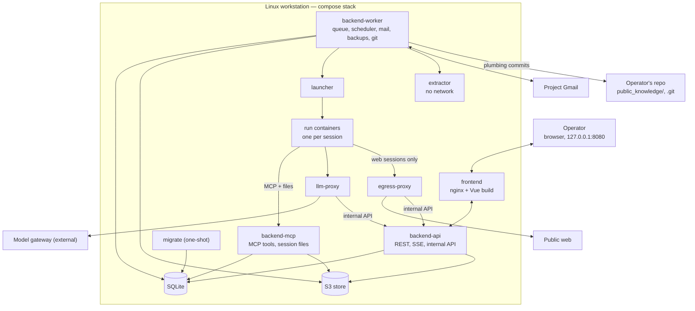

# Tekton — Technical specification

This document describes **how Tekton is built**. It implements the [functional specification](functional-spec.md) (FS); [RFD 1](rfd-0001.md) is the base. Items marked **[v1]** are in the first release.

## 1. Fixed contracts

These are expensive to change later and are defined here; everything else (libraries, tooling) is a recommendation and can be swapped.

| Contract | Section |
| --- | --- |
| Event vocabulary, event envelope, SSE messages | §5.4, §14.4 |
| Decision keys, value types, subjects | §5.5, §14.1, FS §4 |
| Privacy classes, tiers and propagation | §6 |
| Agent views (`sql_query` surface), versioned | §6.4 |
| Agent result envelope, `suspend` payload | §7.5, §7.6 |
| MCP tools and the session file API | §8 |
| Internal API between services | §4.3 |
| Knowledge file format and paths | §11 |
| REST API and error format | §14 |
| Enum wire values (`snake_case`) | FS, §14.1 |

## 2. System overview



- The **backend** is one Python package with four entrypoints: `backend-api` (the operator's REST and SSE, and the internal API), `backend-mcp` (the only service that talks to agent sessions), `backend-worker` and `migrate`. All state changes go through its use cases.
- **Every agent session runs in its own short-lived container**, started by `launcher`. A container holds only its own session token, a private scratch directory, and the networks its tier allows.
- **`llm-proxy`** checks the session token, enforces the session's model allowlist and forwards to the external **model gateway**. The gateway key never enters a run container.
- **`egress-proxy`** is the only route to the internet for web sessions. It denies every non-public address and applies per-site limits.
- Nothing is published outside `127.0.0.1`.

## 3. Repository layout

```
tekton/
  backend/
    pyproject.toml, uv.lock        Python 3.14, uv
    project_structure.md           module map and rules (an M0a deliverable)
    src/tekton/
      kernel/                      shared kernel: Money, Area, Ratio, PrivacyClass, Ulid, StepId,
                                   SubjectRef, SourceId, Clock port, DomainError, spec protocols
      domain/<module>/             entities, value objects, rules, ports — framework-free
      application/<module>/        use cases, event subscribers
      application/shared/          UnitOfWork and ReadOnlyUnitOfWork ports
      infrastructure/<module>/     repositories, S3, Gmail, git, launcher client, BNR, routing
      presentation/
        api/<module>/              REST routers (backend-api)
        stream/                    SSE (backend-api)
        internal/                  internal API (backend-api)
        mcp/                       MCP tools and session files (backend-mcp)
      entrypoints/
        composition.py             the single wiring of ports to adapters
        api.py, mcp.py, worker.py, migrate.py
    migrations/                    Alembic; agent_views.py defines the agent views
    tests/{unit,application,integration,api,contract,e2e,support,fixtures}/
  edge/                            small separate package: llm-proxy and launcher, no domain code
  frontend/
    src/{app,features,shared/domains,shared/foundation}/
    tests/{unit,component,e2e}/
  agents/<name>/                   definition.yaml (references prompt.md, result.schema.json)
  images/                          backend, frontend, edge, run, extractor, egress-proxy Dockerfiles
  public_knowledge/                committed and pushed (§11)
  evals/<agent>/                   synthetic fixtures, expected outputs, threshold.yaml, report.json
  deploy/                          compose.yaml, .env.example, nginx.conf
  docs/
  justfile                         init, up, down, open, logs, backup, restore, upgrade, rollback,
                                   rotate-secrets, map-fetch, api-types, eval, release-fixture,
                                   test, lint
  .gitignore                       data/, s3/, backups/, deploy/.env
```

The layout is layer-first; within each layer, one package per module (§5.1). v1 runs from a clone of the repository (the knowledge flow needs it); packaged installs are out of scope.

## 4. Runtime and deployment [v1]

### 4.1 Services and networks

| Service | Image | Networks | Notes |
| --- | --- | --- | --- |
| `frontend` | `images/frontend` | `edge` | Published on `127.0.0.1:8080`. `server_name 127.0.0.1`, plus a `default_server` returning 444; `localhost` redirects to `127.0.0.1`. Proxies `/api/` to `backend-api:8000` with `proxy_set_header Host $http_host`; SSE locations use `proxy_buffering off` and `proxy_read_timeout 1h`; other paths fall back to `index.html`. Sets the app CSP (§16) |
| `migrate` | `images/backend` | `data` | One-shot (`restart: "no"`): waits for `s3` to be healthy, takes a `pre-migrate` backup when `alembic current ≠ head` and the database is not empty, runs the migrations, provisions buckets, recreates the agent views, runs `projections.recompute` |
| `backend-api` | `images/backend` | `edge`, `data`, `control` | Operator API on `:8000` (edge); internal API on `:8002` (control only) |
| `backend-mcp` | `images/backend` | `runs-mcp`, `data` | MCP tools and session files on `:8001` |
| `backend-worker` | `images/backend` | `data`, `control`, `extract`, `internet` | Run queue, scheduler, bus consumers, Gmail, BNR rates, routing, backups, knowledge commits |
| `llm-proxy` | `images/edge` | `runs-llm`, `control`, `gateway` | §7.7 |
| `launcher` | `images/edge` | `control` | The only service with the container engine socket |
| `extractor` | `images/extractor` | `extract` | poppler, tesseract (`ron`); no internet, no secrets, CPU/memory/time limits |
| `egress-proxy` | `images/egress-proxy` | `runs-web`, `control`, `internet` | §7.3 |
| `s3` | MinIO, pinned by digest (provisional, §21) | `data` | Healthcheck; buckets in §10 |

- `runs-mcp`, `runs-llm`, `runs-web`, `control`, `extract` and `data` are `internal: true`. Only `internet` and `gateway` route outward. The gateway is reached as a host address through `host-gateway`, or as a compose service.
- **Mounts:** `data/` (SQLite; `backend-api`, `backend-mcp`, `backend-worker`, `migrate`), the backup target (`backend-worker`, `migrate`), `public_knowledge/` read-only (`backend-api`, `backend-mcp`, `backend-worker`), and `/repo/.git` read-write in `backend-worker` only, with `/repo/.git/hooks` and `/repo/.git/config` mounted read-only over it. On Rocky/SELinux, shared mounts use `:z`. Services that write to the repository run with the operator's UID (`userns_mode: keep-id` on Podman), so objects stay owned by the operator.
- **Secrets** are compose `secrets:` scoped per service (§16.1); there is no shared `env_file`.
- **Startup order:** `s3` (healthy) → `migrate` (completed) → `backend-api`, `backend-mcp`, `backend-worker`, `llm-proxy`, `launcher`, `extractor`, `egress-proxy` → `frontend`. Backend services refuse to start when `alembic current ≠ head` (`startup.schema_mismatch`).
- **Restart policy:** `unless-stopped` for long-running services.
- **Images:** published images are tagged with the Tekton release and pinned by digest. `images/run` is built locally at `just init`/`just upgrade` from a pinned base digest and a pinned Claude Code CLI version; the build records its resulting digest in `data/run-image.lock`.
- **Supported hosts:** Ubuntu LTS and Rocky Linux, with rootless Podman (reference) or Docker.

### 4.2 Container hardening

All services and run containers run as non-root with `no-new-privileges`, `cap_drop: [ALL]`, a read-only root filesystem with `tmpfs` scratch, and `pids`/memory/CPU limits. Run containers also get a wall-clock limit, the label `tekton.run=<run_id>`, and `--log-driver=none` (their output is captured by the launcher, §7.3).

### 4.3 Internal API

Served by `backend-api` on `:8002`, network `control` only. Each caller has its own credential (§16.1).

| Endpoint | Caller | Purpose |
| --- | --- | --- |
| `POST /internal/tokens/verify` | `llm-proxy`, `egress-proxy`, `backend-mcp` | Session token → `{run_id, session_id, tier, models, tools, expires_at}`; callers cache for 30 s and fail closed when unreachable |
| `POST /internal/usage` | `llm-proxy` | Token usage per session (batched); `backend-api` applies prices and caps and cancels runs through the normal run path |
| `GET /internal/egress/config` | `egress-proxy` | Listing-site limits and paused sites |
| `POST /internal/egress/events` | `egress-proxy` | Connection log (host, session, bytes) and refusals |
| `GET /internal/sessions/{id}` | `launcher` | Session spec, including the session token, returned **once** |
| `POST /internal/sessions/{id}/log` | `launcher` | Batched stream-json lines (up to 50 lines or 1 s), idempotent by line number |
| `POST /internal/sessions/{id}/heartbeat`, `/exit` | `launcher` | Liveness and exit status |

## 5. Backend architecture [v1]

### 5.1 Modules and layering

| Module | Responsibility |
| --- | --- |
| `workflow` | Step definitions (which decisions, derived values and checks each step owns), the step state machine, the check and gate registries, revalidation, can-complete |
| `decisions` | Decision registry, decisions, derived values and overrides |
| `proposals` | Agent proposals and their resolution |
| `eligibility` | Notification-eligibility evaluation |
| `plots` | Plots, plot facts, listings, merges |
| `localities` | Localities, UATs, listing samples, price per m², validation |
| `budget` | Categories, commitments, payments, currency conversion |
| `tasks` | Operator tasks, proof parts, proof check state |
| `approvals` | Approval requests by kind |
| `privacy` | Classes, tiers, propagation, session watermarks, consent |
| `documents` | Documents, links, extraction jobs |
| `sources` | Citation records, snapshots, provenance |
| `runs` | Run lifecycle, the queue, reconciliation |
| `sessions` | Sessions, tokens, the launcher port |
| `metering` | Usage, prices, caps |
| `mail` | Gmail sync, threads, sender rules, outbox |
| `knowledge` | `KnowledgeReader` and `KnowledgeWriter` ports, validation, overlay |
| `deadlines` | Legal deadline rules, holidays, reminders |
| `scheduling` | Scheduled jobs |
| `eventlog` | Events, upcasters, consumers |
| `notifications` | In-app notifications |
| `settings` | Operator settings (non-secret) |
| `auth` | Operator session and CSRF |
| `backup` | Backup, restore, upgrade state |
| `health` | Health probes |

- **Layers:** `presentation → application → domain → kernel`; `infrastructure` implements ports and is wired only in `entrypoints/composition.py`. import-linter enforces a layers contract, "domain and kernel import no framework", and an independence contract between domain modules.
- **Allowed domain DAG** (anything else fails CI): `kernel` ← all; `privacy` ← all modules that store content; `decisions` ← `proposals`, `eligibility`, `localities`, `plots`, `budget`; `localities` ← `plots`, `eligibility`; `plots` ← `eligibility`; `knowledge`, `sources`, `documents` are leaves apart from `kernel` and `privacy`. `workflow` depends on no module: modules register their step contributions (decision specs, derived specs, checks, gate contributors) into `workflow`'s registries through ports, from `composition.py`. Across modules, entities are referenced by id only.
- **Cross-module reactions** go through event subscribers (§5.3). **Revalidation is the exception:** it is synchronous (§5.6).
- **Persistence style:** domain entities are plain dataclasses that record dataclass domain events; SQLAlchemy 2 with imperative mapping; repositories are per aggregate and declared as domain ports; one `UnitOfWork` port in `application/shared/` exposes every repository, with explicit `commit()`, plus a `ReadOnlyUnitOfWork`. On commit, the UoW collects the domain events and infrastructure maps them to versioned Pydantic payloads.
- **Rule inputs are typed:** each derived value and check takes a frozen input dataclass; a startup validator compares its fields with the declared `depends_on`.

### 5.2 SQLite

- Every connection: `journal_mode=WAL`, `busy_timeout=5000`, `synchronous=NORMAL`, `foreign_keys=ON`. The driver's own transaction handling is disabled (`isolation_level=None`); write UoWs emit `BEGIN IMMEDIATE`, read UoWs `BEGIN DEFERRED`.
- Money, rates and ratios are stored as text through a `DecimalText` type, never as floats. Instants are stored as UTC text and loaded as aware datetimes.
- A use case is one synchronous `execute()` run through `anyio.to_thread` with a database `CapacityLimiter`; `sql_query` has its own limiter. Routers inject a UoW factory, never a UoW.
- **No network or S3 I/O inside a write UoW.** Files go to S3 before the row that references them is written; Gmail, git and extraction run in the worker and commit their results in short transactions.
- `SQLITE_BUSY` after the timeout maps to `503 db.busy` with `Retry-After`; the worker retries with jitter. A lock wait over 2 s logs `db.lock_wait`.
- **Migrations:** Alembic with `render_as_batch=True`, run by `migrate` only, on a connection with `foreign_keys=OFF`, all pending migrations in **one transaction**; after them, `PRAGMA foreign_key_check` must return nothing or the transaction is rolled back. Migrations are forward-only and never squashed once a release is tagged. Every migration drops the agent views first and recreates them from `migrations/agent_views.py` last.

### 5.3 Event log and bus

Tekton is **event-logged**: the tables are the source of truth, and every change also appends an event in the same transaction. Events serve the history, the audit trail and the bus; state is not rebuilt by replay.

```
events(
  seq             INTEGER PRIMARY KEY,   -- global order
  id              TEXT UNIQUE,           -- ULID
  at              TEXT,                  -- UTC
  author_kind     TEXT,                  -- operator | agent_run | scheduled_job | system
  author_id       TEXT,
  type            TEXT,                  -- vocabulary §5.4
  payload_version INTEGER NOT NULL,
  subject_type    TEXT NOT NULL,
  subject_id      TEXT NOT NULL,
  causation_id    TEXT,                  -- event or request id (X-Request-Id)
  privacy         TEXT NOT NULL,         -- §6
  payload         TEXT                   -- JSON
)
```

- **Payload versions:** each `(type, version)` has a Pydantic model; upcasters turn any old version into the latest before it is returned or consumed. The fixture corpus holds, per `(type, version)`, an input payload and the `expected_latest.json`; a test upcasts, validates and compares, and CI fails when a registered pair has no fixture.
- **Consumers** (one runner each; the offset update is a compare-and-set on `seq`, committed with the handler's writes):

| Consumer | Process | Consumes |
| --- | --- | --- |
| `run-resumer` | worker | `approval.*`, `task.verified`, `task.completed`, `task.cancelled`, `mail.connected`, `privacy.*` |
| `proof-check-queuer` | worker | `task.completed` |
| `extraction-queuer` | worker | `document.stored` |
| `knowledge-committer` | worker | `knowledge.approved` |
| `mail-outbox` | worker | `approval.approved` (kind `email_send`) |
| `notifier` | worker | events that create notifications |
| `sse-fanout` | api | all (reads, no writes) |

- A handler that fails is retried 5 times with backoff; then the event goes to `consumer_failures`, the offset advances, `bus.handler_failed` is logged and the operator is notified. Consumer lag is on the health page (`bus.consumer_lag_high` above 60 s).
- A consumer introduced by a migration starts at the current max `seq`.
- **Stored JSON values** other than events (decision values, proposals, continuations, task `prepared`, settings) carry a `*_version` column with upcasters and fixtures, like events.

### 5.4 Event vocabulary (v1)

| Area | Events |
| --- | --- |
| Steps | `step.started`, `step.completed`, `step.reopened`, `step.revalidation_required`, `step.revalidated`, `step.not_applicable` |
| Decisions | `decision.set`, `decision.privacy_changed`, `decision.override_set`, `decision.override_cleared` |
| Proposals | `proposal.created`, `proposal.accepted`, `proposal.rejected`, `proposal.superseded` |
| Derived values, checks | `derived.changed`, `check.changed` |
| Eligibility | `eligibility.changed` |
| Plots, localities | `plot.added`, `plot.updated`, `plot.listing_linked`, `plot.merged`, `plot.dismissed`, `locality.added`, `locality.updated`, `locality.sample_added`, `locality.validation_changed` |
| Operator tasks | `task.created`, `task.started`, `task.proof_attached`, `task.completed`, `task.verified`, `task.proof_mismatch`, `task.cancelled` |
| Approvals | `approval.requested`, `approval.approved`, `approval.rejected`, `approval.expired` |
| Documents, sources | `document.stored`, `document.extracted`, `document.extraction_failed`, `document.privacy_changed`, `source.stored` |
| Runs | `run.queued`, `run.started`, `run.waiting`, `run.resumed`, `run.retry_scheduled`, `run.succeeded`, `run.partial`, `run.failed`, `run.cancelled` |
| Mail | `mail.connected`, `mail.disconnected`, `mail.received`, `mail.draft_created`, `mail.draft_pushed`, `mail.sent`, `mail.send_failed`, `mail.thread_privacy_changed`, `mail.sender_privacy_changed` |
| Knowledge | `knowledge.proposed`, `knowledge.approved`, `knowledge.rejected`, `knowledge.committed`, `knowledge.overlay_retired`, `knowledge.overlay_dropped` |
| Budget | `commitment.recorded`, `payment.recorded`, `payment.verified`, `payment.disputed`, `payment.superseded`, `fx.rate_stored` |
| Scheduling | `job.updated`, `job.paused`, `job.resumed`, `job.triggered`, `job.failed`, `deadline.created`, `deadline.reminder_due` |
| Settings, system | `settings.changed` (never with secret values), `backup.completed`, `backup.failed`, `privacy.profile_check_failed` |
| Notifications | `notification.created`, `notification.read` |

A new event type or payload version is a code change with a model, a fixture and, for a new version, an upcaster.

### 5.5 Decisions, proposals and derived values

```python
DecisionSpec(
    key="casa.suprafata_desfasurata_mp",
    scope=Scope.PROJECT,               # PROJECT | PLOT | LOCALITY
    value_type=Area(min=Decimal("1")),
    required=RequiredAlways(),         # or RequiredWhen(predicate)
)
DerivedSpec(
    key="locality.pret_mp",
    scope=Scope.LOCALITY,
    depends_on=[EntityField("locality.samples")],
    compute=price_per_m2,              # Callable[[PricePerM2Inputs], Money | None]
    overridable=False,
)
Check(
    key="zona.validare",
    scope=Scope.LOCALITY,
    depends_on=[DerivedKey("buget.teren_max"), DecisionKey("casa.amprenta_mp"),
                DecisionKey("casa.suprafata_desfasurata_mp"), DerivedKey("locality.pret_mp"),
                KnowledgeInput("zone_rules")],
    evaluate=locality_fits_budget,
)
```

- **Subjects:** `SubjectRef(type, id)` everywhere; project-wide values use `("project", "project")`, never `NULL`. The wire enum `SubjectType` is `project`, `plot`, `locality`, `task`, `approval`, `document`, `run`, `step`, `thread`.
- **Value types** (value objects in `kernel`, serialized per §14.1): `Integer`, `Boolean`, `Enum`, `Money`, `Area`, `Ratio`, `RoomList`, `CategoryAllocation`, `DistanceCriteria`, `EntityRef`, `EntityRefList`. The authoritative v1 keys are the tables in FS §4; a snapshot test of the registered keys fails on any rename; a rename is a data migration with an alias.
- **Decisions:** `decisions(key, subject_type, subject_id, version, value, value_version, rationale, source_ids, author, set_at, privacy)`, `UNIQUE(key, subject_type, subject_id, version)`; the current value is the highest version. The check-and-insert of a new version happens in one write UoW with the expected version.
- **Proposals:** `proposals(id, key, subject_type, subject_id, value, value_version, rationale, source_ids, run_id, status, privacy)`. `source_ids` must be non-empty. A new proposal for the same key and subject supersedes the pending one. Only operator requests produce `decision.set`: accepting (optionally edited, with the decision's expected version) or setting the field.
- **Privacy of accepted values:** the decision's class is `max(operator, proposal.privacy)`. The accept dialog can lower it, which appends `decision.privacy_changed`.
- **Derived values and check results** are projections: `derived_values(key, subject, value, inputs_hash, computed_at, privacy)`, `check_results(key, subject, result, details, computed_at, privacy)`, `overrides(key, subject, value, set_at)`. Each projection's class is the max of its inputs'.
- **Step membership** lives only in `workflow`'s step definitions; `?step=` filters resolve through them.
- **Completion quantifiers** per step requirement: `all_subjects`, `any_subject`, or `selected_subject(key)` (e.g. step 4 requires `teren.verdict = da` for the subject in `teren.ales`).

### 5.6 Dependency graph and revalidation

- Node types: `DecisionKey`, `DerivedKey`, `CheckKey`, `EntityField`, `KnowledgeInput`, `StepId`. Edges come from `depends_on`; each step definition lists what it owns. The reverse index is built at startup and validated (no unknown nodes, no cycles).
- **Revalidation is synchronous.** Every write use case that changes a node calls `RevalidationService` inside the same UoW: it recomputes affected derived values and checks, updates the step states and records the impact, so `needs_revalidation` is committed together with the change. `POST /steps/{id}/complete` re-evaluates can-complete inside its own `BEGIN IMMEDIATE`. Subscribers only handle side effects (notifications, resuming runs, SSE).
- **Triggers:** a changed check result, a changed decision owned by or depended on by the step, or an earlier step leaving `done`.
- After a release that adds or changes checks, the `projections.recompute` job (run by `migrate`, and after `knowledge.committed`/`knowledge.approved`) recomputes all projections through the same service.
- **Impact** is a list of `{code, params}` items; the frontend owns the wording. `GET /steps/{id}/reopen-impact` and `POST /decisions/{key}/preview` return the impact without writing.

### 5.7 Steps

- Step ids are the `StepId` enum: `"1"` … `"6"`, `"7a"`, `"7n"`, `"8"`, `"9"`. Dependencies are lists of alternatives: step 8 depends on `[["7a"], ["7n"]]`.
- The transitions are the FS §4.1 table, implemented as a pure transition table in `domain/workflow/step_state.py` with a unit test per row. All six states are stored; the API also returns `display_state` (a stored state overridden by `blocked` while an earlier step is not `done`).
- Each step resource carries `state`, `display_state`, `release` (`v1`, `v2`, …), `can_complete`, `blocking[]` and `next_action` (`{code, params, route}`), so the UI never re-derives the rules.

### 5.8 Eligibility

`evaluate_eligibility(inputs: EligibilityInputs, rules: NotificationRules) -> EligibilityResult`. `NotificationRules` is loaded from `public_knowledge/lege/169-2026/notificare.yaml` through `KnowledgeReader`; the file maps each condition to its input (decision key, plot fact, locality or UAT field) and its article. The result (`eligibil | neeligibil | de_verificat`, with condition codes and sources) is stored per subject (`project`, each plot, each locality) and recomputed by revalidation. A missing or invalid rules file gives `de_verificat` with `rules_unavailable` and logs `knowledge.invalid`.

### 5.9 Budget and currency

- `Money(amount: Decimal, currency: RON | EUR)`; costs of model usage use a separate `Cost(amount: Decimal, currency: USD)`.
- `ExchangeRates` port with a BNR adapter; the worker stores daily rates in `fx_rates(date, currency, rate)`. A conversion uses the last rate on or before its date, records the rate and its date, and returns `ConvertedMoney {original, ron, rate, rate_date}`. An evaluation freezes its rate date; the next evaluation after a rate change of more than 2% re-runs affected checks. A missing rate gives `de_verificat` (`fx.rate_missing`); a rate older than 3 banking days logs `fx.rate_stale`.
- `commitments(id, category, amount, currency, source, created_at)` — operator-entered in v1.
- `payments(id, task_id, category, amount, currency, ron_amount, rate_date, paid_on, receipt_document_id, receipt_sha256, status: unverified|verified|disputed|superseded)`, `UNIQUE(task_id, receipt_sha256)`. When a disputed payment's task is completed again, the old row becomes `superseded`. "Paid" sums `unverified` and `verified` only.

## 6. Privacy model [v1]

### 6.1 Classes

| Class | Meaning |
| --- | --- |
| `public` | Public web content, knowledge, listings |
| `operator` | What the operator types: decisions, rationale, settings |
| `personal_cloud` | Personal data the operator released to cloud models |
| `personal_local` | Personal data; the default for uploads, mail and anything derived from them |

### 6.2 Tiers

Each session has a tier, fixed for the run, from its definition (optionally overridden in Settings):

| Tier | Models | Web | Reads |
| --- | --- | --- | --- |
| `web` | Cloud or local | Yes | `public`, plus the allowlisted brief keys: `casa.tip`, `casa.regim_inaltime`, `casa.subsol`, `casa.suprafata_desfasurata_mp`, `casa.amprenta_mp`, `casa.persoane`, `casa.camere`, `casa.locuire`, `procedura.tinta`, `buget.teren_max`, `zona.criterii`, `zona.localitati`, `teren.lista_scurta` |
| `cloud` | Cloud or local | No | `public`, `operator`, `personal_cloud` |
| `local_only` | Local only | No | Everything |

A tier with web access never reads `operator` or personal data outside the allowlist. `PATCH /settings` refuses a combination that would give `local_only` data to a web session (`422 privacy.invalid_tier`), and the session spec builder re-checks it (`failed(privacy_check_failed)`).

### 6.3 Propagation

- **Rule:** every column written by, or derived from, an MCP session carries `privacy`. A schema test lists the tables and fails when a table reachable from MCP has none. Tables: `decisions`, `proposals`, `derived_values`, `check_results`, `eligibility_results`, `documents`, `document_text`, `mail_messages`, `mail_threads`, `outbox`, `plot_facts`, `locality_facts`, `listing_samples`, `sources`, `tasks`, `approvals`, `notifications`, `deadlines`, `knowledge_overlay`, `runs` (continuation, result), `tool_invocations`, `run_log`, `events`.
- **Session watermark:** `session_privacy(session_id, max_class)` is raised monotonically (a write only when the class increases) by an application-level `SessionPrivacyGuard` on every read that returns data. It survives restarts of `backend-mcp`.
- Anything a session writes gets at least its watermark, except `store_source`/`store_document` of web content whose provenance is verified (§10): those are `public`.
- `propose_knowledge_change` is refused (`privacy.forbidden`) from a session whose watermark is above `operator`.
- Reads outside the tier fail with `privacy.forbidden` and a hint to call `request_consent`.
- **Lowering a class** is an operator action (document, thread, sender rule, decision, or approving a `privacy_consent` request), always after a confirmation, and appends the matching `*.privacy_changed` event. Sender rules (`mail_sender_rules(address, privacy, set_at)`) apply to messages received after they are set.

### 6.4 Agent views and `sql_query`

- `sql_query(sql, params?)` runs on a separate connection opened with `mode=ro`, `PRAGMA query_only`, a row limit (1,000) and a time limit (progress handler, 5 s).
- The views are generated from `migrations/agent_views.py`: `web_*` (public rows and allowlisted decision keys), `cloud_*` (rows with `privacy` in `public`, `operator`, `personal_cloud`) and `local_*` (all rows). `settings` and secrets are in no view.
- An SQLite authorizer allows `SELECT` only on the views of the session's tier, deciding on the innermost view name and refusing direct base-table reads; `ATTACH`, `PRAGMA`, writes and non-allowlisted functions are denied; extension loading is disabled. A read of any `local_*` view raises the session watermark to `personal_local`.
- The views are a **versioned contract** (`agent_views` version in the tool description). A snapshot test fails when a view changes without a version bump; a bump requires re-running the agent evals. The cloud privacy test runs on databases upgraded from every released fixture.

## 7. Agent runs [v1]

### 7.1 Definitions

`agents/<name>/definition.yaml`: `prompt: prompt.md`, `result_schema: result.schema.json`, the MCP tool allowlist, web tools (if tier `web`), tier, step, per-session timeout, cost cap (required), `max_turns`, priority, and the decision keys it may propose.

| Definition | Tier | Step |
| --- | --- | --- |
| `cost-researcher` (costs per m², fees, connection tariffs from the web) | `web` | 1 |
| `budget-estimator` (combines costs with the brief and finances) | `cloud` | 1 |
| `lending-researcher` (bank offers and rules from the web) | `web` | 1 |
| `lending-calculator` (applies them to the operator's income) | `cloud` | 1 |
| `listing-scout` (plots and listing samples) | `web` | 2–3 |
| `rlu-reader` (fetches and reads PUG/RLU) | `web` | 2–3 |
| `plot-zone-finder` (zone, protected zones, PUG compliance) | `web` | 3 |
| `connection-cost-estimator` | `web` | 4 |
| `cu-type-selector` (from public plot data and the brief) | `cloud` | 4 |
| `cf-reader` | `local_only` | 4 |
| `cu-reader` | `local_only` | 4 |
| `plot-verdict` | `local_only` | 4 |
| `mail-triage` | `local_only` | any |
| `proof-checker` | `local_only` | any |
| `knowledge-verifier`, `legal-watch` | `web` | — |

### 7.2 Lifecycle

- **States:** `queued → running → waiting_approval | waiting_operator | waiting_resource → running → succeeded | partial | failed | cancelled`. Terminal states are absorbing.
- `waiting_resource` reasons: `local_model_unavailable`, `gateway_unavailable`, `cost_cap_reached`, `mail_disconnected`, `concurrency`. `failed` reasons: `invalid_result`, `no_terminal_call`, `timeout`, `orphaned`, `cost_cap`, `container_error`, `privacy_check_failed`, `definition_changed`. `cancelled` reasons: `operator`, `wait_expired`.
- **Transitions** are a pure table in `domain/runs/run.py`; every write is `UPDATE … WHERE id=:id AND version=:expected`, and a lost race raises `RunStateConflict`, so finalization (in `backend-mcp`/`backend-api`) and reconciliation (in the worker) cannot both win.
- **Durable queue:** `runs(id, definition, definition_hash, step_id, subject_type, subject_id, status, status_reason, priority, attempt, lease_until, deadline_at, continuation, continuation_version, privacy, version)` and `sessions(id, run_id, started_at, ended_at, exit_status, cost)`. The worker claims queued runs with a lease; the lease is renewed from the launcher's heartbeats.
- **Coalescing:** a partial unique index allows one `queued` run per `(definition, subject)`; a new request merges into it, keeping the higher priority. Mail triage runs once per sync batch.
- **Retries:** `orphaned`, `container_error` and `no_terminal_call` are retried up to 3 times with backoff from the last continuation (`run.retry_scheduled`); then the run fails and the operator is notified.
- **Reconciliation** (worker, at startup and every minute): runs with an expired lease or passed `deadline_at` are killed through the launcher, their token revoked, and marked `failed(orphaned|timeout)`; waiting runs whose awaited items are resolved are resumed; `waiting_resource` reasons are re-probed and the run requeued when the resource is back; runs waiting more than 30 days are `cancelled(wait_expired)`.
- **Definition changes:** a resumed run whose definition hash changed fails with `definition_changed`, and the operator can restart it.
- **Concurrency:** 3 concurrent sessions by default; operator-started runs have priority over scheduled ones.
- **Upgrades drain:** `just upgrade` stops new claims, waits up to 5 minutes for running sessions to suspend or finish, then proceeds.

### 7.3 Launcher and run containers

- The worker asks `launcher` to start a session with only `{run_id, session_id}`. The launcher fetches the spec from `/internal/sessions/{id}` (returned once) and starts a container from the locked run image with fixed flags. It accepts no images, commands, mounts or arguments from the request.
- The container gets its session token and prompt through the environment and stdin, a private `tmpfs` scratch directory, and these networks: always `runs-mcp` and `runs-llm`; `runs-web` only for tier `web`, with `HTTPS_PROXY`/`HTTP_PROXY` set to `egress-proxy` and `NO_PROXY=backend-mcp,llm-proxy`.
- The launcher reads the container output and forwards stream-json lines to `/internal/sessions/{id}/log`; it sends heartbeats and the exit status; it kills containers at the deadline and on cancel. At startup and every minute it removes `tekton.run` containers whose session is not running. `just down`, `upgrade`, `restore` and `rollback` stop them all.
- **egress-proxy:**
  - denies every address that is not global unicast (IPv4 and IPv6, including mapped and NAT64 forms, `0.0.0.0/8`, CGNAT, link-local, loopback, private ranges), plus the host's own and the gateway's addresses; it resolves once, checks, and connects to the validated address, for CONNECT and absolute-URI requests alike;
  - authenticates each session with a per-run proxy credential and logs connections (host, session, bytes) to `/internal/egress/events`, which also serves source provenance (§10);
  - applies per-host connection-rate limits from `/internal/egress/config`.
- **Page budgets and blocking detection** for listing sites are enforced in Tekton's browser MCP wrapper (the proxy sees only encrypted tunnels): pages per run per site, and three consecutive 403/429 responses pause the site for 24 hours through `egress/events`. This is advisory against a hijacked session, which is recorded in the RFD risk table.
- Chromium runs with its own sandbox when the runtime allows user namespaces; otherwise the container is the boundary, and the health page says so.

### 7.4 Session invocation (Claude Code adapter)

Inside the run container:

```
claude -p --verbose \
  --output-format stream-json \
  --mcp-config /run/tekton/mcp.json \
  --allowedTools "mcp__tekton__<tool>,…[,mcp__browser__<tool>,…,WebFetch]" \
  --max-turns <max_turns>
```

- `mcp.json` defines the `tekton` server (`http://backend-mcp:8001/mcp`, session token) and, for tier `web`, the `browser` server (Tekton's wrapper around Playwright MCP, running inside the container). `WebSearch` is not used (it depends on the model provider); searching is done with the browser.
- Environment: `ANTHROPIC_BASE_URL=http://llm-proxy:4000`, `ANTHROPIC_AUTH_TOKEN=<session token>`, every model variable (the main and the small/fast model) set to the tier's model, `CLAUDE_CODE_DISABLE_NONESSENTIAL_TRAFFIC=1`. The prompt is rendered by the backend and read from stdin.
- The CLI is installed when the run image is built, from the pinned npm version; Tekton does not redistribute it. A contract test parses recorded transcripts of that version; unknown event types are logged and skipped. The launcher normalizes the stream into `RunLogLine` items (`text`, `tool_call`, `tool_result`, `error`, `usage`) for the UI; the raw transcript is kept for download.
- **Session tokens** are opaque 256-bit values, minted when the spec is fetched, stored hashed in `session_tokens` with run, session, tier, tool allowlist, proposable keys and expiry (the session deadline). They are revoked when the session ends, suspends or is cancelled.

### 7.5 Result envelope

`submit_result` takes this envelope; `payload` is validated against the definition's schema.

```json
{
  "status": "complete | partial",
  "claims": [
    {"id": "c1", "text": "The plot has a mortgage in favour of Bank X.", "source_ids": ["01J…"]}
  ],
  "summary": [{"text": "…", "claim_ids": ["c1"]}],
  "payload": {"verdict": {"value": "nu", "reasons": [{"claim_id": "c1"}]}}
}
```

- Payload fields that state something to the operator reference claims by `claim_id`. The loader rejects a result schema in which such a field is not nullable.
- **Processing order:** validate the envelope → drop claims whose `source_ids` do not resolve → set every payload field referencing a dropped claim to `null`, and drop summary sentences referencing it → if anything was dropped, the run is `partial` and the drops are listed on the run page. FS principle 4 matches this rule.
- An invalid envelope is rejected with validation errors; the session may retry within its turns. **Finalization** is an application service invoked by `submit_result`, `suspend` or the launcher's exit report, guarded by the run's CAS (§7.2). A session that exits without a terminal call fails with `no_terminal_call`.

### 7.6 Waiting and resuming

- `suspend(continuation, waiting_on)` is the second terminal tool. `continuation` has a fixed, versioned schema: `{done: [...], next: [...], state: {...}, notes}`. `waiting_on` lists approval or task ids created by the same run. It emits `run.waiting`.
- The `run-resumer` consumer resumes the run when every awaited item is resolved: `approval.approved`, `approval.rejected`, `approval.expired`, `task.verified`, `task.cancelled`, or `task.completed` for types without an automated check. A new session starts with the continuation and the outcomes (`run.resumed`).
- `create_operator_task` and the approval-creating tools never block; waiting is always an explicit `suspend`.

### 7.7 Model profiles and `llm-proxy`

- Settings hold the model names per tier: `local_only.models` (declared local by the operator) and `cloud.models` (used by `cloud` and `web`).
- `llm-proxy` forwards only `POST /v1/messages` and `POST /v1/messages/count_tokens`; everything else is `404`. It accepts only a live session token (via `/internal/tokens/verify`), rejects any `model` outside the session's list (`403`, `privacy.model_rejected`), adds the gateway key (an inference-scoped key, not an admin key) and forwards, streaming. Gateway connect and idle timeouts return `503 gateway_unavailable`, which finalization maps to `waiting_resource(gateway_unavailable)`.
- **Usage:** `llm-proxy` spools token usage locally and posts it to `/internal/usage`, retrying until accepted. Before each request it checks the session's usage plus an in-flight estimate against the run cap. `backend-api` prices usage from the per-model price table in Settings (local models cost 0), cancels a run over its cap (`failed(cost_cap)`), and at the monthly cap pauses watchers and requires `confirm_over_cap` on manual runs.
- **Self-check (fail-closed):** at startup and before each `local_only` session (cached 5 minutes), `llm-proxy` verifies that the gateway is reachable and, where the gateway exposes model metadata, that every `local_only` model routes to a local provider. If that cannot be verified, `local_only` sessions start only after the operator's explicit acknowledgement in Settings; otherwise they wait with `local_model_unavailable`, `privacy.profile_check_failed` is logged, and the health page shows it.
- An `http://` gateway URL is refused unless it resolves to loopback or `host-gateway`.

### 7.8 Idempotency

- `tool_invocations(run_id, tool, idempotency_key, args_sha256, result, privacy)`, primary key `(run_id, tool, idempotency_key)`, written in the same UoW as the tool's effect. A repeat with the same arguments returns the stored result; with different arguments it fails with `conflict.idempotency_key_reused`.
- For `create_operator_task` and `draft_email`, the backend derives the key itself (run, tool, type, subject, content hash), so resumed sessions do not duplicate them; one open task per `(type, subject, title)` and one pending send per body hash are also enforced.
- Natural keys: plots by cadastral number, otherwise site + listing id (aliases in `plot_aliases`); sources by URL + extracted-text hash; documents by content hash; payments by task + receipt hash; deadline reminders by deadline + offset.
- REST `POST` creates accept an `Idempotency-Key` header with the same storage.

## 8. MCP tools and session files [v1]

Served by `backend-mcp` at `/mcp` (network `runs-mcp`), named `mcp__tekton__<tool>` in the CLI. Every call is authorized against the session's tool allowlist, tier and objects: a tool acts only on the run's subject and on objects the run created or was given. Outputs with web, mail or knowledge content are wrapped in an untrusted-content envelope (`{"untrusted": true, "origin": …, "content": …}`). String arguments have maximum lengths; request bodies are capped at 1 MB.

| Tool | Kind | Notes |
| --- | --- | --- |
| `sql_query(sql, params?)` | read | Tier views only (§6.4) |
| `get_decisions(keys?, subject?)`, `get_step(step_id)` | read | Current values, pending proposals, the last rejected proposal and its reason, derived values |
| `get_plot(id)`, `list_plots(filter, cursor?)`, `get_locality(id)`, `list_localities(filter, cursor?)` | read | Filtered by tier |
| `get_document(id)` | read | Extracted text with page offsets; for `local_only` sessions, `file_id` of a copy in the session files |
| `get_mail_thread(id)` | read | Tier checked |
| `search_knowledge(query)`, `get_knowledge(path)` | read | Effective knowledge (§11.3), `KnowledgePath` validated, untrusted envelope |
| `store_source(file_id, url, excerpt, locator)` | write | The session saved the page (HTML, text and a PDF/PNG render) as session files; provenance checked (§10) |
| `store_document(file_id, type, links)` | write | Agent-fetched public documents |
| `propose_decision(key, subject?, value, rationale, source_ids)` | write | Only keys in the definition's list; `source_ids` non-empty |
| `upsert_plot(natural_key, fields, source_ids)`, `link_listing(plot_id, site, listing_id, source_id)` | write | Facts carry sources; a match on another plot's key proposes a merge to the operator |
| `add_listing_sample(locality_id, price, area, url, source_id)` | write | Samples for price per m² |
| `upsert_locality(siruta, fields, source_ids)` | write | SIRUTA must exist in the nomenclator |
| `mark_listing_removed(plot_id, listing, source_id)` | write | |
| `create_operator_task(type, subject, prepared, required, due?)` | write | `prepared` is typed per task type, each field with its `source_ids` |
| `draft_email(type, to, subject, body, attachment_ids, thread_id?)` | write | Creates a draft and, per the send rule, an `email_send` approval. For tier `web`, attachments must be `public`, and each recipient must come from a source stored by another run or from an operator-confirmed entity |
| `propose_knowledge_change(path, content, source_ids)` | write | Validated (§11.2); creates a `knowledge_change` approval |
| `request_consent(items, reason)` | write | Creates a `privacy_consent` approval |
| `report_proof_check(task_id, verdict, findings)` | write | `proof-checker` only, for its subject task |
| `submit_result(envelope)` | terminal | §7.5 |
| `suspend(continuation, waiting_on)` | terminal | §7.6 |

**Session files** (HTTP on the same listener, session token): `PUT /files` (body up to 50 MB, MIME allowlist by magic bytes, 500 MB per session) returns an opaque `file_id`; `GET /files/{file_id}`. Ids are bound to the session; everything not promoted by `store_*` is deleted when the session ends. The backend never fetches URLs chosen by an agent.

## 9. Operator tasks and proof [v1]

- `tasks(id, type, step_id, subject_type, subject_id, title, prepared, prepared_version, required, due_on, status, check_status, run_id, privacy, version)`. Status: `open`, `in_progress`, `completed`, `cancelled`; check status: `unchecked`, `verified`, `mismatch`.
- `type` is a closed enum with typed proof parts; `GET /task-types` returns them (kind, required, alternatives group) and the models are exported to OpenAPI:

| Type | Proof parts |
| --- | --- |
| `plata` | `receipt` (document) + `amount` (Money) + `paid_on` (date); `prepared` requires `category` and the payee |
| `portal` | `confirmation_number` + `document`, and `receipt` + `amount` + `paid_on` when `prepared.fee` is set |
| `telefon` | `answers` (one per `prepared.questions` id) |
| `deplasare` | `registration_number` + `stamped_copy_photo`, **or** `checklist` + `photos` |
| `semnare` | `signed_document` |
| `intalnire` | `answers` + optional `documents` |
| `cont` | `connection_confirmed` (filled automatically by `mail.connected`, or by the operator for other accounts) |

- Proof submission: files are uploaded with `POST /documents` first; `PUT /tasks/{id}/proof/{part}` takes a body discriminated on `kind` (`document` with `document_id`, `money`, `date`, `text`, `answers`, `checklist`, `photos`, `confirmation`).
- **Payee details** in `plata` tasks carry their sources; a detail from mail or the web is `unverified` until the operator confirms it (`PUT /tasks/{id}/payee-confirmation`); the task cannot complete before that.
- `POST /tasks/{id}/complete` returns `422 proof.missing` with `missing_parts` unless every part is present.
- On completion the payment (if any) is recorded as `unverified`. A `proof-checker` run is queued for `plata`, `portal`, `deplasare` and `semnare`; it appends `task.verified` (and `payment.verified`) or `task.proof_mismatch` (task back to `open`, payment `disputed`). Without a local model, the operator can verify the proof themselves (`POST /tasks/{id}/verify`) or release it for a cloud check (`privacy_consent`).

## 10. Documents, sources and storage [v1]

- **S3 buckets** (provisioned idempotently by `migrate`): `documents` (personal files), `public` (agent-fetched public documents, the map extract), `snapshots`, `transcripts` (retention 180 days, configurable), `session-files` (per-session prefixes, deleted at session end, lifecycle rule 1 day as a safety net).
- Object keys are `sha256/<hash>`; the hash is verified when an object is copied in and when it is read for display or backup.
- **Access:** only `backend-api`, `backend-mcp` and `backend-worker` hold S3 credentials; run containers exchange files only through the session file API (§8).
- **Metadata:** `documents(id, sha256, bucket, mime, size, filename, type, privacy, origin, regim_legal, created_at)`, `document_links(document_id, subject_type, subject_id)`, `document_text(document_id, page, text, privacy)`.
- **Extraction:** `extraction_jobs(document_id, attempts, status, error)`; the worker sends documents to `extractor` over the `extract` network (text PDFs via poppler, scans via tesseract `ron`), with a 5-minute timeout and 3 attempts, then `document.extraction_failed` and a notification. A vision-model pass is an optional `local_only` run for `personal_local` documents.
- **Sources:** `sources(id, kind: web|document|knowledge|email, url, retrieved_at, snapshot_key, sha256, text_sha256, excerpt, locator, provenance: verified|unverified, privacy)`. `locator` is `{page, offset?}` for documents. A web source is `verified` only if `egress-proxy` logged a connection from the same session to the URL's host before the call. Listing sources dedupe by URL + text hash. Snapshots are shown as the rendered PDF/PNG plus text, never as live HTML.
- **Serving content:** `GET /api/v1/documents/{id}/content` (and `/sources/{id}/snapshot`) streams from S3 with `Range` support, `Content-Security-Policy: sandbox; default-src 'none'`, `X-Content-Type-Options: nosniff`, an RFC 6266 `filename*`, and `Content-Disposition: attachment` unless the MIME type is in the allowlist (`application/pdf`, `image/png`, `image/jpeg`, `image/webp`, `text/plain`). Uploads: `POST /api/v1/documents` (multipart, 50 MB limit, type detected from magic bytes, default class `personal_local`).

## 11. Knowledge base: `public_knowledge/` [v1]

### 11.1 Layout and format

```
public_knowledge/
  _schema/                         JSON Schemas, one per file kind and version
  lege/169-2026/
    pasi.yaml                      steps and legal deadlines
    tipuri_cu.yaml                 the five CU types
    notificare.yaml                notification conditions, inputs, article references
  calendar/
    sarbatori.yaml                 public holidays, keyed by year
  nomenclator/
    siruta.yaml                    localities and UATs (SIRUTA), with source and date
  judete/<judet>/<uat>/
    uat.yaml                       SIRUTA, type, component localities, metropolitan area,
                                   protected zones, town hall contact, portal
    zone/<cod>.yaml                RLU zone rules (lowercase file name; the original code inside)
    taxe.yaml                      local taxes, infrastructure levy
```

- **Slugs:** `<judet>` and `<uat>` are lowercase ASCII with diacritics folded and spaces as `-` (e.g. `cluj/feleacu`); the SIRUTA code in `uat.yaml` is authoritative.
- Every file starts with a common header; rules inside a file may carry their own `sursa`, `verificat`, `status` and `nota`, which override the header:

```yaml
schema: zona/v1                  # kind/version, validated against _schema/
sursa: https://…                 # the law (Monitorul Oficial), HCL, RLU, or official page
verificat: 2026-09-27
status: confirmat                # confirmat | de_verificat
nota: …                          # optional, at most 500 characters
```

- Files are loaded with `yaml.safe_load` (anchors and aliases rejected, 256 KB per file) and validated on read, cached by `(path, mtime, overlay_version)`. Readers accept the current and previous schema version of a kind; a file with an unsupported version is skipped with `knowledge.schema_unsupported`, never failing the whole kind. A schema change and the migration of every affected file land in the same PR.
- `calendar/sarbatori.yaml` must contain the current and next year; the deadline engine marks a deadline `de_verificat`, logs `deadline.holidays_missing` and notifies when a year is missing. A scheduled CI job opens an issue from 1 October when next year is missing. Orthodox Easter and Pentecost are cross-checked against a computed date.

### 11.2 Paths and validation

- One `KnowledgePath` value object is used for every read and write (MCP, REST, overlay): normalized, matching `^(lege|calendar|nomenclator|judete)/[a-z0-9_/-]+\.yaml$`, no `..`, symlinks resolved, inside `public_knowledge/`; `_schema/` is not writable by agents.
- Proposals are validated against their schema, and scanned for personal data by the **pattern scanner** (CNP with checksum, IBAN, personal e-mail addresses and phone numbers outside institutional domains) and, locally, by the **records scanner** (names and addresses from Tekton's own records, behind a `KnownPersonalNames` port). Their sources must be `verified` and on an official domain listed in Settings. An operator edit is validated again.

### 11.3 Effective knowledge and commits

- Agents and rules read the **effective knowledge**: `public_knowledge/` as mounted, overlaid with approved changes not yet on disk (`knowledge_overlay(path, content, approved_at, branch, privacy)`). An entry is retired when the file on disk equals it or carries a later `verificat`; the operator can drop an entry whose branch is gone.
- On `knowledge.approved`, the `knowledge-committer` builds the commit without touching the working tree or index: with a temporary `GIT_INDEX_FILE`, `read-tree` of `knowledge.base_ref` (default `main`), `hash-object -w`, `update-index --cacheinfo 100644,…`, `write-tree`, `commit-tree`, then `update-ref` creating `refs/heads/knowledge/<topic>-<ulid>` (the ulid is minted at approval time; an existing ref is skipped). Git runs with `-c core.hooksPath=/dev/null`, author and committer "Tekton agent (approved by operator) `<tekton-agent@localhost>`". It never pushes.
- **Residual risk (accepted by the operator):** the worker writes into the operator's `.git`. Hooks and config are mounted read-only and hooks are disabled for Tekton's own git calls, but a compromised worker could still write objects or refs. This is recorded in §16.
- Branch topics are neutral (`zone-rules`, `taxes`, `holidays`, `law`); the UAT is in the commit message, which the operator reviews before pushing.
- **CI** on the repository runs the schema validation and the pattern scanner on every PR touching `public_knowledge/` or `evals/`, and CODEOWNERS requires a maintainer review for `public_knowledge/`.

## 12. Mail [v1]

- **Provisioning** (a `cont` task with step-by-step instructions): create the Gmail account; create a Google Cloud project; enable the Gmail API; configure the OAuth consent screen (External) and **publish it to production** (unverified, used only by the operator), because apps in Testing mode get refresh tokens that expire after 7 days; create a *Desktop* OAuth client; enter its id and secret in Settings (stored in `data/secrets`, never returned).
- **OAuth:** `POST /api/v1/mail/oauth/start` (session-authenticated) creates a single-use pending row with `state`, a PKCE verifier and a 10-minute expiry, and returns Google's URL with the fixed redirect `http://127.0.0.1:8080/api/v1/mail/oauth/callback`. The callback does not use the session cookie; it validates `state` and PKCE, stores the tokens and redirects to `/settings/mail?result=connected|error`. Scope: `https://www.googleapis.com/auth/gmail.modify` (read, labels, drafts, send).
- **Sync** (worker, every 15 minutes): `users.history.list` from the stored `historyId`; on `404`, `messages.list` with `after:` one day before the last successful sync (`mail.sync_fallback`). Messages are deduplicated by `UNIQUE(gmail_message_id)` and committed in batches of 100 together with the new `historyId`; attachments go to S3 first as `personal_local`; one `mail-triage` run is queued per batch with new messages. Sender rules set the class of new messages.
- **Expiry:** `invalid_grant` marks the mailbox disconnected (`mail.disconnected`), creates a `cont` task to reconnect and a notification.
- **Outbox:** `outbox(id, draft_id, approval_id, gmail_draft_id, state: draft|approved|sending|sent|failed, attempts, privacy)`. Sending creates the Gmail draft (`drafts.create`), stores `gmail_draft_id`, then calls `drafts.send`. To recover a row left in `sending`, Tekton checks the draft: `404` means it was sent, confirmed by finding the message in Sent. Errors (429, 5xx, timeouts) are retried up to 5 times with backoff, then the row is `failed` with a notification. After a restore, `approved` and `sending` rows are set to `sending`, so they go through the same check, and the restore report lists emails sent since the backup.
- `draft_only` drafts stay in Tekton until the operator clicks "Create in Gmail" (`mail.draft_pushed`).
- **Rendering:** mail HTML is sanitized with DOMPurify and shown in an `<iframe sandbox="" srcdoc>` with a CSP meta allowing only `data:`/`cid:` images, remote images (including CSS) blocked until the operator loads them, links rewritten to open in a new tab with `noopener`, and the height reported to the parent.

## 13. Scheduling and deadlines [v1]

- `scheduled_jobs(id, kind: agent|system, target, schedule, enabled, last_run_at, next_run_at, last_status, last_error, consecutive_failures, version)`. `schedule` is `{"kind": "every", "every": "PT15M"}` or `{"kind": "cron", "cron": "0 7 * * *"}` (Europe/Bucharest, evaluated with croniter; a time that does not exist in a DST change runs at the next valid minute, a repeated one runs once); `next_run_at` is stored in UTC. The worker's loop reads the table every 30 seconds; a job missed while the machine was off runs once at startup. Three consecutive failures append `job.failed` and notify.
- Agent jobs ship with `enabled=false` and `listing_sites=[]`; setup enables them.
- v1 jobs: listing watcher (agent), listing samples (agent), locality distances (system, through a `Routing` port), mail sync (system) + triage (agent), deadline engine (system), stale knowledge (agent), legal watch (agent), BNR rates (system), backup (system), run reconciliation (system, every minute), extraction queue (system).
- **Deadlines** (`deadlines` module): rules from `lege/169-2026/pasi.yaml` and holidays from `calendar/sarbatori.yaml`, working days in Europe/Bucharest. v1 triggers: a CU's issue date and validity (from `cu-reader`, confirmed by the operator), the filing date of a notification (v3), a permit's issue date (v3). Deadlines are stored in `deadlines(id, kind, subject, due_on, status, privacy)`, with reminders at configured offsets.
- Time comes from a `Clock` port, so tests can set it.

## 14. API [v1]

### 14.1 Conventions

- REST under `/api/v1`, JSON, OpenAPI generated by FastAPI with stable `operation_id`s, `json_schema_serialization_defaults_required=True` and separate input/output schemas.
- **IDs:** ULID strings (26 characters, with a pattern). **Instants:** UTC ISO-8601 with `Z` (`AwareDatetime`), named `*_at`. **Legal and calendar dates:** `YYYY-MM-DD` in Europe/Bucharest, named `*_on`.
- **Numbers:** `Money = {"amount": "1234.50", "currency": "RON"}` (decimal string with a pattern); `ConvertedMoney = {original, ron, rate, rate_date}`; `Area = {"value": "150.00", "unit": "m2"}`; ratios as decimal strings; `Cost = {"amount": "0.42", "currency": "USD"}`. The frontend never computes money; live totals come from `POST /decisions/{key}/preview`.
- **Composite values:** `RoomList = [{kind, area}]`; `CategoryAllocation = [{category, amount: Money}]`; `DistanceCriteria = [{target: city|hospital|school|transport|shops, max_minutes}]`; `EntityRef = {type, id}`; `EntityRefList = [EntityRef]`. `/decision-specs` returns, per key, the value type, options for enums, and bounds.
- **Decisions on the wire:** `DecisionOut` is a union discriminated on `value_type`; each branch has `value: T | null`, `version`, `subject`, `rationale`, `sources`, `privacy`. An unset decision is its branch with `value: null, version: 0`. `PUT /decisions/{key}` takes the same union.
- **Enums:** `snake_case`, published as named schemas; i18n keys `enum.<schema>.<value>` and `decision.<key>.option.<value>`.
- **Nulls:** response fields are always present, absent values are `null`. `PATCH` uses `application/merge-patch+json` (absent = unchanged, `null` = clear).
- **Pagination:** list endpoints marked paginated take `?cursor=&limit=` (default 50, max 200) and return `{items, next_cursor}`; each documents its filters and fixed sort. `/events` takes `?after_seq=`.
- **Concurrency:** resources carry `version` and GETs send `ETag`; mutating requests on decisions, proposals (accept), overrides, steps, tasks, approvals, plots, settings sections and jobs require `If-Match`; a missing header returns `428 precondition.required`, a stale one `409 conflict.stale_version`.
- **Human text:** the server returns codes with typed params (impacts, blocking items, eligibility conditions, errors), published as discriminated unions. Agent prose is `LocalizedText {text, lang}`.
- **Errors:** `application/problem+json` (RFC 9457): `{type: "urn:tekton:error:<code>", title, status, code, detail, params, errors: [{path, code, params}]}` with `path` as a JSON Pointer into the request body, plus typed extension members per code (e.g. `missing_parts` for `proof.missing`, `blocking` for `step.cannot_complete`). Each route declares its problem union as its 4xx response. The domain raises `DomainError(code, params)` subclasses; repositories translate integrity errors; presentation maps codes to statuses, with a test that every subclass is mapped:

| Status | Codes |
| --- | --- |
| 400 | `validation.failed` |
| 401 | `auth.required`, `auth.login_token_invalid` |
| 403 | `csrf.invalid`, `host.rejected`, `privacy.forbidden` |
| 404 | `not_found` |
| 409 | `conflict.stale_version`, `conflict.idempotency_key_reused`, `step.cannot_complete`, `proposal.superseded`, `approval.already_resolved`, `task.invalid_transition`, `run.already_finished`, `cost.confirmation_required` |
| 413, 415 | `upload.too_large`, `upload.type_not_allowed` |
| 422 | `proof.missing`, `payee.unconfirmed`, `decision.not_overridable`, `knowledge.invalid`, `privacy.invalid_tier`, `subject.scope_mismatch` |
| 428 | `precondition.required` |
| 503 | `db.busy`, `gateway_unavailable` |

### 14.2 Operator session

- The canonical origin is `http://127.0.0.1:8080`; `localhost` redirects to it.
- `just init` generates `data/secrets/operator.key` (`0600`). `just open` derives a single-use login token (256-bit, 10-minute expiry) and prints `http://127.0.0.1:8080/login#<token>`.
- `POST /session` exchanges it for a `tekton_session` cookie (`HttpOnly`, `SameSite=Strict`, 30 days, sliding); the login page then strips the fragment from history; an invalid token shows "run `just open` again". `GET /session` returns the state and the CSRF token; `DELETE /session` logs out.
- Mutating requests carry `X-CSRF-Token`. Every route except `POST /session`, `GET /mail/oauth/callback` and `GET /health/live` (which returns only `ok`) requires the session; a test enumerates the routes.
- The operator API accepts only `Host: 127.0.0.1:8080` (and `localhost:8080` for the redirect). The MCP and internal listeners are separate services/ports on internal networks and accept only their own credentials.

### 14.3 Endpoints

| Area | Endpoints |
| --- | --- |
| Session | `GET/POST/DELETE /session` |
| Attention | `GET /attention` — counts and items needing the operator (proposals, tasks, approvals) |
| Steps | `GET /steps`, `GET /steps/{step_id}`, `GET /steps/{step_id}/reopen-impact`, `POST /steps/{step_id}/complete`, `POST /steps/{step_id}/reopen`, `POST /steps/{step_id}/revalidate` (confirm after review) |
| Decisions | `GET /decision-specs`, `GET /decisions?step=&subject_type=&subject_id=` (one entry per key and subject), `PUT /decisions/{key}?subject_type=&subject_id=`, `POST /decisions/{key}/preview` |
| Proposals | `GET /proposals?status=&step=&subject_type=&subject_id=`, `POST /proposals/{id}/accept` (optional edited value, optional privacy lowering), `POST /proposals/{id}/reject` (reason) |
| Derived values | `GET /derived?step=&subject_type=&subject_id=`, `PUT /derived/{key}/override`, `DELETE /derived/{key}/override` (with subject params) |
| Eligibility | `GET /eligibility?subject_type=&subject_id=` (default: the project, or `teren.ales` once set) |
| Plots | `GET /plots`, `POST /plots` (listing URL or details; queues enrichment), `GET /plots/{id}`, `PATCH /plots/{id}`, `POST /plots/{id}/dismiss` (reason), `POST /plots/merge` |
| Localities | `GET /localities`, `POST /localities` (`{siruta}`; queues enrichment), `GET /localities/{id}` (with eligibility and validation) |
| Budget | `GET /budget`, `GET /payments`, `POST /commitments` |
| Tasks | `GET /task-types`, `GET /tasks`, `POST /tasks`, `GET /tasks/{id}`, `POST /tasks/{id}/start`, `PUT /tasks/{id}/proof/{part}`, `PUT /tasks/{id}/payee-confirmation`, `POST /tasks/{id}/complete`, `POST /tasks/{id}/verify`, `POST /tasks/{id}/cancel` |
| Approvals | `GET /approvals`, `GET /approvals/{id}`, `POST /approvals/{id}/approve` (body discriminated on kind, with the optional edit), `POST /approvals/{id}/reject` (reason) |
| Documents | `GET /documents`, `POST /documents`, `GET /documents/{id}`, `GET /documents/{id}/content`, `GET /documents/{id}/text`, `PATCH /documents/{id}/privacy` |
| Sources | `GET /sources/{id}`, `GET /sources/{id}/snapshot` |
| Runs | `GET /agent-definitions`, `GET /runs`, `POST /runs` (definition, subject, `confirm_over_cap`), `GET /runs/{id}`, `POST /runs/{id}/cancel`, `GET /runs/{id}/log` (normalized lines), `GET /runs/{id}/transcript` (raw download) |
| Scheduled jobs | `GET /jobs`, `PATCH /jobs/{id}` (enabled, schedule), `POST /jobs/{id}/run` |
| Mail | `GET /mail/status`, `POST /mail/oauth/start`, `GET /mail/oauth/callback`, `GET /mail/threads`, `GET /mail/threads/{id}`, `PATCH /mail/threads/{id}/privacy`, `PATCH /mail/senders/privacy` (address in the body), `POST /mail/drafts/{id}/push` |
| Knowledge | `GET /knowledge/tree`, `GET /knowledge/file?path=`, `GET /knowledge/changes` (each: `{approval_id, path, before, after, unified_diff, sources, status: pending|approved|committed|rejected|retired}`), `DELETE /knowledge/overlay?path=` |
| Calendar | `GET /calendar?from=&to=`, `GET /calendar.ics` (download, `text/calendar`) |
| History | `GET /events?after_seq=&limit=&type=&subject_type=&subject_id=` (items are the same union as SSE messages) |
| Notifications | `GET /notifications`, `POST /notifications/{id}/read`, `POST /notifications/read-all` (`{up_to_seq}`) |
| Settings | `GET /settings`, `PATCH /settings/{section}` — sections: `mail` (client id; secret write-only, returned as `{"set": true}`), `email_rules` (per type: `draft_only` or `send_after_approval`), `models` (per-tier model lists, local-routing acknowledgement, prices), `tiers` (per-agent overrides), `caps`, `listing_sites`, `official_domains`, `backup` (target, retention), `transcripts` (retention), `knowledge` (`base_ref`) |
| Map | `GET /map/{file}` (PMTiles, style, glyphs, sprites; `Range`; session cookie) |
| Health | `GET /health/live`, `GET /health` |
| Streams | `GET /stream`, `GET /runs/{id}/stream` |

### 14.4 Live updates (SSE)

- `GET /api/v1/stream?last_event_id=` sends one message per event: `id: <seq>`, `event: message`, `data:` an `SseMessage {seq, type, at, subject, version, causation_id, data}` whose `data` is the upcast latest payload, as a union over the event types plus `resync`, `heartbeat` and `unknown`. GET responses carry `X-Event-Seq`, so the client can start the stream after the state it fetched.
- Replay from the events table; beyond 10,000 missed events the server sends `resync`. A heartbeat every 15 s; `retry: 3000`.
- `GET /runs/{id}/stream` sends `RunLogLine` items.
- The client shares one stream across tabs (a `BroadcastChannel` leader), opens a run stream only while its panel is visible, reconnects with backoff, probes `GET /session` to tell expiry from an outage, and invalidates all queries after a gap.

### 14.5 Generated types

`just api-types` exports the OpenAPI schema and generates `frontend/src/shared/foundation/api/schema.d.ts` with `openapi-typescript`; the client uses `openapi-fetch`. CI regenerates and fails on any diff (M0a).

## 15. Frontend [v1]

- **Stack:** Vue 3 (Composition API), TypeScript strict, Vite, Vue Router (history mode), TanStack Vue Query for server state, Pinia for client-only state (listed in `project_structure.md`: stream status, drafts registry, UI preferences), vue-i18n (`en` from day one; `ro` through the same keys, with `Intl.PluralRules` plural rules), Reka UI (headless, accessible components), MapLibre GL with a local PMTiles extract (style, glyphs and sprites bundled; `just map-fetch` downloads a pinned extract and checks its hash; ODbL attribution shown), pdf.js (pinned, `isEvalSupported: false`, inside a sandboxed iframe), DOMPurify.
- **Structure:** `src/app` (shell, router, providers, stream wiring), `src/features/<feature>`, `src/shared/domains/<domain>` (queries, key factories, stream handlers and shared presenters of a domain used by two or more features), `src/shared/foundation` (`api` client with CSRF, `problem+json` → `ApiError` and 401 → `onUnauthorized` middleware; `stream`; `ui` incl. `AsyncState`, `SafeHtml`, `SafeLink`, announcer; `i18n`; `format` incl. `parseDecimal`, instant and legal-date helpers). Rules, enforced by ESLint: `app → features → shared/domains → shared/foundation`; features never import features; domains never import other domains (entity pickers receive their options from the feature). A query lives in its feature until a second feature needs it, then moves to `shared/domains`.
- **Routes:**

| Route | Feature |
| --- | --- |
| `/` | home |
| `/steps/:stepId` | step |
| `/tasks`, `/tasks/:id` | tasks |
| `/approvals`, `/approvals/:id` | approvals |
| `/plots`, `/plots/:id` | plots |
| `/localities`, `/localities/:id` | localities |
| `/budget` | budget |
| `/calendar` | calendar |
| `/documents`, `/documents/:id` | documents |
| `/mail`, `/mail/:threadId` | mail |
| `/agents`, `/agents/runs/:id` | agents |
| `/knowledge` | knowledge |
| `/history` | history |
| `/notifications` | notifications |
| `/health` | health |
| `/settings/:section?` | settings |
| `/login`, `/session-expired` | auth |

  `subjectRoute(subject)` maps every `SubjectType` to a route, with a test.
- **Server state:** `staleTime: Infinity`, no refetch on focus or reconnect while the stream is healthy. Each domain registers its stream handlers with its key factory (`registerStreamHandlers()` from `app/`); handlers **invalidate** queries, and only resource-shaped appends (notifications, run log lines, history items) are added directly to caches. Messages whose `causation_id` matches the client's own `X-Request-Id` are ignored. Cache updates are immutable.
- **Drafts:** `useDraft` copies the server value with its `baseVersion`, tracks `isDirty` and `serverChanged` (a newer `version` arrived), sends `If-Match`, shows Reload / Keep mine on 409, and guards navigation.
- **Decision fields:** a `useDecisionField` container, `DecisionInput<ValueType>` presenters (an exhaustive switch on `value_type`), `ProposalInline`, `DerivedValueRow` (with the override editor), and per-key renderer slots. The step screen renders a generic `StepView` plus panels from `features/step/panels/<stepId>/` (room list, budget allocation with live preview, localities, plot verdict links). Per-plot decisions render in the plot sheet.
- **Proofs:** `ProofPartInput` per part kind; uploads with progress (XHR), browser-side type and size checks, per-part states.
- **Status components:** `RunStatusBadge`/`RunStatusDetail` (reason codes with the next action), `ProofCheckStatus`, `EligibilityStatus` (the shell shows the project, or the chosen plot once set).
- **Safe content:** `SafeHtml` (DOMPurify) and sandboxed iframes for mail; `SafeLink` accepts only `http(s)` URLs; `vue/no-v-html` is an error; agent prose gets its `lang` attribute.
- **States:** `AsyncState` with loading, error (with retry) and an `#empty` slot per screen; a global "disconnected" banner.
- **Accessibility:** `eslint-plugin-vuejs-accessibility`; axe in Playwright; the step map uses `aria-current`; dialogs trap focus; focus moves to the page heading on navigation and to the next item (or the list heading) when the focused item disappears; blocked buttons use `aria-disabled` with `aria-describedby` pointing to the visible blocking list; the announcer speaks the operator's own actions and a debounced (10 s) summary of background changes.
- **Times** are formatted with `timeZone: "Europe/Bucharest"`; legal dates are parsed as dates, never as instants.

## 16. Security [v1]

| Threat | Controls |
| --- | --- |
| Another local process or website drives the app | `127.0.0.1` binding, nginx `server_name` + default 444, Host allowlist, `SameSite=Strict` session cookie and CSRF header, single-use login token, app CSP |
| Hijacked agent (prompt injection from web, mail or knowledge) | One container per session; per-session token with server-side tool, tier and object scoping; no S3, DB, Gmail or git credentials in runs; outbound actions only through approvals; web sessions draft only to independently sourced recipients with public attachments; payee details unverified until the operator confirms; untrusted-content envelopes |
| Personal or financial data sent out | Privacy classes and tiers with propagation (§6); web sessions see only public data and the allowlisted brief; `local_only` sessions have no web; model allowlist and path allowlist in `llm-proxy`; fail-closed self-check |
| Exfiltration over the network | Run networks are internal; web only through `egress-proxy`, which denies non-public addresses |
| SSRF against internal services | The backend never fetches agent-chosen URLs; `egress-proxy` deny list |
| Malicious content in the browser | App CSP (`default-src 'self'`, `worker-src 'self' blob:` for pdf.js and MapLibre, no inline scripts); CSP sandbox and `nosniff` on served content; snapshots rendered as PDF/PNG; pdf.js in a sandboxed iframe; DOMPurify; sandboxed mail iframes; `SafeLink` |
| Malicious file parsing | `extractor` on its own network with only the worker, no secrets, resource limits |
| Malicious knowledge paths | `KnowledgePath` on every read and write; commit mode `100644` |
| Compromised worker writing into the operator's `.git` | Hooks and config mounted read-only; hooks disabled for Tekton's git calls. **Residual risk accepted:** objects and refs can still be written; the operator reviews `knowledge/*` branches before pushing |
| Container engine abuse | Only `launcher` holds the socket; it accepts `{run_id, session_id}` only and uses a fixed image and flags; separate minimal `edge` image |
| Secrets in data or logs | §16.1; `settings.changed` never carries secrets; secrets in no agent view; log formatter redacts tokens, cookies, auth headers and signed URLs; proxies and APIs never log bodies; run containers have no engine logs |

### 16.1 Secrets

| Secret | Holders | Storage | Rotation |
| --- | --- | --- | --- |
| `TEKTON_SECRETS_KEY` (encrypts `data/secrets`) | `backend-api`, `backend-worker` | `deploy/.env` (`0600`), kept offline by the operator | `just rotate-secrets`: re-encrypt into a temp directory, swap atomically, keep the old key until the swap succeeds |
| Gmail OAuth client secret and tokens | `backend-worker`, `backend-api` (OAuth flow) | `data/secrets`, encrypted | Reconnect |
| Gateway inference key | `llm-proxy` only | compose secret | Replace in the gateway, restart `llm-proxy` |
| Internal API credentials (one per caller) | `llm-proxy`, `egress-proxy`, `launcher`, `backend-mcp`, `backend-worker` | compose secrets, generated by `just init` | `just rotate-secrets` |
| S3 credentials | `backend-api`, `backend-mcp`, `backend-worker`, `migrate` | compose secrets | `just rotate-secrets` |
| Operator key | `backend-api` | `data/secrets/operator.key` (`0600`) | `just rotate-secrets` (logs out) |
| Session tokens | run container (plaintext, once), `backend-api` (hash) | `session_tokens` | Per session |
| Backup key (restic password) | `backend-worker`, `migrate` | compose secret; the operator keeps a copy offline | `restic key` |

The gateway must be on the same host or reached over TLS.

## 17. Backup, restore, upgrades [v1]

- **Backups use restic**, one repository at the configured target (mounted into `backend-worker` and `migrate`). restic encrypts and authenticates the data, stores it content-addressed, and prunes by snapshot, so any retained snapshot restores completely.
- **Each snapshot** contains: the SQLite online backup (taken first), the S3 objects (objects are written before the rows that reference them, so every row in the snapshot has its object), `data/secrets` (already encrypted) and the non-secret config. Excluded: `session-files`, `transcripts` (optional), `TEKTON_SECRETS_KEY`, the restic password.
- **Retention:** 14 daily, 8 weekly, plus every `pre-migrate` snapshot for 90 days; `restic forget --prune` after each backup. A missing or full target is a health warning and a notification; it never blocks startup.
- **Restore:** `just restore [snapshot]` stops the stack (including run containers), restores SQLite, objects and `data/secrets`, verifies object hashes against the rows, applies the outbox rule (§12), and starts the stack with a report. A CI test backs up several times, prunes past the first snapshot, and restores both the newest and the oldest retained snapshot with every hash verified.
- **Upgrades:** `just upgrade <release>`:
  1. requires a clean working tree;
  2. writes `data/upgrade-state.json` with `{from_release, from_git_ref, to_release, snapshot}`;
  3. drains runs (§7.2), then stops `backend-api`, `backend-mcp`, `backend-worker`, `llm-proxy`, `launcher` and the run containers;
  4. takes the `pre-migrate` snapshot;
  5. checks out the release tag (code, `compose.yaml`, `public_knowledge/`), pulls the pinned images, rebuilds the run image;
  6. runs `migrate` (one transaction; a failure leaves the old schema intact) and starts the stack.
- **Rollback:** `just rollback` reads `data/upgrade-state.json`, requires a clean tree, stops the stack, restores exactly that snapshot, checks out `from_git_ref`, and starts it. Everything recorded since the upgrade is lost; the command lists it (events since the snapshot) and asks for confirmation. An upgrade-then-rollback test covers it, including a migration that fails halfway.
- **Release fixtures:** `just release-fixture <tag>` commits a seeded database (with rows in every child table) for each tag, starting with M0a; migration tests upgrade every fixture to head and compare row counts per table.

## 18. Observability

- JSON logs with bound fields: `request_id`, `run_id`, `session_id`, `definition`, `tool`, `tier`, `authz_decision`, `event_seq`, `outcome`, `duration_ms`. Logs go to `data/logs/<service>.jsonl` with 30-day rotation; `just logs [service]` tails them.
- Named log lines, among them: `startup.schema_mismatch`, `migrate.noop`, `db.lock_wait`, `db.busy`, `bus.handler_failed`, `bus.consumer_lag_high`, `run.orphaned`, `run.timeout`, `privacy.model_rejected`, `privacy.profile_check_failed`, `mail.sync_fallback`, `mail.disconnected`, `egress.site_paused`, `deadline.holidays_missing`, `knowledge.schema_unsupported`, `knowledge.invalid`, `fx.rate_stale`, `runs.queue_depth_high` (more than 20 queued, or the oldest older than 1 hour), `worker.job_overrun`, `disk.low`, `backup.failed`.
- Run transcripts in the `transcripts` bucket, classed like the data they touched; normalized run log lines in `run_log` for 30 days.
- **Health page:** service status, gateway reachability and the self-check, Gmail connection, scheduled jobs (last status, next run), bus consumer lag, queue depth and waiting runs by reason, backups (last success, target device, free space), disk free space (below 5 GB: `disk.low`, watchers pause), Chromium sandbox status, cost this month.

## 19. Testing and evaluation [v1]

- **Backend:** pytest. `unit` (domain and kernel), `application` (use cases with a `FakeUnitOfWork`, plus a parity suite running the same contract tests against the real UoW), `integration` (temp-file SQLite in WAL mode; S3 via testcontainers), `api`, `contract` (stream-json transcripts, OpenAPI), `e2e` (compose). `support/` holds a **fake runner** that replays scripted sessions (tool calls, `submit_result`, `suspend`, crashes).
- **Frontend:** Vitest + Testing Library, MSW, Playwright end-to-end against a compose profile with the fake runner.
- **Test inventory** (each row is a named test; a milestone exits only when its rows pass):

| Invariant or seam | Level | Milestone |
| --- | --- | --- |
| Step transition table, every row; `not_applicable` branch | unit | M0a |
| Revalidation commits `needs_revalidation` with `decision.set`; graph has no unknown nodes or cycles | integration | M0a |
| Stale `If-Match` → 409; missing → 428; proposal accept requires the version | api | M0a |
| Every event `(type, version)` upcasts to its expected latest payload | unit | M0a |
| Decimal round trip (DB, JSON); project-subject uniqueness | integration | M0a |
| Two processes writing concurrently without `SQLITE_BUSY` errors | integration | M0a |
| Poison event goes to `consumer_failures` and the consumer advances | integration | M0a |
| Every route except the listed ones requires the session; CSRF enforced; Host rules via `frontend`, including a rebinding `Host` | e2e | M0a |
| Backup several times, prune, restore newest and oldest; upgrade, failed migration, rollback | integration | M0a |
| Migrations from every release fixture keep row counts; `foreign_key_check` passes | integration | M0a |
| Cron across DST changes; missed jobs run once | unit | M0a |
| SSE replay from `last_event_id`, `resync` beyond the limit; client resync | integration, e2e | M0a |
| `cloud` and `web` sessions cannot read data outside their tier through any tool, including `sql_query`; authorizer refuses base tables | integration | M0b |
| Watermark survives a `backend-mcp` restart; writes after reading `personal_local` are `personal_local` | integration | M0b |
| Accepting a `personal_local` proposal does not expose it to cloud sessions | integration | M0b |
| Only operator requests produce `decision.set` | api | M0b |
| Session tokens: tools, tier, objects and lifetime; revoked on suspend | integration | M0b |
| `llm-proxy` rejects other models and paths; self-check fails closed; revoked token; cost-cap cancellation | integration | M0b |
| Run containers have no S3, DB, Gmail or git credentials; `local_only` has no route out; `egress-proxy` refuses every denied range | e2e | M0b |
| Launcher rejects any input beyond `{run_id, session_id}`; orphans are reaped | integration | M0b |
| Finalization and reconciliation race; waiting runs resume after restart; retries | integration | M0b |
| Unsourced claims are dropped, fields nulled, run `partial` | integration | M0b |
| Write tools are idempotent; key reuse with other arguments is refused | integration | M0b |
| Session files are bound to their session and deleted at the end | integration | M0b |
| `task.completed` refused per missing part; payee must be confirmed | api | M0c |
| Knowledge commits leave the working tree and index untouched; bad read and write paths refused; overlay retired | integration | M0c |
| Pattern scanner and records scanner | unit | M0c |
| Document serving headers per MIME type; oversize and disallowed uploads refused | api | M0c |
| Working-day deadlines across holidays; missing year; clock at 30 Sep and 1 Oct | unit | M0c |
| Eligibility for every condition combination; rules file missing | unit | M1 |
| Minimum plot formula; smallest-minimum residential zone | unit | M2 |
| FX last banking day; rate change threshold; missing rate | unit | M1 |
| Override survival; proposal supersede; budget alerts | application | M1 |
| Gmail OAuth `state`/PKCE; sync idempotent and recovers from expired `historyId` | integration | M3 |
| Outbox never sends twice across a crash or a restore; real-mailbox contract test | integration | M3 |
| Plot merge re-points every reference | integration | M3 |
| Mail and snapshot content cannot run scripts; PDF scripts do not execute | e2e | M3 |
| Frontend: value-type presenters, 409 handling, stream invalidation map, eligibility display, impacts preview, approve with edit, privacy lowering confirmation, `SafeHtml`/`SafeLink`, i18n keys complete, 401 redirect, focus management, four tabs sharing one stream | component, e2e | per feature |

- **Agent evals:** `evals/<agent>/` holds **synthetic** fixtures (each file has `synthetic: true`, checked by CI and the pattern scanner) and expected results, plus `threshold.yaml`. `just eval <agent>` runs against the configured gateway and writes `report.json` with the score, the model, and a hash of `definition.yaml`, `prompt.md`, the result schema, the fixtures and the CLI pin. CI fails when the hash does not match or the score is below the threshold. Required: `cf-reader`, `cu-reader`, `rlu-reader`, `cu-type-selector` (field accuracy ≥ 0.9); `plot-verdict` (no `da` on any fixture whose expected verdict is `nu`); `proof-checker` (no false `verified`); `mail-triage` (no proposal, task or draft originating from an injected instruction); `listing-scout` (dedupe and price extraction ≥ 0.9); `budget-estimator` (category estimates within the fixture ranges).
- **CI** (blocking): ruff, basedpyright, import-linter, ESLint, vue-tsc, tests, API type drift, knowledge validation and scan, eval report hashes and thresholds.

## 20. v1 build plan

Built in workflow order (FS §14). Each milestone exits when its inventory rows pass.

| Milestone | Contents |
| --- | --- |
| M0a — Platform slice | Compose stack, `migrate`, SQLite settings, kernel, event log and bus, session and CSRF, one decision end to end (spec → form → `PUT` → revalidation → event → SSE → UI), proposals seeded by a test fixture, derived values, step state machine, API conventions and type generation, frontend shell (layout, routes, `AsyncState`, stream, i18n), backup/restore/upgrade/rollback, `project_structure.md` |
| M0b — Agents and safety | Launcher and run containers, `llm-proxy`, `egress-proxy`, `backend-mcp` with tools and session files, privacy tiers and views, envelope, suspend/resume, reconciliation, retries, idempotency, metering and caps |
| M0c — Operator loop | Tasks with proof, approvals, documents and extractor, sources and snapshots, knowledge read/overlay/commit, scheduling and deadlines, notifications, health |
| M1 — Step 1 | Brief, budget categories and currency, cost and lending research, eligibility, bank pre-approval task |
| M2 — Step 2 | Localities from SIRUTA, distances, listing samples and price per m², locality validation, RLU fetch into knowledge |
| M3 — Step 3 | Listing watcher, dedupe and merges, plot sheet, zones, filters, map, Gmail connection and sync, seller emails with the outbox |
| M4 — Step 4 | `cf-reader`, CU type selection and reading, connection costs, verdict, ANCPI and CU tasks, `proof-checker` |

## 21. Open technical questions

- [ ] Reference model gateway (e.g. LiteLLM) and local model; Tekton needs an Anthropic-compatible endpoint, model names per tier, an inference-scoped key and, ideally, model metadata for the self-check.
- [ ] Claude Code terms of use when driven headless and when pointed at non-Anthropic models through a gateway; an open-source runner adapter as an alternative.
- [ ] The S3 server image: MinIO pinned by digest if an obtainable image remains available, otherwise Garage or SeaweedFS behind the same S3 port.
- [ ] Routing engine for travel times (public OSRM/Valhalla calls for locality coordinates, or a local instance) behind the `Routing` port.
- [ ] Listing sites: per-site limits and whether to use only their public search pages.
