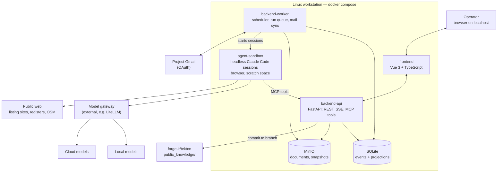

# Tekton — Technical specification

This document describes **how Tekton is built**. It implements the [functional specification](functional-spec.md); [RFD 1](rfd-0001.md) is the base. Items marked **[v1]** are in the first release.

Contracts that are expensive to change later are fixed here: event vocabulary, decision keys, the knowledge file format, the agent result envelope, and the document privacy classes. Libraries and tooling are recommendations and can be swapped.

## 1. System overview



- The **backend** owns all state. Agents change state only through backend tools, which validate types, append events and trigger revalidation.
- **Agents** are headless coding-agent sessions (Claude Code, or a compatible CLI). They run inside a sandbox container and are started by the worker through a runner interface.
- The **model gateway** is external to Tekton. The sandbox points Claude Code at it (e.g. `ANTHROPIC_BASE_URL`). The gateway routes each request to a local or a cloud model according to the session's **model profile**.
- Nothing listens outside `127.0.0.1`.

## 2. Repository layout

```
tekton/
  backend/              Python service: API + worker (one package, two entrypoints)
    src/tekton/
      domain/           entities, value objects, decision registry, rules — framework-free
      application/      use cases, ports, unit of work
      infrastructure/   SQLite repositories, MinIO, Gmail, git, runner adapters
      presentation/     FastAPI routers, SSE, MCP server
    migrations/         Alembic
    tests/
  frontend/             Vue 3 + Vite + TypeScript
  agents/               agent definitions: prompt templates, tool allowlists, result schemas
  sandbox/              Dockerfile for the agent sandbox image
  public_knowledge/     committed and pushed (see §9)
  evals/                golden fixtures and expected outputs for agents
  deploy/               compose.yaml, .env.example
  docs/
  justfile              single entry point: dev, test, lint, up, backup
```

## 3. Runtime and deployment [v1]

| Service | Image | Notes |
| --- | --- | --- |
| `frontend` | nginx serving the Vite build | Also reverse-proxies `/api` to the backend, so everything is served from one origin |
| `backend-api` | Python 3.14, uv | FastAPI with uvicorn; REST, SSE, and an MCP server at `/mcp` for agents |
| `backend-worker` | same image | Scheduler (watchers), run queue, Gmail sync, deadline engine |
| `minio` | MinIO | Buckets described in §8 |
| `agent-sandbox` | `sandbox/` | Node + Claude Code CLI, Chromium + Playwright MCP, Python, poppler, tesseract-ron; runs sessions on the worker's request |

- **Volumes:**
  - `data/` holds the SQLite database, OAuth tokens and secrets.
  - `minio/` holds the objects.
  - The repository is mounted into `backend-api`, for the `public_knowledge/` git operations.
- **Port binding:** `127.0.0.1:8080` only.
- **Restart policy:** `unless-stopped`, so watchers run whenever the workstation is on.
- **Supported hosts:** Ubuntu LTS and Rocky Linux, with Docker or Podman (compose).
- **SQLite:** WAL mode. Only the backend processes (api and worker) open the file. The sandbox never mounts it.

## 4. Backend architecture [v1]

Layered DDD: presentation → application → domain; infrastructure implements the application's ports. The layering is enforced by import-linter in CI.

### 4.1 Bounded modules

| Module | Responsibility |
| --- | --- |
| `workflow` | Steps, step states, the dependency graph, revalidation, notification eligibility |
| `decisions` | Decision registry (keys, types, dependencies), versions, rationale, sources |
| `entities` | Plots (teren), localities (UAT), professionals, quotes, contracts, payments, approvals (avize) |
| `budget` | Categories and planned / committed / paid / remaining; currency conversion (BNR rates) |
| `tasks` | Operator tasks, proof requirements, proof verification |
| `approvals` | Approval requests, the outcome, resuming the waiting run |
| `documents` | Metadata, privacy classes, consent, links to entities |
| `sources` | Citation records and snapshots |
| `agents` | Runs, the runner port, model profiles, cost accounting |
| `watchers` | Schedules, last result, pause and run-now |
| `mail` | Gmail sync, threads, outbound messages, per-type send rules |
| `knowledge` | Reads `public_knowledge/`, validates proposals, commits to a branch |
| `calendar` | Legal deadlines (working-day calendar with Romanian public holidays), `.ics` export |
| `notifications` | In-app notifications, SSE fan-out |

### 4.2 Event log and projections

All state changes are **events**, appended in the same transaction that updates the read tables (projections). The history is never rewritten.

```
events(
  seq          INTEGER PRIMARY KEY,        -- global order
  id           TEXT UNIQUE,                -- ULID
  at           TEXT,                       -- UTC ISO-8601
  author_kind  TEXT,                       -- operator | agent_run | watcher | system
  author_id    TEXT,
  type         TEXT,                       -- vocabulary below
  subject_type TEXT, subject_id TEXT,      -- e.g. plot/01J…, step/4
  payload      TEXT                        -- JSON, versioned by type
)
```

**Event vocabulary (v1):**

- Workflow: `decision.set`, `decision.proposed`, `step.completed`, `step.reopened`, `step.revalidation_required`
- Plots: `plot.added`, `plot.updated`, `plot.status_changed`
- Operator tasks: `task.created`, `task.proof_attached`, `task.completed`, `task.reopened`
- Approvals: `approval.requested`, `approval.resolved`
- Documents: `document.stored`, `document.consent_changed`
- Agent runs: `run.queued`, `run.started`, `run.waiting`, `run.finished`
- Mail: `mail.received`, `mail.sent`
- Knowledge: `knowledge.proposed`, `knowledge.committed`
- Budget: `payment.recorded`

A new event type is a code change with a payload schema. Old payload versions must stay readable.

### 4.3 Decision registry

Decision keys are declared in code, not in the database:

```python
DecisionSpec(
    key="casa.suprafata_desfasurata_mp",
    step=1,
    type=PositiveDecimal(unit="m2"),
    required=True,
    affects=["eligibility.notificare", "zona.validare", "teren.fit"],
)
```

- `affects` defines the **dependency graph**. When a decision changes, the workflow module walks the graph. It re-evaluates the derived checks and moves dependent steps to *needs revalidation*. It also produces a human-readable impact list ("2 plots are now over budget").
- Every decision version stores its value, rationale, source ids and author.
- Agents submit **`decision.proposed`**. Only the operator's confirmation produces **`decision.set`**.

### 4.4 Notification eligibility

This is a pure domain function: `eligibility(decisions, plot?) -> {status: eligibil|neeligibil|de_verificat, conditions: [...]}`. Each condition carries the decision or knowledge rule it was evaluated from. It is recomputed on every relevant `decision.set` or plot change and pushed to the UI over SSE.

## 5. Agent runner [v1]

### 5.1 Concepts

- **Agent definition** (`agents/<name>/`):
  - a prompt template
  - the allowed MCP tools
  - allowed web access (yes/no)
  - the default model profile
  - a **result schema** (JSON Schema)
  - a timeout and a cost cap

  Examples: `budget-estimator`, `listing-scout`, `price-per-m2`, `rlu-reader`, `cf-reader`, `cu-type-selector`, `plot-verdict`, `mail-triage`, `proof-checker`, `knowledge-verifier`.
- **Run:** one execution of an agent definition for a subject (a step, plot or task).
  - States: `queued → running → waiting_approval | waiting_operator → running → succeeded | failed | cancelled`
- **Runner port:**

  ```
  start(run) -> handle
  events(handle) -> stream
  cancel(handle)
  ```

  The v1 adapter is **Claude Code headless**. Other CLIs can be added as adapters.

### 5.2 Session invocation (Claude Code adapter)

The worker asks the sandbox to start:

```
claude -p "<rendered prompt>" \
  --output-format stream-json \
  --mcp-config /run/tekton/mcp-<run_id>.json \
  --allowedTools "<allowlist from the definition>" \
  --max-turns <n>
```

with environment:

- `ANTHROPIC_BASE_URL=<gateway>`
- `ANTHROPIC_MODEL=<model for the profile>`
- a per-run scratch directory

- **MCP config:** points to the backend's `/mcp` with a **per-run bearer token**. The token encodes the run id, the model profile and the tool allowlist, and expires with the run.
- **Streaming:** the stream-json output is parsed live, giving progress lines, tool calls and token usage. It is stored as the run log and forwarded to the UI over SSE.
- **Result:** the session must finish by calling the `submit_result` tool, with a payload that matches the result schema. An invalid payload is rejected with the validation errors, and the session may retry within its turn budget. A run without a valid result fails.
- **Every result carries `sources[]`.** Claims without a source id are dropped by the backend (functional spec, principle 4).

### 5.3 Waiting and resuming

- When a run needs approval or operator input, it calls `request_approval` or `create_operator_task` with `wait=true`. It then ends its session with a **continuation note** (structured state: what was done, what comes next).
- The run moves to `waiting_*`.
- When the approval is resolved or the task completed, the worker starts a **new session** for the same run. The input is the continuation note plus the outcome. This follows the RFD: a new run starts after the decision, even days later.
- If the CLI supports resuming a session, it may be used as an optimization. It is never the only path.

### 5.4 Model profiles and privacy

| Profile | Gateway route | Allowed documents |
| --- | --- | --- |
| `cloud` | Cloud models | `public`, `personal-cloud` |
| `local-only` | Local models only | All classes |

- The backend enforces the profile. The document tool refuses `personal-local` documents to a `cloud` run and returns a hint to request consent (an approval) or a local rerun.
- The gateway must be configured so that the `local-only` model names cannot resolve to a cloud provider. This is a documented deployment requirement, and a startup self-check verifies it.

### 5.5 Concurrency and cost

- The number of concurrent runs is configurable (default 3). Watchers have lower priority than operator-triggered runs.
- Token usage and cost are recorded per run, with caps per run and per month. Exceeding a cap pauses watchers and notifies the operator.

## 6. MCP tools exposed to agents [v1]

All tools are served by `backend-api` at `/mcp` and authorized by the run token. **Reads** are free within the profile. **Writes** go through use cases that validate and emit events.

| Tool | Kind | Notes |
| --- | --- | --- |
| `sql_query(sql)` | read | Read-only connection (`PRAGMA query_only`), row and time limits; schema documented in the tool description |
| `get_decisions(keys?)`, `get_step(n)`, `get_plot(id)`, `list_plots(filter)` | read | Typed convenience reads |
| `get_document(id)` | read | Returns a short-lived presigned URL or the extracted text; privacy class checked against the profile |
| `search_knowledge(query)`, `get_knowledge(path)` | read | Reads `public_knowledge/` |
| `store_source(url, excerpt, locator)` | write | Snapshots the page to MinIO and returns `source_id` |
| `store_document(bytes/url, type, links, privacy)` | write | Agent-fetched documents (listings, regulations) |
| `propose_decision(key, value, rationale, sources)` | write | → `decision.proposed` |
| `upsert_plot(...)`, `set_plot_status(...)` | write | Plots and their sheets |
| `create_operator_task(type, prepared, proof_spec, due?, wait?)` | write | See §7 |
| `request_approval(kind, content, wait=true)` | write | Email send, consent, knowledge change |
| `draft_email(type, to, subject, body, attachments, thread?)` | write | Sent according to the per-type rule |
| `propose_knowledge_change(path, content, sources)` | write | Validated against the knowledge schema |
| `record_payment(...)` | write | Only from `proof-checker`, linked to a task |
| `submit_result(payload)` | terminal | Validated against the definition's result schema |

Web research uses the sandbox's own tools (fetch, Playwright browser) and needs no backend involvement. Only *storing* a source goes through the backend.

## 7. Operator tasks and proof [v1]

- A `task` row holds: type, step, subject, title, the `prepared` payload (contacts, questions, form fields, amounts, documents to bring), `proof_spec`, `due_at`, status and linked run.
- **`proof_spec` per type** (a JSON Schema):
  - payment: `receipt` document + `amount` + `paid_at`
  - portal request: `confirmation_number` + document
  - phone call: answers to the prepared questions
  - visit: `registration_number` + photo, or checklist + photos
  - signing: signed document
  - account setup: an OAuth connection event
- The API refuses `task.completed` unless `proof_spec` is satisfied.
- **Proof verification:** after completion, the worker queues a `proof-checker` run. It uses the `local-only` profile, because receipts are personal. It compares the proof with the task: amount, date, number format, the payee. On a mismatch it emits `task.reopened` with the reason. On a match for a payment, it records the payment against the budget.

## 8. Documents and storage [v1]

- **MinIO buckets:**
  - `documents` (personal, operator uploads and email attachments)
  - `public` (listings, regulations, fetched PDFs)
  - `snapshots` (source snapshots)
  - `scratch` (agent temporary files, 7-day lifecycle rule)
- **Object keys:** `sha256/<hash>`, so identical files are stored once. The metadata lives in SQLite `documents(id, sha256, bucket, mime, type, privacy, origin, created_at, …)` plus `document_links(document_id, subject_type, subject_id)`.
- **Privacy classes:** `public`, `personal-local` (the default for uploads and attachments), `personal-cloud` (after consent). A consent change is the event `document.consent_changed`.
- **Access:** agents get presigned URLs only through `get_document`. The sandbox holds MinIO credentials for `public`, `snapshots` and `scratch` only, never `documents`.
- **Text extraction:** pdf text via poppler; scans via tesseract with the Romanian model, with a vision-model pass as an option. The extracted text is stored with page offsets, so claims can link back to a page.
- **Source record:** `sources(id, kind: web|document|knowledge|email, url, retrieved_at, snapshot_key, sha256, excerpt, locator)`. Every web source is snapshotted at the time it is cited.

## 9. Knowledge base: `public_knowledge/` [v1]

### 9.1 Layout and format

```
public_knowledge/
  _schema/                     JSON Schemas for every file kind
  lege/169-2026/
    pasi.yaml                  steps, deadlines, CU types, notification conditions
    termene.yaml
  judete/<judet>/<uat>/
    uat.yaml                   type (comuna/oras/municipiu), SIRUTA code, town hall contact, portal
    zone/<cod>.yaml            RLU zone rules
    taxe.yaml                  local taxes, infrastructure levy
```

The common header is required in every file:

```yaml
sursa: <URL of the law, HCL, RLU, or official page>
verificat: 2026-09-27          # date the content was last checked against the source
status: confirmat              # confirmat | de_verificat
nota: <optional interpretation note>
```

A zone file (`zone/L1.yaml`) follows the RFD example: `reguli.pot_max`, `cut_max`, `regim_inaltime`, `retragere_strada_m`, `lot_minim_mp`, and more.

### 9.2 Change flow

1. An agent calls `propose_knowledge_change`. The backend validates the file against `_schema/` and runs the personal-data scan (CNP pattern, personal names from the operator's own records, emails and phone numbers of private persons).
2. An approval request shows the diff and the sources.
3. On approval, the backend commits on the branch `knowledge/<uat-or-topic>-<date>`, as the author "Tekton agent (approved by operator)". It never pushes.
4. The operator pushes and opens the PR with their own git tooling.

**CI on the repository** runs the same schema validation and personal-data scan on every PR that touches `public_knowledge/`.

## 10. Mail [v1]

- **Gmail API** through Google OAuth, on the dedicated project account. Scopes: read and modify labels, send. Tokens are stored in `data/` and encrypted with a key from the environment.
- **Sync:** the worker polls the Gmail history API every 15 minutes. Push notifications need a public endpoint and are not used. New messages are stored, their attachments go to MinIO as `personal-local`, and a `mail-triage` run is queued.
- **Outbound:**
  - Agents only create drafts.
  - The per-type rule (`draft_only` | `send_after_approval`) decides whether an approval request is created. On approval, the backend sends the draft.
  - `draft_only` drafts appear in the UI (and as Gmail drafts) for the operator to send.
- **Prompt injection:**
  - Mail bodies are passed to agents inside an explicit untrusted-content envelope.
  - `mail-triage` runs have no send tool, and they can only *propose* decisions and tasks.

## 11. Watchers and scheduling [v1]

- **Scheduling:** APScheduler in `backend-worker`, with its job store in SQLite. Each watcher is an agent definition plus a schedule, a priority and an enabled flag, editable in the UI.
- **Deadline engine:** a non-agent job computes legal deadlines from events, e.g. 15 working days from the date the notification was filed, excluding Romanian public holidays from `public_knowledge/lege/…/sarbatori.yaml`. It creates reminders and tasks.
- **Missed runs:** runs missed while the machine was off run once at startup (coalesced).

## 12. API and frontend [v1]

### 12.1 API

- REST under `/api/v1`, with an OpenAPI schema generated by FastAPI. The frontend's TypeScript types are generated from it.
- `GET /api/v1/stream` is a Server-Sent Events stream: run progress, new tasks and approvals, notifications, eligibility and step-state changes.
- Resources: `steps`, `decisions`, `plots`, `localities`, `tasks`, `approvals`, `documents`, `runs`, `watchers`, `mail/threads`, `knowledge`, `budget`, `calendar`, `events`, `settings`.

### 12.2 Frontend

- **Stack:** Vue 3 (Composition API), TypeScript strict, Vite, Pinia, Vue Router, vue-i18n (`en` first, `ro` added), a component library chosen for accessibility, MapLibre with OpenStreetMap tiles for the plots map.
- **Structure:** feature-based, with ESLint architecture rules:
  - features: `home`, `step`, `tasks`, `approvals`, `plots`, `budget`, `calendar`, `documents`, `mail`, `agents`, `knowledge`, `history`, `settings`
  - `shared/` for foundation code
- **UX rules:**
  - every agent claim renders with its source chip (opens the snapshot and page)
  - every screen shows its blocking items and the next action
  - long runs show live progress

## 13. Security [v1]

- **Network:** services bind to `127.0.0.1`. The backend checks the `Host` header against an allowlist, which protects against DNS rebinding.
- **Operator session:** a local secret generated at first start, exchanged for an `HttpOnly`, `SameSite=Strict` cookie, plus a CSRF token on mutating requests.
- **Agent isolation:**
  - The sandbox has no access to the SQLite file or the `documents` bucket, and no Gmail or git credentials.
  - Its only way into state is the MCP endpoint, with a per-run token scoped to the definition's tool allowlist and profile.
- **Secrets:** OAuth tokens and the gateway key live in `data/secrets`, encrypted at rest with a key from `.env`. None are ever passed into the sandbox except the gateway key.
- **Prompt injection:** web pages and emails are untrusted. Every outward-facing write requires approval (functional spec §8), and agents that read the web cannot send.

## 14. Backup and durability

- [v1] `just backup` makes a consistent SQLite backup (the online backup API) and a MinIO mirror to a local path, and the backend runs it on a daily schedule.
- [v1] Alembic migrations on startup, with an automatic backup before migrating.
- [Last] Google Drive backup of documents flagged *important*, through Google OAuth.

## 15. Testing and evaluation [v1]

- **Backend:** pytest unit tests (domain: eligibility, revalidation, budget, deadlines), integration tests (SQLite, MinIO via testcontainers), API tests.
- **Frontend:** Vitest + Testing Library, MSW for API mocks, Playwright end-to-end on the composed stack.
- **Agents:** `evals/` holds golden fixtures:
  - anonymized extras CF samples
  - RLU excerpts
  - saved listing pages
  - CU samples

  Each has the expected structured result. `just eval <agent>` runs a definition against its fixtures and scores the results (field accuracy, sources present). Evals are required for `cf-reader`, `rlu-reader`, `cu-type-selector`, `plot-verdict` and `proof-checker`.
- **CI:** lint (ruff, basedpyright, import-linter, ESLint, vue-tsc), tests, and knowledge validation, all blocking.

## 16. Observability

- Structured JSON logs from the backend.
- The run logs (the stream-json transcript) are stored per run and viewable in the UI.
- A health page shows service status, gateway reachability, profile self-check, Gmail connection, watcher last-run times, and cost this month.

## 17. v1 build plan

Built in workflow order (functional spec §14):

| Milestone | Contents |
| --- | --- |
| M0 — Foundation | Repo layout, compose stack, event log, decision registry, workflow engine and revalidation, operator tasks with proof, approvals, documents and privacy classes, sources, runner with the Claude Code adapter, MCP tools, SSE, the frontend shell, `public_knowledge/` schema and CI |
| M1 — Step 1 | Brief, budget categories, financing research, eligibility live status, bank pre-approval task |
| M2 — Step 2 | OSM distances, listing collection and price per m², locality validation, RLU fetch into knowledge |
| M3 — Step 3 | Listing watcher, dedupe, plot sheet, filters, map, seller emails (Gmail integration lands here) |
| M4 — Step 4 | `cf-reader`, CU type selection and reading, connection costs, verdict, ANCPI and CU operator tasks, `proof-checker` |

## 18. Open technical questions

- [ ] Which gateway (LiteLLM or another) and which local model is the reference setup? Tekton only needs an Anthropic-compatible endpoint and two profile model names.
- [ ] Listing sites: per-site rate limits and terms of use; whether to use their public search pages only.
- [ ] Component library for the frontend.
- [ ] Encryption of the `documents` bucket beyond disk encryption.
