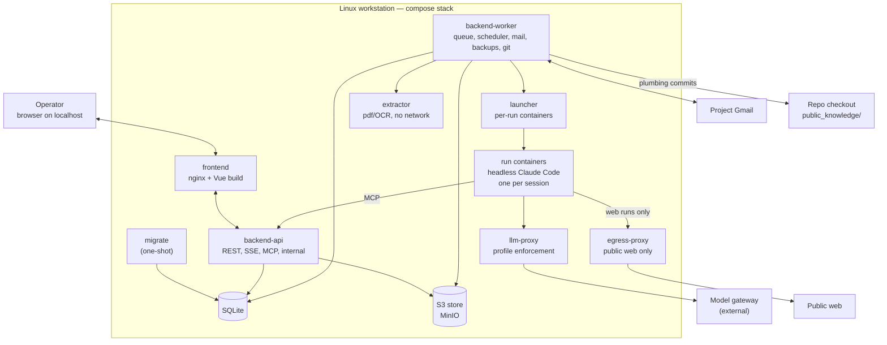

# Tekton — Technical specification

This document describes **how Tekton is built**. It implements the [functional specification](functional-spec.md) (FS); [RFD 1](rfd-0001.md) is the base. Items marked **[v1]** are in the first release.

## 1. Fixed contracts

These are expensive to change later and are defined here; everything else (libraries, tooling) is a recommendation and can be swapped.

| Contract | Section |
| --- | --- |
| Event vocabulary and event envelope | §5.4 |
| Decision keys, value types and scopes | §5.5, FS §4 |
| Privacy classes and propagation rules | §6 |
| Agent views (`sql_query` surface), versioned | §6.4 |
| Agent result envelope, `suspend` payload | §7.5, §7.6 |
| MCP tool names and arguments | §8 |
| Knowledge file format and paths | §11 |
| REST API, error format, SSE messages | §14 |
| Enum wire values (`snake_case`) | FS, §14.1 |

## 2. System overview



- The **backend** (`backend-api` + `backend-worker`, one Python package) owns all state. Agents change state only through MCP tools served by `backend-api`, which validate, apply privacy rules and append events.
- **Every agent session runs in its own short-lived container**, started by `launcher`. A container sees only its own token, its own scratch space, and the networks its profile allows.
- **`llm-proxy`** is Tekton's own small service: it checks the session token, enforces the profile's model allowlist and forwards to the external **model gateway** with the gateway key. The key never enters a run container.
- **`egress-proxy`** is the only route to the internet for runs with web access. It blocks private, loopback, link-local and compose addresses and applies per-site limits.
- Nothing is published outside `127.0.0.1`.

## 3. Repository layout

```
tekton/
  backend/
    src/tekton/
      domain/<module>/          entities, value objects, rules, ports — framework-free
      application/<module>/     use cases, event subscribers, unit of work
      infrastructure/<module>/  SQLite repositories, S3, Gmail, git, launcher client, BNR
      presentation/
        api/<module>/           FastAPI routers
        mcp/                    MCP server and tools
        stream/                 SSE
        internal/               endpoints for launcher, llm-proxy (internal network only)
      entrypoints/              api.py, worker.py, migrate.py, llm_proxy.py
    migrations/                 Alembic
    tests/{unit,integration,api,contract,support,fixtures}/
  frontend/
    src/{app,features,shared/domains,shared/foundation}/
    tests/{unit,component,e2e}/
  agents/<name>/                definition.yaml, prompt.md, result.schema.json
  images/                       run (Claude Code), extractor, egress-proxy Dockerfiles
  public_knowledge/             committed and pushed (§11)
  evals/<agent>/                fixtures, expected outputs, reports
  deploy/                       compose.yaml, .env.example, nginx.conf
  docs/
  justfile                      init, up, down, open, migrate, backup, restore, upgrade,
                                rollback, rotate-secrets, api-types, eval, test, lint
  .gitignore                    data/, s3/, deploy/.env, backups/
```

The layout is layer-first; within each layer, one package per module (§5.1). v1 runs from a clone of the repository (the knowledge flow needs it); packaged installs are out of scope.

## 4. Runtime and deployment [v1]

### 4.1 Services

| Service | Image | Networks | Notes |
| --- | --- | --- | --- |
| `frontend` | nginx + Vite build | `edge` | Published on `127.0.0.1:8080`. Proxies `/api/` to `backend-api` with `proxy_set_header Host $host`; SSE locations have `proxy_buffering off`, `proxy_read_timeout 1h`. `/mcp` and `/internal` are **not** proxied |
| `migrate` | backend | `data` | One-shot: backup, then `alembic upgrade head`, then S3 bucket provisioning (idempotent) |
| `backend-api` | backend | `edge`, `data`, `runs-mcp`, `control` | uvicorn; waits for `migrate` (`service_completed_successfully`) |
| `backend-worker` | backend | `data`, `control`, `internet` | Run queue, scheduler, Gmail, BNR rates, backups, knowledge commits; waits for `migrate` |
| `llm-proxy` | backend | `runs-llm`, `control`, `gateway` | Forwards model requests (§7.7) |
| `launcher` | backend | `control` | The only service with the container engine socket (rootless Podman, or Docker) |
| `extractor` | `images/extractor` | `control` (internal) | poppler, tesseract (`ron`), no internet, no secrets, CPU/memory limits |
| `egress-proxy` | `images/egress-proxy` | `runs-web`, `internet` | Forward proxy with deny rules and per-host limits (§7.3) |
| `s3` | MinIO, pinned by digest | `data` | Buckets in §10 |

- **Networks:** `runs-mcp`, `runs-llm` and `runs-web` are `internal: true` (no route out). `internet` is the only network with outbound access; `gateway` reaches the configured gateway URL (a host address through `host-gateway`, or a compose service).
- **Volumes:** `data/` (SQLite, `secrets/`), `s3/` (objects), the repository mounted read-only at `/repo` in `backend-api` and `backend-worker`, plus `/repo/.git` read-write in `backend-worker` only. On Rocky/SELinux, shared mounts use `:z`; the worker sets `safe.directory=/repo`.
- **Startup order:** `s3` → `migrate` → `backend-api`, `backend-worker`, `llm-proxy`, `launcher`, `extractor`, `egress-proxy` → `frontend`. `backend-api` and `backend-worker` refuse to start when `alembic current ≠ head` (log `startup.schema_mismatch`).
- **Restart policy:** `unless-stopped`, so watchers run whenever the workstation is on.
- **Images:** every image is tagged with the Tekton release and pinned by digest in `compose.yaml`; the Claude Code CLI version is pinned in `images/run`.
- **Supported hosts:** Ubuntu LTS and Rocky Linux, with rootless Podman (reference) or Docker.

### 4.2 Container hardening

All services and run containers run as non-root with `no-new-privileges`, `cap_drop: [ALL]`, a read-only root filesystem with `tmpfs` scratch, and `pids`/memory/CPU limits. Run containers additionally get a per-session wall-clock limit (§7.2).

## 5. Backend architecture [v1]

### 5.1 Modules and layering

| Module | Responsibility |
| --- | --- |
| `workflow` | Steps, the step state machine, the dependency graph, revalidation, "can complete" |
| `decisions` | Decision registry, decisions, proposals, derived values and overrides |
| `eligibility` | Notification-eligibility evaluation |
| `plots` | Plots, plot facts, listings, dedupe |
| `localities` | Localities, UATs, price per m², validation |
| `budget` | Categories, payments, currency conversion (through an `ExchangeRates` port) |
| `tasks` | Operator tasks, proof parts, proof verification state |
| `approvals` | Approval requests by kind |
| `documents` | Documents, privacy classes, consent, extraction jobs |
| `sources` | Citation records and snapshots |
| `agents` | Runs, sessions, the runner and launcher ports, profiles, tokens, cost, idempotency |
| `mail` | Gmail sync, threads, outbox, send rules |
| `knowledge` | `KnowledgeReader` and `KnowledgeWriter` ports, validation, overlay |
| `scheduling` | Scheduled jobs, the deadline engine, holidays |
| `notifications` | In-app notifications |

- **Layers:** `presentation → application → domain`; `infrastructure` implements domain and application ports and is wired in `entrypoints/`. Enforced by import-linter: a layers contract, a "domain imports no framework" contract, and an independence contract between domain modules with this allowed DAG: `workflow → decisions`; `eligibility → decisions, plots, localities`; `localities → decisions`; `plots → decisions, localities`; `budget → decisions`.
- **Cross-module reactions** go through event subscribers in `application/` (§5.3), never through direct calls into another module's application layer. For example, `agents` subscribes to `approval.resolved` and `task.verified` to resume waiting runs.
- **Persistence style:** domain entities are plain dataclasses; repositories are per aggregate, declared as ports in the domain; SQLAlchemy 2 with imperative (classical) mapping; a typed `UnitOfWork` with explicit `commit()`. Revalidation and event appends happen in the same unit of work as the change that caused them.

### 5.2 SQLite

- Every connection: `journal_mode=WAL`, `busy_timeout=5000`, `synchronous=NORMAL`, `foreign_keys=ON`.
- Every write unit of work opens with `BEGIN IMMEDIATE`, so writers queue on the lock instead of failing on upgrade.
- The SQLAlchemy engine is synchronous; async FastAPI handlers run units of work through `anyio.to_thread`. Git, extraction and snapshotting run in the worker, never in a request.
- Only `backend-api`, `backend-worker` and `migrate` open the file. Run containers never mount it.
- Alembic runs with `render_as_batch=True`. Migrations are forward-only; after the v1.0 tag they are never squashed, so any older release can upgrade to head.
- A lock wait over 2 s logs `db.lock_wait`.

### 5.3 Event log

Tekton is **event-logged**: the tables are the source of truth, and every change also appends an event in the same transaction. Events serve the history, the audit trail and the inter-process bus; projections are not rebuilt by replay.

```
events(
  seq             INTEGER PRIMARY KEY,   -- global order
  id              TEXT UNIQUE,           -- ULID
  at              TEXT,                  -- UTC, ISO-8601 with Z
  author_kind     TEXT,                  -- operator | agent_run | scheduled_job | system
  author_id       TEXT,
  type            TEXT,                  -- vocabulary §5.4
  payload_version INTEGER NOT NULL,
  subject_type    TEXT, subject_id TEXT,
  causation_id    TEXT,                  -- event or request that caused it
  privacy         TEXT NOT NULL,         -- §6
  payload         TEXT                   -- JSON
)
```

- **Payload versions:** each `(type, version)` has a Pydantic model; an upcaster registry turns any old version into the latest before it is returned by the API or consumed by a subscriber. A frozen fixture corpus holds one payload per `(type, version)`; CI fails when a registered type/version has no fixture.
- **Bus:** subscribers in both processes track their position in `consumer_offsets(consumer, seq)` and poll new events every 250 ms. Handlers are idempotent; the offset is committed in the same transaction as the handler's writes.
- **Run logs** (stream-json lines) go to `run_log(run_id, session_id, line_no, at, privacy, json)`, not to `events`.

### 5.4 Event vocabulary (v1)

| State machine / area | Events |
| --- | --- |
| Steps | `step.unblocked`, `step.started`, `step.completed`, `step.reopened`, `step.revalidation_required`, `step.revalidated` |
| Decisions | `decision.set`, `decision.override_set`, `decision.override_cleared` |
| Proposals | `proposal.created`, `proposal.accepted`, `proposal.rejected`, `proposal.superseded` |
| Derived values | `derived.changed` |
| Eligibility | `eligibility.changed` |
| Plots, localities | `plot.added`, `plot.updated`, `plot.merged`, `plot.status_changed`, `locality.added`, `locality.updated`, `locality.validation_changed` |
| Operator tasks | `task.created`, `task.started`, `task.proof_attached`, `task.completed`, `task.verified`, `task.proof_mismatch`, `task.cancelled` |
| Approvals | `approval.requested`, `approval.approved`, `approval.rejected` (approved-with-edits carries the edit) |
| Documents, sources | `document.stored`, `document.extracted`, `document.privacy_changed`, `source.stored` |
| Runs | `run.queued`, `run.started`, `run.waiting`, `run.resumed`, `run.succeeded`, `run.partial`, `run.failed`, `run.cancelled` (payloads carry the waiting kind or failure reason) |
| Mail | `mail.connected`, `mail.disconnected`, `mail.received`, `mail.draft_created`, `mail.sent`, `mail.send_failed`, `mail.thread_privacy_changed` |
| Knowledge | `knowledge.proposed`, `knowledge.approved`, `knowledge.rejected`, `knowledge.committed`, `knowledge.overlay_retired` |
| Budget | `budget.plan_changed`, `payment.recorded`, `payment.verified`, `payment.disputed`, `fx.rate_stored` |
| Scheduling | `job.created`, `job.updated`, `job.paused`, `job.resumed`, `job.triggered`, `deadline.created`, `deadline.reminder_due` |
| Settings, system | `settings.changed`, `backup.completed`, `backup.failed`, `privacy.profile_check_failed` |
| Notifications | `notification.created`, `notification.read` |

A new event type or payload version is a code change with a model, a fixture and, for a new version, an upcaster.

### 5.5 Decisions, proposals and derived values

```python
DecisionSpec(
    key="casa.suprafata_desfasurata_mp",
    step="1",
    scope=Scope.GLOBAL,              # GLOBAL | PLOT | LOCALITY
    value_type=Area(min=Decimal("1")),
    required=True,
)
DerivedSpec(
    key="buget.teren_max",
    step="1",
    depends_on=["buget.categorii"],
    compute=land_budget,
    overridable=False,
)
Check(
    key="zona.validare",
    subject=Scope.LOCALITY,
    depends_on=["buget.teren_max", "casa.amprenta_mp", "casa.suprafata_desfasurata_mp",
                "locality.pret_mp", "knowledge:zone_rules"],
    evaluate=locality_fits_budget,
)
```

- **Value types** (value objects, serialized per §14.1): `Integer`, `Boolean`, `Enum`, `Money`, `Area`, `Ratio`, `RoomList`, `CategoryAllocation`, `DistanceCriteria`, `EntityRef`, `EntityRefList`. The authoritative v1 keys are the tables in FS §4; a snapshot test of the registered keys fails on any rename, which then needs an alias.
- **Decisions** are stored in `decisions(key, subject_type, subject_id, version, value, rationale, source_ids, author, set_at)` with one row per version; the current value is the highest version. Writes carry the expected version (§14.1).
- **Proposals** live in `proposals(id, key, subject, value, rationale, source_ids, run_id, status, privacy)`. `propose_decision` creates or supersedes the pending proposal for that key and subject. Only operator requests produce `decision.set`: accepting (optionally with an edited value) or setting the field directly.
- **Derived values** are computed by the backend only; overridable ones store the operator override separately and keep showing the computed value next to it.

### 5.6 Dependency graph and revalidation

- Nodes are typed: `DecisionKey`, `DerivedKey`, `CheckKey`, `StepId`, plus `knowledge:<kind>` inputs. Edges are declared as `depends_on` on derived values and checks; each step declares the decisions, derived values and checks it owns. The reverse index is built at startup and validated (no unknown keys, no cycles); a test covers it.
- When a decision, an override, a derived input, an entity field or knowledge used by a check changes, the `workflow` subscriber re-evaluates the affected checks. Every `done` step owning a changed check moves to `needs_revalidation`.
- The impact list is a list of `{code, params}` items (e.g. `{"code": "plots_over_budget", "params": {"count": 2}}`); the frontend owns the wording.

### 5.7 Steps

Step ids are strings: `"1"` … `"6"`, `"7a"`, `"7n"`, `"8"`, `"9"`. The transitions are the table in FS §4.1; `blocked`/`available` are computed from earlier steps, and the others are stored. The API returns, per step, `state`, `can_complete`, `blocking[]` (codes with params) and `next_action`, so the UI never re-derives the rules.

### 5.8 Eligibility

`evaluate_eligibility(decisions, plot | None, locality | None, zone_rules | None, rules: NotificationRules) -> EligibilityResult`. `NotificationRules` holds the parameters and article references loaded from `public_knowledge/lege/169-2026/notificare.yaml` by the application layer through `KnowledgeReader`; the code implements the logic, and the knowledge file supplies the thresholds and citations. The result (`eligibil | neeligibil | de_verificat`, conditions with codes and sources) is stored as a projection and recomputed on relevant `decision.set`, plot or locality changes and `knowledge.committed`/`knowledge.approved`.

### 5.9 Budget and currency

- Amounts are `Money(amount: Decimal, currency: RON | EUR)`. The reporting currency is RON.
- `ExchangeRates` port with a BNR adapter; the worker stores daily rates in `fx_rates(date, currency, rate)`. A conversion uses the last rate on or before its date and records the rate's date. Payments convert at the payment date; plans and validations at the calculation date.
- Payments: `payments(id, task_id, amount, paid_at, receipt_document_id, status: unverified|verified|disputed)`, `UNIQUE(task_id, receipt_sha256)`. A payment is recorded when the operator completes a `plata` task (or a `portal` task with a receipt) and verified by the proof check (§9).

## 6. Privacy model [v1]

### 6.1 Classes

| Class | Meaning | Visible to |
| --- | --- | --- |
| `public` | Public web content, knowledge, listings | All runs |
| `operator` | What the operator types: decisions, rationale, settings | All runs |
| `personal_cloud` | Personal data the operator released to cloud models | All runs |
| `personal_local` | Personal data; the default for uploads, mail and anything derived from them | `local_only` runs and the operator |

### 6.2 Propagation

- Every table that can hold personal content has a `privacy` column: `documents`, `document_text`, `mail_messages`, `mail_threads`, `plot_facts`, `proposals`, `sources` (for excerpts of personal documents), `tasks.prepared`, `events`, `run_log`, `approvals`.
- The backend tracks, per session, the highest class it has read. Anything the session writes gets at least that class. The class is always assigned by the backend; tool arguments cannot set it.
- A session of a `cloud` run cannot read `personal_local` data; the read fails with `privacy.forbidden` and a hint to call `request_consent`.
- **Lowering a class** is an operator action (document, thread, sender, or approving a `privacy_consent` request) and appends `document.privacy_changed` or `mail.thread_privacy_changed`.
- An accepted proposal becomes an `operator` decision value; its rationale and sources keep their own classes.

### 6.3 Profiles

A run's profile is set by its definition, may be overridden per agent in Settings, and is fixed for the run:

- `cloud`: cloud or local models; reads `public`, `operator`, `personal_cloud`.
- `local_only`: local models only; reads everything; **never** has web access.

Definitions that read personal data are `local_only` by default (`cf-reader`, `proof-checker`, `mail-triage`); the loader rejects a definition that combines `local_only` with web access.

### 6.4 Agent views and `sql_query`

- `sql_query(sql, params?)` runs on a separate connection opened with `mode=ro`, `PRAGMA query_only`, a row limit (1,000) and a time limit (progress handler, 5 s).
- An SQLite authorizer allows `SELECT` only, and only on the views of the run's profile: `cloud_*` views (rows with `privacy` in `public`, `operator`, `personal_cloud`) or `local_*` views (all rows). `ATTACH`, `PRAGMA`, writes and non-allowlisted functions are denied; extension loading is disabled.
- The views are a **versioned contract** (`agent_views` version in the tool description, generated from the migration that defines them). A test snapshots the view definitions; changing them requires a version bump and re-running the agent evals.

## 7. Agent runs [v1]

### 7.1 Definitions

`agents/<name>/definition.yaml`: prompt template, MCP tool allowlist, `web: true|false`, profile, result schema, per-session timeout, cost cap, `max_turns`, priority. v1 definitions: `budget-estimator`, `lending-researcher`, `listing-scout`, `price-per-m2`, `rlu-reader`, `plot-zone-finder`, `cf-reader`, `cu-type-selector`, `cu-reader`, `connection-cost-estimator`, `plot-verdict`, `mail-triage`, `proof-checker`, `knowledge-verifier`, `legal-watch`.

### 7.2 Lifecycle

States: `queued → running → waiting_approval | waiting_operator | waiting_resource → running → succeeded | partial | failed | cancelled`.

- `waiting_resource` carries a reason: `local_model_unavailable`, `gateway_unavailable`, `cost_cap_reached`, `mail_disconnected`, `concurrency`.
- `failed` carries a reason: `invalid_result`, `no_terminal_call`, `timeout`, `orphaned`, `cost_cap`, `container_error`, `privacy_check_failed`.
- **Durable queue:** `runs(id, definition, subject, status, status_reason, priority, attempt, lease_until, sandbox_session_id, deadline_at, continuation, cost)`. The worker claims queued runs with a lease and renews it while the session runs.
- **Coalescing:** at most one queued run per `(definition, subject)`; a new request for the same pair is merged into the queued run. Mail triage runs once per sync batch.
- **Reconciliation:** at startup and every minute, the worker finds runs with an expired lease or a passed `deadline_at`, asks `launcher` to kill the container, revokes the session token, and marks the run `failed(orphaned|timeout)`. Waiting runs whose awaited event already happened are resumed.
- **Concurrency:** 3 concurrent sessions by default; operator-started runs have priority over scheduled ones.

### 7.3 Launcher and run containers

- The worker asks `launcher` (over `control`, authenticated with a shared secret) to start a session. The request carries only `{run_id, session_id}`. The launcher fetches the session spec from `backend-api` `/internal/sessions/{id}` and starts a container from the pinned `images/run` image with fixed flags. It accepts no image names, commands, mounts or arguments from the request.
- The container gets its session token and prompt through environment and stdin, a private `tmpfs` scratch directory, and these networks:
  - always `runs-mcp` (to `backend-api:8000/mcp`) and `runs-llm` (to `llm-proxy`);
  - `runs-web` (to `egress-proxy`, set as `HTTPS_PROXY`/`HTTP_PROXY`) only when the definition has `web: true`.
- `launcher` attaches to the container output and forwards stream-json lines to `backend-api` `/internal/runs/{id}/log`; it reports the exit status. It kills containers at the session deadline and on cancel.
- **egress-proxy:** denies private, loopback, link-local and compose ranges (resolved once per connection, re-checked on every CONNECT); per-host connection rate limits and a per-run page budget for listing sites from `settings.listing_sites`; three consecutive 403/429 responses from a site pause it for 24 hours (`notification.created`). Requests are logged with host, run id and bytes.
- Chromium runs with its own sandbox when the container runtime allows user namespaces; otherwise the container is the boundary, and this is recorded in the health page.

### 7.4 Session invocation (Claude Code adapter)

Inside the run container:

```
claude -p --verbose \
  --output-format stream-json \
  --mcp-config /run/tekton/mcp.json \
  --allowedTools "mcp__tekton__<tool>,…,<web tools if web: true>" \
  --max-turns <max_turns>
```

Environment: `ANTHROPIC_BASE_URL=http://llm-proxy:4000`, `ANTHROPIC_AUTH_TOKEN=<session token>`, every model variable (`ANTHROPIC_MODEL`, and the small/fast model variables) set to the profile's model, and `CLAUDE_CODE_DISABLE_NONESSENTIAL_TRAFFIC=1`. `mcp.json` points at `http://backend-api:8000/mcp` with the same session token. The prompt is rendered by the backend and read from stdin.

- The CLI is installed at image build time from the pinned npm version; Tekton does not redistribute it. A contract test parses recorded stream-json transcripts; unknown event types are logged and skipped.
- **Session tokens** are opaque 256-bit values, stored hashed in `session_tokens` with run id, profile, tool allowlist and expiry (the session deadline). They are revoked when the session ends, suspends or is cancelled. MCP authorization checks the allowlist and profile server-side on every call.

### 7.5 Result envelope

`submit_result` takes this envelope; `payload` is validated against the definition's schema.

```json
{
  "status": "complete | partial",
  "summary": "one paragraph for the run page",
  "claims": [
    {"id": "c1", "path": "payload.verdict.reasons[0]", "text": "…", "source_ids": ["01J…"]}
  ],
  "payload": { }
}
```

- Every statement shown to the operator must be a claim referenced from the payload. The backend drops claims without resolvable `source_ids` and the payload fields that reference them, sets the run to `partial`, and lists the drops on the run page. FS principle 4 matches this rule.
- An invalid envelope is rejected with validation errors; the session may retry within its turns. The run's **finalization** is an application service in `backend-api`, invoked by `submit_result`, by `suspend`, or by the launcher's exit report; it is idempotent on the run state. A session that exits without a terminal call fails with `no_terminal_call`.

### 7.6 Waiting and resuming

- `suspend(continuation, waiting_on)` is the second terminal tool. `continuation` follows a fixed schema: `{done: [...], next: [...], state: {...}, notes}`. `waiting_on` names the approval or task ids. It emits `run.waiting` and stores the continuation on the run.
- The `agents` subscriber resumes the run when every awaited item is resolved: `approval.approved`/`approval.rejected`, or `task.verified` (or `task.completed` for task types without an automated check). A new session starts with the continuation and the outcomes; `run.resumed` is appended.
- `create_operator_task` and the approval-creating tools never block; waiting is always an explicit `suspend`.

### 7.7 Model profiles and `llm-proxy`

- Settings hold the model names per profile: `local_only.models` (declared local by the operator) and `cloud.models`.
- `llm-proxy` accepts only requests with a live session token, rejects any `model` outside the session profile's list (`403`, logged as `privacy.model_rejected`), adds the gateway key and forwards, streaming. The gateway key lives only in `llm-proxy`.
- **Self-check (fail-closed):** at startup and before each `local_only` session (cached 5 minutes), `llm-proxy` verifies that the gateway is reachable and, where the gateway exposes model metadata, that every `local_only` model routes to a local provider. If this fails or cannot be verified without the operator's explicit acknowledgement in Settings, `local_only` sessions do not start (`waiting_resource(local_model_unavailable)`), and `privacy.profile_check_failed` is logged and shown on the health page.
- **Cost:** `llm-proxy` records tokens per session; prices come from a per-model price table in Settings (local models cost 0). A run over its cap is cancelled with `failed(cost_cap)`. Over the monthly cap, watchers pause and manually started runs require confirmation.

### 7.8 Idempotency

- Every write tool takes a required `idempotency_key`, stored with the result in `tool_invocations(run_id, tool, idempotency_key, result)`; a repeated call returns the stored result.
- Natural keys prevent duplicates across runs: plots by cadastral number, otherwise site + listing id; sources by URL + content hash; documents by content hash; payments by task + receipt hash; deadline reminders by deadline + offset.

## 8. MCP tools [v1]

Served by `backend-api` at `/mcp` on the `runs-mcp` network, named `mcp__tekton__<tool>` in the CLI. All outputs that contain web, mail or knowledge content are wrapped in an untrusted-content envelope (`{"untrusted": true, "origin": …, "content": …}`).

| Tool | Kind | Notes |
| --- | --- | --- |
| `sql_query(sql, params?)` | read | Profile views only (§6.4) |
| `get_decisions(keys?, subject?)`, `get_step(step_id)` | read | Current values, proposals, derived values |
| `get_plot(id)`, `list_plots(filter, cursor?)`, `get_locality(id)`, `list_localities(filter, cursor?)` | read | Filtered by profile |
| `get_document(id)` | read | Extracted text with page offsets; for `local_only` runs, also a copy of the file in the session scratch |
| `get_mail_thread(id)` | read | Profile checked |
| `search_knowledge(query)`, `get_knowledge(path)` | read | Effective knowledge (§11.3), untrusted envelope |
| `store_source(scratch_key, url, excerpt, locator)` | write | The session fetched the page and saved it (HTML, text, PDF/PNG render) to its scratch; the backend hashes and copies it to `snapshots` |
| `store_document(scratch_key, type, links)` | write | Agent-fetched public documents (regulations, listings) |
| `propose_decision(key, subject?, value, rationale, source_ids)` | write | Creates or supersedes a proposal |
| `upsert_plot(natural_key, fields, source_ids)`, `upsert_locality(siruta, fields, source_ids)` | write | Facts carry sources and inherit privacy |
| `mark_listing_removed(plot_id, listing, source_id)` | write | Agents cannot shortlist, reject or choose plots |
| `create_operator_task(type, subject, prepared, required, due?)` | write | Proof parts come from the type (§9) |
| `draft_email(type, to, subject, body, attachment_ids, thread_id?)` | write | Creates a draft and, per the send rule, an `email_send` approval. For `web: true` definitions, attachments must be `public` and recipients must come from a stored source, plot, locality or thread |
| `propose_knowledge_change(path, content, source_ids)` | write | Validated (§11.2); creates a `knowledge_change` approval |
| `request_consent(items, reason)` | write | Creates a `privacy_consent` approval |
| `report_proof_check(task_id, verdict, findings)` | write | `proof-checker` only |
| `submit_result(envelope)` | terminal | §7.5 |
| `suspend(continuation, waiting_on)` | terminal | §7.6 |

Web research uses the run container's own tools (fetch, Playwright browser) through `egress-proxy`. The backend never fetches URLs chosen by an agent.

## 9. Operator tasks and proof [v1]

- `tasks(id, type, step, subject, title, prepared, required, due_at, status, check_status, run_id, privacy, version)`.
- `type` is a closed enum: `plata`, `portal`, `telefon`, `deplasare`, `semnare`, `intalnire`, `cont`. Each type defines its **proof parts** as typed models, from which the JSON Schema and the UI form are generated:

| Type | Proof parts |
| --- | --- |
| `plata` | `receipt` (document) + `amount` (Money) + `paid_at` (date) |
| `portal` | `confirmation_number` + `document`, and `receipt` + `amount` + `paid_at` when `prepared.fee` is set |
| `telefon` | `answers` to `prepared.questions` |
| `deplasare` | `registration_number` + `stamped_copy_photo`, or `checklist` + `photos` |
| `semnare` | `signed_document` |
| `intalnire` | `answers` + optional `documents` |
| `cont` | a `mail.connected` event (Gmail) or an operator confirmation |

- `POST /tasks/{id}/complete` returns `422 proof.missing` with the missing parts unless every part is present.
- On completion, the payment (if any) is recorded as `unverified`. A `proof-checker` run (`local_only`) is queued for types with an automated check (`plata`, `portal`, `deplasare`, `semnare`); it calls `report_proof_check`, which appends `task.verified` (and `payment.verified`) or `task.proof_mismatch` (task reopened, payment `disputed`). Without a local model, the check waits and the task shows `unchecked`.

## 10. Documents and storage [v1]

- **S3 buckets** (provisioned idempotently by `migrate`):
  - `documents`: personal files (uploads, attachments, receipts, photos)
  - `public`: agent-fetched public documents
  - `snapshots`: source snapshots
  - `transcripts`: run transcripts (retention 180 days, configurable)
  - `scratch`: per-session areas `scratch/<session_id>/`, 7-day lifecycle rule
- Object keys are `sha256/<hash>`; the hash is verified when an object is copied in and when it is read back for display or backup.
- **Access:** only `backend-api` and `backend-worker` hold S3 credentials. Run containers never do; they exchange files with the backend through their scratch area (a per-session prefix exposed by `backend-api` over the MCP connection) and the `scratch_key` arguments.
- **Metadata:** `documents(id, sha256, bucket, mime, size, type, privacy, origin, regim_legal?, created_at)`, `document_links(document_id, subject_type, subject_id)`, `document_text(document_id, page, text, privacy)`.
- **Extraction:** the worker sends new documents to `extractor` (text PDFs via poppler; scans via tesseract `ron`), stores the text with page offsets and appends `document.extracted`. A vision-model pass is optional, runs as a `local_only` agent run, and applies only to `personal_local` documents.
- **Sources:** `sources(id, kind: web|document|knowledge|email, url, retrieved_at, snapshot_key, sha256, excerpt, locator, privacy)`. Every web source is snapshotted when it is cited; snapshots are shown as the rendered PDF/PNG plus text, never as live HTML.
- **Serving content:** `GET /api/v1/documents/{id}/content` streams from S3 with `Range` support, `Content-Security-Policy: sandbox; default-src 'none'`, `X-Content-Type-Options: nosniff`, and `Content-Disposition: attachment` unless the MIME type is in the allowlist (`application/pdf`, `image/png`, `image/jpeg`, `image/webp`, `text/plain`). PDFs are rendered in the app with pdf.js. Uploads: `POST /api/v1/documents` (multipart, 50 MB limit, MIME allowlist, default class `personal_local`).

## 11. Knowledge base: `public_knowledge/` [v1]

### 11.1 Layout and format

```
public_knowledge/
  _schema/                         JSON Schemas, one per file kind and version
  lege/169-2026/
    pasi.yaml                      steps and legal deadlines
    tipuri_cu.yaml                 the five CU types
    notificare.yaml                notification conditions, with article references
  calendar/
    sarbatori.yaml                 public holidays, keyed by year
  judete/<judet>/<uat>/
    uat.yaml                       SIRUTA, type (comuna/oras/municipiu), component localities (SIRUTA), town hall contact, portal
    zone/<cod>.yaml                RLU zone rules
    taxe.yaml                      local taxes, infrastructure levy
```

Every file starts with a common header:

```yaml
schema: zona/v1                  # kind/version, validated against _schema/
sursa: https://…                 # the law (Monitorul Oficial), HCL, RLU, or official page
verificat: 2026-09-27            # date the content was last checked against the source
status: confirmat                # confirmat | de_verificat
nota: …                          # optional, at most 500 characters
```

- Files are loaded with `yaml.safe_load` and validated on every read. Readers accept the current and previous schema version of a kind; a schema change and the migration of every affected file land in the same PR.
- `calendar/sarbatori.yaml` must contain the current and next year. From 1 October, CI fails if next year is missing; the deadline engine marks a deadline `de_verificat`, logs `deadline.holidays_missing` and notifies when a year is missing. Orthodox Easter and Pentecost are cross-checked against a computed date.

### 11.2 Validation of proposals

- `path` is normalized and must match `^(lege|calendar|judete)/[a-z0-9_/-]+\.yaml$`, contain no `..`, and resolve inside `public_knowledge/`; `_schema/` is not writable by agents.
- The content is validated against its schema, and scanned for personal data by the **pattern scanner** (CNP with checksum, IBAN, personal e-mail addresses and phone numbers outside institutional domains) and, locally, by the **records scanner** (names and addresses of the operator, sellers and professionals from Tekton's own records, behind a `KnownPersonalNames` port).
- An operator edit in the approval is validated again before it is applied.

### 11.3 Effective knowledge and commits

- Agents and rules read the **effective knowledge**: the files of `/repo/public_knowledge/` as checked out, overlaid with approved changes not yet on disk (`knowledge_overlay(path, content, approved_at, commit)`). An overlay entry is retired when the file on disk equals it or carries a later `verificat`.
- On approval, `backend-worker` commits without touching the operator's working tree or index: with a temporary `GIT_INDEX_FILE`, `read-tree` of the base ref (`knowledge.base_ref`, default `main`), `hash-object -w`, `update-index --cacheinfo`, `write-tree`, `commit-tree`, then `update-ref` creating `refs/heads/knowledge/<topic>-<ulid>`. Git runs with `-c core.hooksPath=/dev/null` and the author "Tekton agent (approved by operator)". It never pushes.
- The branch topic is neutral (`zone-rules`, `taxes`, `holidays`, `law`); the UAT is in the commit message, which the operator reviews before pushing.
- **CI** on the repository runs the schema validation and the pattern scanner on every PR touching `public_knowledge/` or `evals/`, and CODEOWNERS requires a maintainer review for `public_knowledge/`.

## 12. Mail [v1]

- **Provisioning** (a `cont` task with step-by-step instructions): create the Gmail account; create a Google Cloud project; enable the Gmail API; configure the OAuth consent screen (External) and **publish it to production** (unverified, used only by the operator), because apps in Testing mode get refresh tokens that expire after 7 days; create a *Desktop* OAuth client; enter its id and secret in Settings.
- **OAuth:** `POST /api/v1/mail/oauth/start` (session-authenticated) creates a pending row with `state` and a PKCE verifier and returns Google's URL; the loopback redirect `GET /api/v1/mail/oauth/callback` does not use the session cookie, validates `state` and PKCE against the pending row, stores the tokens and redirects to `/settings/mail`. Scope: `https://www.googleapis.com/auth/gmail.modify` (read, labels, drafts, send).
- **Sync** (worker, every 15 minutes): `users.history.list` from the stored `historyId`. On `404` (expired history), fall back to `messages.list` with `after:` one day before the last successful sync. Messages are deduplicated by `UNIQUE(gmail_message_id)`; stored messages and the new `historyId` are committed in one transaction; attachments go to S3 as `personal_local`; one `mail-triage` run is queued per batch with new messages.
- **Expiry:** `invalid_grant` marks the mailbox disconnected (`mail.disconnected`), creates a `cont` task to reconnect and a notification, and shows it on the health page.
- **Outbox:** `outbox(id, draft_id, approval_id, state: draft|approved|sending|sent|failed, message_id)`. Tekton sets its own `Message-ID` (`<ulid@tekton.local>`). Before retrying a message left in `sending`, it searches the mailbox for `rfc822msgid:` and marks it `sent` if found, so a crash never sends twice. `draft_only` drafts are also created as Gmail drafts for the operator to send.
- **Rendering:** mail HTML is sanitized with DOMPurify and shown in a sandboxed `<iframe srcdoc>` with remote images blocked until the operator loads them.

## 13. Scheduling [v1]

- `scheduled_jobs(id, kind: agent|system, target, schedule, enabled, last_run_at, next_run_at, version)`. `schedule` is `{"every": "PT15M"}` or `{"cron": "0 7 * * *"}` (Europe/Bucharest). This table is the only store; the worker's loop reads it every 30 seconds and runs due jobs. A job missed while the machine was off runs once at startup.
- Edits come through the API (`job.updated`); the worker picks them up on the next tick.
- v1 jobs: listing watcher (agent), price refresh (agent), mail sync (system) + triage (agent), deadline engine (system), stale knowledge (agent), legal watch (agent), BNR rates (system), backup (system), run reconciliation (system, every minute), extraction queue (system).
- **Deadline engine:** computes legal deadlines from events (e.g. 15 working days from the notification filing date, in Europe/Bucharest, excluding holidays from `calendar/sarbatori.yaml`), stores them in `deadlines`, and creates reminders and tasks at configured offsets.

## 14. API [v1]

### 14.1 Conventions

- REST under `/api/v1`, JSON, OpenAPI generated by FastAPI with stable `operation_id`s.
- **IDs:** ULID strings (26 characters). **Instants:** UTC ISO-8601 with `Z`. **Legal and calendar dates:** `YYYY-MM-DD`, interpreted in Europe/Bucharest.
- **Money:** `{"amount": "1234.50", "currency": "RON"}` (decimal string). **Area:** `{"value": "150.00", "unit": "m2"}`. **Ratios:** decimal strings (`"0.30"`). No money arithmetic in the frontend.
- **Enums:** `snake_case` wire values; the frontend translates `enum.<name>.<value>`.
- **Decision values:** a discriminated union on `value_type`, so OpenAPI emits `oneOf`.
- **Nulls:** fields are always present; absent values are `null`. An unset decision is `{"value": null, "version": 0}`.
- **Pagination:** cursor based, `?after=<cursor>&limit=<n>` → `{"items": [...], "next_cursor": … }`.
- **Concurrency:** resources carry `version`; mutating requests send `If-Match: "<version>"`; a stale version returns `409 conflict.stale_version`.
- **Human text:** the server returns codes with params (impacts, blocking items, eligibility conditions, errors); agent-written prose is returned with its language tag and displayed as is.
- **Errors:** `application/problem+json` (RFC 9457): `{type, title, status, code, detail, errors: [{path, code}]}`. FastAPI's validation errors are converted to this shape. Codes include `validation.failed`, `auth.required`, `csrf.invalid`, `conflict.stale_version`, `step.cannot_complete`, `proof.missing`, `privacy.forbidden`, `not_found`. The domain raises typed errors without HTTP codes; the presentation layer maps them. MCP tools return the same `code` plus a `hint`.

### 14.2 Operator session

- `just init` generates `data/secrets/operator.key` (mode `0600`). `just open` prints a single-use login URL `http://127.0.0.1:8080/login#<one-time token>`.
- `POST /api/v1/session` exchanges the one-time token for a `tekton_session` cookie (`HttpOnly`, `SameSite=Strict`, 30 days, sliding); `GET /api/v1/session` returns the session state and the CSRF token; `DELETE /api/v1/session` logs out.
- Mutating requests carry `X-CSRF-Token`. Every route except `/session` (POST), `/mail/oauth/callback` and `/health/live` requires the session; a test enumerates the routes to prove it.
- The backend accepts only `Host: 127.0.0.1:8080` or `localhost:8080` on the public router. `/mcp` and `/internal` are mounted on separate listeners bound to the internal networks and accept only their own tokens.

### 14.3 Endpoints

| Area | Endpoints |
| --- | --- |
| Session | `GET/POST/DELETE /session` |
| Home | `GET /home` — steps summary, current step, eligibility, budget summary, next deadlines, attention counts |
| Steps | `GET /steps`, `GET /steps/{step_id}`, `POST /steps/{step_id}/complete`, `POST /steps/{step_id}/reopen`, `POST /steps/{step_id}/revalidate` |
| Decisions | `GET /decision-specs`, `GET /decisions?step=&subject_type=&subject_id=`, `PUT /decisions/{key}?subject_type=&subject_id=` (value, rationale; `If-Match`) |
| Proposals | `GET /proposals?status=&step=`, `POST /proposals/{id}/accept` (optional edited value), `POST /proposals/{id}/reject` (reason) |
| Derived values | `GET /derived?step=`, `PUT /derived/{key}/override`, `DELETE /derived/{key}/override` |
| Eligibility | `GET /eligibility?plot_id=` |
| Plots | `GET /plots`, `POST /plots` (listing URL or details; queues enrichment), `GET /plots/{id}`, `PATCH /plots/{id}`, `POST /plots/{id}/status` |
| Localities | `GET /localities`, `GET /localities/{id}` |
| Tasks | `GET /tasks`, `POST /tasks`, `GET /tasks/{id}`, `POST /tasks/{id}/start`, `PUT /tasks/{id}/proof/{part}`, `POST /tasks/{id}/complete`, `POST /tasks/{id}/cancel` |
| Approvals | `GET /approvals`, `GET /approvals/{id}`, `POST /approvals/{id}/approve` (optional edit), `POST /approvals/{id}/reject` (reason) |
| Documents | `GET /documents`, `POST /documents`, `GET /documents/{id}`, `GET /documents/{id}/content`, `GET /documents/{id}/text`, `PATCH /documents/{id}/privacy` |
| Sources | `GET /sources/{id}`, `GET /sources/{id}/snapshot` |
| Runs | `GET /runs`, `POST /runs` (definition, subject), `GET /runs/{id}`, `POST /runs/{id}/cancel`, `GET /runs/{id}/log` |
| Scheduled jobs | `GET /jobs`, `PATCH /jobs/{id}` (enabled, schedule), `POST /jobs/{id}/run` |
| Mail | `GET /mail/status`, `POST /mail/oauth/start`, `GET /mail/oauth/callback`, `GET /mail/threads`, `GET /mail/threads/{id}`, `PATCH /mail/threads/{id}/privacy`, `PATCH /mail/senders/{address}/privacy` |
| Knowledge | `GET /knowledge/tree`, `GET /knowledge/file?path=`, `GET /knowledge/changes` (each: `{path, before, after, unified_diff, sources, status}`) |
| Budget | `GET /budget`, `GET /payments` |
| Calendar | `GET /calendar?from=&to=`, `GET /calendar.ics` (download, `text/calendar`, session cookie) |
| History | `GET /events?after=&limit=&type=&subject_type=&subject_id=` |
| Notifications | `GET /notifications`, `POST /notifications/{id}/read`, `POST /notifications/read-all` |
| Settings | `GET /settings`, `PATCH /settings` (email rules, profile overrides, model lists, prices, caps, listing sites) |
| Health | `GET /health/live`, `GET /health` |
| Streams | `GET /stream`, `GET /runs/{id}/stream` |

### 14.4 Live updates (SSE)

- `GET /api/v1/stream` sends one message per event: `id: <seq>`, `event: <type>`, `data:` an `SseMessage` (`{seq, type, at, subject_type, subject_id, data}`) whose `data` is a discriminated union over the event types the UI consumes, published in OpenAPI through a schema-only endpoint.
- On reconnect with `Last-Event-ID`, the server replays from the events table; beyond 10,000 missed events it sends `resync` and the client refetches. A heartbeat comment every 15 s; `retry: 3000`.
- Events whose `privacy` is `personal_local` are sent too (the browser is the operator's); run log lines go only to `GET /runs/{id}/stream`.

### 14.5 Generated types

`just api-types` exports the OpenAPI schema and generates `frontend/src/shared/foundation/api/schema.d.ts` with `openapi-typescript`; the client uses `openapi-fetch`. CI regenerates and fails on any diff. This is part of M0.

## 15. Frontend [v1]

- **Stack:** Vue 3 (Composition API), TypeScript strict, Vite, Vue Router, **TanStack Vue Query** for server state, Pinia for client-only state, vue-i18n (`en` catalogue from day one; `ro` added through the same keys), MapLibre GL with a local **PMTiles** extract of Romania served from the `public` bucket (no tile requests leave the machine), pdf.js, DOMPurify.
- **Structure:** `src/app` (shell, router, providers), `src/features/<feature>` (`home`, `step`, `tasks`, `approvals`, `plots`, `localities`, `budget`, `calendar`, `documents`, `mail`, `agents`, `knowledge`, `history`, `notifications`, `health`, `settings`, `auth`), `src/shared/domains/<domain>` (`steps`, `decisions`, `proposals`, `eligibility`, `plots`, `tasks`, `approvals`, `documents`, `sources`, `budget`), `src/shared/foundation` (`api`, `stream`, `ui`, `i18n`, `format`). Imports go `app → features → shared/domains → shared/foundation`, enforced by ESLint rules.
- **Server state:** every server read goes through a query in `shared/domains`; one `useEventStream` in the app shell maps SSE messages to query invalidations or patches. Forms keep a local draft; an incoming change to the same resource shows "changed on server" instead of overwriting the draft.
- **Decision forms** are generated from `/decision-specs` (one component per value type), with per-key override slots; proposals render inline with Accept / Edit / Reject.
- **Proof forms** are generated from the task type's proof parts.
- **Safe content:** a single `SafeHtml` component (DOMPurify) and sandboxed iframes for mail; `vue/no-v-html` is an error.
- **States:** a shared `AsyncState` with loading, empty (with the next action) and error (with retry); a global "disconnected" banner when the stream drops.
- **Accessibility:** `eslint-plugin-vuejs-accessibility`; axe checks in Playwright; the step map uses `aria-current`; dialogs trap focus; focus moves to the page heading on navigation; one polite live region for updates; every map action has a list equivalent.
- **Times** are formatted with `timeZone: "Europe/Bucharest"`.

## 16. Security [v1]

| Threat | Controls |
| --- | --- |
| Another local process or website drives the app | `127.0.0.1` binding, Host allowlist, session cookie (`SameSite=Strict`) and CSRF header, single-use login token |
| Hijacked agent (prompt injection from web, mail or knowledge) | One container per session; per-session token with a server-side tool allowlist; no S3, DB, Gmail or git credentials in runs; outbound actions only through approvals; web agents can draft only to known recipients with public attachments; untrusted-content envelopes |
| Personal data sent to a cloud model | Privacy classes with propagation (§6); `local_only` runs without web; model allowlist enforced by `llm-proxy`; fail-closed self-check |
| Exfiltration over the network | Run networks are internal; web only through `egress-proxy`; `local_only` runs never get web |
| SSRF against internal services | The backend never fetches agent-chosen URLs; `egress-proxy` denies private ranges |
| Malicious content in the browser | CSP sandbox and `nosniff` on served content; snapshots rendered as PDF/PNG; DOMPurify; sandboxed mail iframes |
| Malicious knowledge paths or hooks | Path allowlist; plumbing commits with hooks disabled; no working-tree writes |
| Container escape from the launcher | `launcher` accepts only `{run_id, session_id}` and uses a fixed image and flags; hardened containers (§4.2) |
| Secrets at rest | OAuth tokens and keys in `data/secrets`, encrypted with `TEKTON_SECRETS_KEY` from `deploy/.env` (`0600`); `just rotate-secrets` re-encrypts; losing the key means reconnecting Gmail |
| Secrets in logs | Formatter redacts auth headers, tokens, cookies and signed URLs; logs and transcripts inherit privacy classes |

The gateway must be on the same host or reached over TLS.

## 17. Backup, restore, upgrades [v1]

- **Backup module** (one implementation, used by the daily job and `just backup`):
  1. SQLite online backup to a temporary file;
  2. S3 objects added since the last backup (objects are content-addressed and written before the rows that reference them, so every row in the snapshot has its object);
  3. `data/secrets` (already encrypted) and the non-secret config.
  Excluded: `scratch`, `transcripts` (optional), the `.env` key. The archive is encrypted with `age` to a recipient key created by `just init`; the operator keeps the identity file and `TEKTON_SECRETS_KEY` together, offline.
- **Target:** a configurable directory, ideally on another disk; the health page warns when it is on the same device as `data/`. Retention: 14 daily, 8 weekly.
- **Restore:** `just restore <archive>` stops the stack, verifies the archive, restores SQLite and objects, verifies object hashes against the rows, and starts the stack. A restore test in CI restores a generated backup into an empty stack and compares.
- **Upgrades:** `just upgrade <release>`: backup → pull the pinned images → `migrate` → start. **Rollback:** `just rollback`: stop → restore the pre-upgrade backup → start the previous release's images. Everything recorded since the upgrade is lost; the command says so and asks for confirmation.
- Schema changes that must survive a rollback across releases use expand/contract migrations. Migration tests upgrade a fixture database of every released schema to head.
- Events `backup.completed` / `backup.failed` appear on the health page.

## 18. Observability

- JSON logs with bound fields: `request_id`, `run_id`, `session_id`, `definition`, `tool`, `profile`, `authz_decision`, `event_seq`, `outcome`, `duration_ms`. Container logs capped (`max-size` 10 MB × 5).
- Named log lines, among them: `startup.schema_mismatch`, `db.lock_wait`, `run.orphaned`, `run.timeout`, `privacy.model_rejected`, `privacy.profile_check_failed`, `mail.sync_fallback`, `mail.disconnected`, `egress.site_paused`, `deadline.holidays_missing`, `runs.queue_depth_high`, `backup.failed`.
- Run transcripts in the `transcripts` bucket, classed like the data they touched, viewable per run.
- **Health page:** service status, gateway reachability and profile self-check, Gmail connection and token state, scheduled jobs (last and next run), queue depth, backups (last success, target device), cost this month.

## 19. Testing and evaluation [v1]

- **Backend:** pytest. `unit` (domain), `integration` (temp-file SQLite in WAL mode; S3 via testcontainers), `api`, `contract` (stream-json, OpenAPI), with `support/` holding a **fake runner** that replays scripted sessions (tool calls, `submit_result`, `suspend`, crashes) and recorded transcripts.
- **Frontend:** Vitest + Testing Library, MSW, Playwright end-to-end against a compose profile with the fake runner.
- **Test inventory** (each row is a named test, required before its milestone exits):

| Invariant or seam | Level |
| --- | --- |
| `cloud` sessions cannot read `personal_local` rows through any tool, including `sql_query` | integration |
| Writes after reading `personal_local` data are `personal_local` | integration |
| Only operator requests produce `decision.set` | api |
| A session token works only for its tools, profile and lifetime | integration |
| `llm-proxy` rejects models outside the profile; self-check fails closed | integration |
| Run containers have no S3, DB, Gmail or git credentials, and `local_only` runs have no route to the internet | e2e (compose) |
| `task.completed` is refused per missing proof part | api |
| Unsourced claims are dropped and the run is `partial` | integration |
| Write tools are idempotent under repeated calls | integration |
| Outbox never sends twice across a crash between send and record | integration |
| Gmail sync is idempotent and recovers from an expired `historyId` | integration |
| Runs are reconciled after a worker crash; waiting runs resume after restart | integration |
| Revalidation marks the right steps; the dependency graph has no unknown keys or cycles | unit |
| Eligibility for every condition combination | unit |
| Working-day deadlines across holidays and a missing year | unit |
| Knowledge commits leave the working tree and index untouched; bad paths are refused | integration |
| Migrations from every released schema; payload fixtures for every `(type, version)` | integration |
| Backup → restore round trip | integration |
| Two processes writing concurrently without `SQLITE_BUSY` errors | integration |
| Every route except the listed ones requires the session; CSRF enforced | api |
| Mail and snapshot content cannot run scripts | e2e |
| Done gating, proof forms, proposal accept/reject, disconnected state | component / e2e |

- **Agent evals:** `evals/<agent>/` holds fixtures (anonymized extras CF samples, RLU excerpts, saved listing pages, CU samples, emails with injection attempts) and expected results. `just eval <agent>` runs against the configured gateway and writes `evals/<agent>/report.json` with the score and the hash of the definition. Required agents and thresholds: `cf-reader`, `cu-reader`, `rlu-reader` (field accuracy ≥ 0.9); `cu-type-selector` (≥ 0.9); `plot-verdict` (no `da` on any fixture whose expected verdict is `nu`); `proof-checker` (no false `verified`); `mail-triage` (no tool call outside its allowlist on injection fixtures); `listing-scout`, `price-per-m2` (dedupe and price extraction ≥ 0.9). CI fails when a definition changed and its report hash does not match. Fixtures are covered by the pattern scanner.
- **CI** (blocking): ruff, basedpyright, import-linter, ESLint, vue-tsc, tests, API type drift, knowledge validation and scan, eval report hashes.

## 20. v1 build plan

Built in workflow order (FS §14). Each milestone exits only when its tests pass.

| Milestone | Contents | Proven by |
| --- | --- | --- |
| M0a — Platform slice | Compose stack, `migrate`, SQLite settings, event log and bus, session and CSRF, one decision end to end (spec → form → `PUT` → event → SSE → UI), proposals from the fake runner, derived values, revalidation skeleton, API conventions and type generation, frontend shell (layout, navigation, `AsyncState`, stream, i18n), backup and restore | Session/route tests, concurrency test, backup round trip, payload fixtures, e2e of the decision slice |
| M0b — Agents and safety | Launcher and run containers, `llm-proxy`, `egress-proxy`, MCP tools, privacy classes and views, envelope, suspend/resume, reconciliation, idempotency, cost caps, tasks with proof, approvals, documents and extractor, sources and snapshots, knowledge read/overlay/commit, scheduling, notifications, health | Every privacy, token, proxy, idempotency, reconciliation, proof and knowledge row of the inventory |
| M1 — Step 1 | Brief, budget categories and currency, financing research, eligibility live status, bank pre-approval task | Eligibility and budget unit tests; e2e of step 1; `budget-estimator` run on the real gateway |
| M2 — Step 2 | Localities, OSM distances, listing collection and price per m², locality validation, RLU fetch into knowledge | `price-per-m2` and `rlu-reader` evals; revalidation from step 1 changes |
| M3 — Step 3 | Listing watcher, dedupe, plot sheet, zones, filters, map, Gmail connection and sync, seller emails with the outbox | `listing-scout` eval; Gmail and outbox tests; e2e of the shortlist |
| M4 — Step 4 | `cf-reader`, CU type selection and reading, connection costs, verdict, ANCPI and CU tasks, `proof-checker` | `cf-reader`, `cu-*`, `plot-verdict`, `proof-checker` evals; e2e from shortlist to `teren.ales` |

## 21. Open technical questions

- [ ] Reference model gateway (e.g. LiteLLM) and local model; Tekton needs an Anthropic-compatible endpoint, model names per profile and, ideally, model metadata for the self-check.
- [ ] Claude Code terms of use when driven headless and when pointed at non-Anthropic models through a gateway; an open-source runner adapter as an alternative.
- [ ] The S3 server image: MinIO pinned by digest if an obtainable image remains available, otherwise Garage or SeaweedFS behind the same S3 port.
- [ ] Frontend component library (headless, accessible), to be chosen before M0a.
- [ ] Routing engine for travel times (public OSRM/Valhalla calls for locality coordinates, or a local instance).
- [ ] Listing sites: per-site limits and whether to use only their public search pages.
